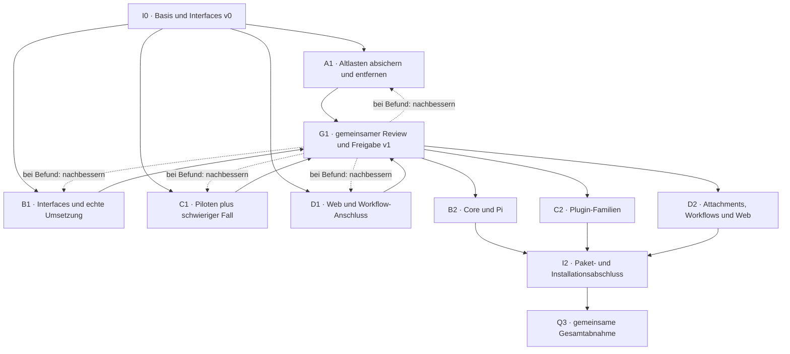

# Pibo Beta 4.0 – Arbeitsplan 04: Tiefe Module, einheitliche Attachments und integrierter Remote Agent

**Stand:** 20. September 2026 (nachmittags, UTC) · **Status:** fortgeschriebener Planungsvorschlag V4; Remote-Agent-Integration nachgezogen, keine gestartete Bloat-/K07-Umsetzung.
**Basis:** V3-Plan (unverändert archiviert) + Beta-Commit `84101adc` mit integrierter Remote-Observe-Änderung `175afcfa`; 65/65 Remote-Tests grün. Produktziele, Attachment-Zusagen und Arbeitspakete identisch zu V3.
**Vorgänger:** V3 (finale Downloadfassung, historisch; Metadaten als superseded markiert, Body unverändert).

> **Planänderung 03:** K07 ist jetzt ausschließlich das Core-Attachment-System. Der frühere MCP-Interaktionsentwurf ist verworfen. Bilder und Dateien bleiben Core; Web Annotations nutzt denselben Pluginanschluss. Neu beauftragt sind Widget-Grid, persistente Sessiondrafts und explizites Kopieren. Der übrige Bereinigungsplan bleibt bestehen.

> **Planänderung 04:** Remote-Basis `a3472458` war bereits via `ece5f18c` integriert; hinzu kommt exakt `175afcfa` (Observe-Spiegelung, 4 Dateien, Merge `84101adc`). Remote Agent ist ein ERHALTENES wichtiges Plugin und bleibt sauber vom Kern getrennt installierbar. K07 bleibt ausschließlich Attachments; der vorhandene Remote-MCP ist nicht der verworfene K07-MCP-Vorschlag.

## 0. Was V4 ändert (Remote-Integration)

V4 ist V3 mit neuer Baseline und nachgezogener Remote-Wirklichkeit; alle Produktziele, Attachment-Zusagen (inkl. AT-01–AT-22) und Arbeitspakete gelten unverändert. Konkret: (1) Baseline `84101adc` statt Audit-Baseline; die Remote-Basis `a3472458` war schon in `ece5f18c` enthalten — keine Komplett-Neuintegration, sondern exakt ein Commit `175afcfa` (Observe-Spiegelung `remote_session_observe` ≡ `pibo_agents_observe`: 2 Src- + 2 Testdateien). (2) Tatsächliche Tests: 65/65 `test/remote-agent-*.test.mjs` grün, `tsc`-Emit fehlerfrei; vorbestehende Rotfunde (Chat-UI-TS2322, Doku-Tracecommit) sind Baseline, kein V4-Versäumnis. (3) Remote Agent bleibt erhaltenes, separat installierbares Plugin (`pibo.remote-agent`) und ergänzt Cs Bündel — kein fünfter Dauer-Worker. (4) Redaktionell eindeutige Schreibgrenzen: B neutrale Verträge/Owner-Bindung, C Remote-/Transkriptions-/Tool-Verbraucher, D zentrale Web-/Attachment-Dateien, I Root/Builder; keine B+C-Doppelschreibrechte. (5) K07 ausschließlich Attachments; Unklarheiten zum Zukunftsvertrag vor dem jeweils benötigten Piloten klären (D1→I→C1 vor G1 bleibt). Details in Anhang R (§13) und im Remote-Plugin-Contract-Spec.

## 1. So läuft die Arbeit

I0 legt einen aktuellen Startpunkt, Funktionsschutz, Schreibrechte und Vertragsentwürfe v0 fest. Vier feste Worker bearbeiten A1, B1, C1 und D1 in getrennten Worktrees. G1 prüft jetzt alle vier Vorbereitungen, gibt Befunde an die zuständige Spur zurück und veröffentlicht nach bestandener Prüfung einen gemeinsamen Commit mit Vertragsstand v1. Dieselben Worker B/C/D setzen danach B2/C2/D2 um; A übernimmt Gegenprüfung und Dokumentation. I integriert bereits während der Arbeit, anschließend folgen I2 und Q3.

Der alte Plan band G1 nur an B1/C1; A1 und D1 waren zusätzliche einzelne Nachfolgerbedingungen. Hier wird zugunsten einer gemeinsamen Freigabe der ganze Vorbereitungsstand betrachtet. Unabhängige Prüfungen können vorher weiterlaufen; kein abhängiger Großumbau gegen ungeprüfte Zusagen.



Für K07 gibt es zusätzlich einen frühen, integrierten Pilotstand: D1 → I → C1. C1 kann seine unabhängigen Paketpiloten parallel vorbereiten, aber den Attachment-Anbieter erst gegen den vorhandenen Host prüfen. Kein zusätzlicher dauerhafter Worker.

Durchgezogene Pfeile sind Voraussetzungen; gestrichelte Pfeile Rückmeldungen, keine zusätzlichen Voraussetzungen. Derselbe Review-Loop wird auf die Umbau-Zwischenstände angewandt.

## 2. Was unverändert bleibt

Beide Loops-Modi – gleiche logische Session oder frische Session pro Iteration –, aktives VS-Code-Web-Plugin, normale CLI, Basis-Web mit den festen Core-Ansichten, Sessions und Historie, Auth-Scope, Runtime-Fähigkeiten, Sub-Agenten und Benutzerdaten bleiben. Entfernt werden nur die ausdrücklich aufgegebenen alten Implementierungen. Keine Produktänderung durch eine beiläufige neue Paket- oder Namensentscheidung. Einzige ausdrücklich ergänzte Produktoberfläche: K07-Attachment-Grid, gemeinsame JSON-Anhänge, persistente Sessiondrafts und bestätigte Übernahme. Vorhandenes Bild-/Datei-/Annotationsverhalten bleibt dabei erhalten. Der Remote Agent (`pibo.remote-agent`: Sessions, Observe, Dateien, Bash über MCP) bleibt als wichtiges Plugin erhalten und sauber vom Kern getrennt installierbar.

## 3. Was wir aus dem Skill übernehmen

### Ein kleines Interface, viel Verhalten
Ein Aufrufer lernt wenige zusammenhängende Zusagen. Die Implementation verbirgt Arbeit, statt sie als viele Helper wieder an den Aufrufer zurückzugeben.
*Quelle / Abgrenzung: S1 · Zeilen 8–28, 54–65.*

### Vollständig heißt nicht groß
Zum Interface zählen auch Invarianten, Reihenfolge, Fehler, Konfiguration und Leistung. Das ist mehr als eine TypeScript-Signatur, aber kein Grund für mehr öffentliche Methoden.
*Quelle / Abgrenzung: S1 · Zeilen 16, 54–65, 105–109.*

### Tiefe ist keine Zeilenzahl
Depth bedeutet Nutzen pro gelernter Oberfläche. Eine lange Datei ist nicht automatisch tief; intern dürfen Teile klein sein. Zusammengehöriges Wissen soll an einem Ort bleiben.
*Quelle / Abgrenzung: S1 · Zeilen 20, 26–28, 62, 107.*

### Nicht jede Funktion braucht einen Port
Pure Logik kann zusammengeführt und direkt getestet werden. Adapter lohnen dort, wo etwas wirklich austauschbar ist; interne Test-Seams bleiben intern.
*Quelle / Abgrenzung: S1 · Zeilen 62–65; S2 · Zeilen 9–30.*

### Erst Alternativen, dann ein Vertrag
Der Skill schlägt drei oder mehr deutlich verschiedene Interface-Entwürfe vor. Für Pibo liefern B/C/D diese Sichtweisen an wenigen kritischen Stellen; daraus entsteht eine gemeinsame Entscheidung.
*Quelle / Abgrenzung: S3 · Zeilen 9–44; Pibo-Anwendung ist Planentscheidung.*

### Tests am beobachtbaren Verhalten
Der Skill will Tests an der Moduloberfläche und später statt doppelter interner Alttests. Für Pibo gilt zusätzlich: keine Prüfung ohne nachgewiesene Ablösung und Review entfernen.
*Quelle / Abgrenzung: S1 · Zeile 64; S2 · Zeilen 32–37; Pibo-Schutzregel ist Planentscheidung.*

Der Skill verwendet Module, Interface, Implementation, Depth, Seam, Adapter, Leverage und Locality. Ein Interface umfasst alles, was Aufrufer wissen müssen; eine Seam ist seine Austauschstelle. Depth wird nicht über Implementierungszeilen gemessen. Die Begriffe werden mit dem Pibo-Glossar verbunden, ohne eine neue Domänensprache neben GLOSSARY.md einzuführen.

Die Empfehlung „Return results, don’t produce side effects“ wird als Entwurfsrichtung für reine Logik übernommen. Pibo muss weiterhin Dateien, Prozesse und Datenbanken verändern. Diese Effekte werden nicht abgeschafft, sondern eindeutig einem Modul zugeordnet und an dessen Interface geprüft.

## 4. Interface-Entwurf und Freigabe

In I0 steht v0: Zweck, vorhandene Einstiegspunkte, Aufrufer, Zuständigkeiten, Invarianten und offene Fragen. In B1/C1/D1 wird der Vertrag an echten Fällen ausgearbeitet. G1 gibt v1 nur mit exakten Exporten, zugehöriger Implementation, Aufrufbeispielen und bestandenen Tests frei. Keine offene Detailfrage im anschließend benötigten Pfad. Das ist kein Vorabentwurf sämtlicher interner Klassen.

Für ein oder zwei riskante Seams vergleichen B/C/D drei deutlich verschiedene Entwürfe für denselben Fall: minimale Lernfläche, einfachster üblicher Aufruf, reale Erweiterbarkeit. Das entspricht der Drei-Entwurfsrichtung aus DESIGN-IT-TWICE.md; die Nutzung vorhandener Worker statt zusätzlicher Sessions ist unsere Anpassung. Keine neuen Entwurfs-Worker wurden hier gestartet.

### Pflichtfelder jedes Vertrags

- **Zweck und Nicht-Ziele:** Welche Aufgabe übernimmt das Modul; was bleibt ausdrücklich außerhalb?
- **Owner und Aufrufer:** Wer implementiert; wer nutzt es; wer prüft es unabhängig?
- **Exakter Einstieg:** Vorhandener Export oder konkret begründeter neuer Export samt Typen und Beispiel. Keine fiktive Signatur als fertiger Code.
- **Beobachtbares Verhalten:** Ergebnisse, Ereignisse, Invarianten, Konfiguration und unveränderte öffentliche Namen.
- **Reihenfolge und Parallelität:** Was darf wann aufgerufen werden? Was heißt angenommen, aktiv, abgeschlossen oder bereits abgebrochen?
- **Fehler und Wiederholung:** Fehlerform, Wiederholbarkeit, Zuständigkeit für Retries und Verhalten nach Teilfehlern.
- **Ressourcen und Abbruch:** Wer erzeugt und entsorgt; wer darf abbrechen; was geschieht bei Timeout, Dispose oder verspäteten Ereignissen?
- **Daten und Berechtigungen:** Scope, Identitäten, persistierte Daten, Credential-Besitz und Geheimnis-Redaktion.
- **Betriebs- und Paketkosten:** Erlaubte Imports, keine unbeabsichtigten Starts/Downloads, erwartete Leistungsbedingungen und Messverfahren.
- **Adapter und Tests:** Welche Abhängigkeit variiert tatsächlich? Welche gemeinsamen Tests prüfen Produktions- und Testadapter?
- **Version und Freigabe:** Vertragsstand, Source-Commit, Testbelege, Zustimmung der Aufrufer und offene Punkte. Vor G1 keine offene Frage im benötigten Pfad.

### Vertragsblätter K01–K07

Diese Blätter sind konkrete Entwürfe, keine Behauptung fertig implementierter oder neu geprüfter SDK-Signaturen. Bestehende Exporte und Verhaltenstests werden vor Umsetzung neu zugeordnet. Es sind nicht automatisch sieben neue Softwaremodule. K07 wird unten in Abschnitt 12 vollständig beschrieben.

#### K01 – Runtime und Session
**Owner:** B · **Aufrufer:** C: weitere Runtimes (inkl. Remote-Session-Erzeugung über Raum-Defaultprofil) · D: Workflows · A: Verhaltensprüfung

**Zweck:** Einen Auftrag an eine passende Runtime geben, ohne dass Aufrufer deren nativen Ablauf kennen müssen.

**Bestehendes zuerst:** Vorhandene AgentRuntimeSession-/Driver-Verträge, semantische Ereignisse und RuntimeSessionBinding zuerst verwenden. Die exakten aktuellen Signaturen werden vor der Umsetzung zugeordnet.

**Kleine äußere Oberfläche:** Benötigte Prompt-, Ereignis-, Status-, Abbruch- und Dispose-Wege; optionale Controls bleiben an tatsächlich unterstützte Fähigkeiten gebunden. Keine zweite Runtime-Schnittstelle daneben.

**Verborgene Implementation:** Native Protokolle und Handles, Resume-Details und harnessspezifische Abläufe bleiben im jeweiligen Adapter. Produktweite Queue und Session-Identität bleiben beim zuständigen Core-Modul.

**Verhalten und Reihenfolge:** Annahme einer Nachricht und deren endgültiger Abschluss sind verschieden. Reihenfolge, höchstens ein terminales Ergebnis, wartende Arbeit, Wiederaufnahme und Verhalten bei fehlender nativer Session werden aus bestehenden Tests festgeschrieben.

**Scope und Lebensdauer:** Runtime-Generation, Bindings und Ressourcen haben klare Owner. Abbruch, Dispose, verspätete Events und Cleanup dürfen keine Arbeit oder Credentials hinterlassen.

**Abhängigkeiten:** In-process: Orchestrierungsregeln. Local-substitutable: isolierte Persistenz. True external: Provider-Gegenstelle. Nicht die ganze Runtime als unprüfbaren Mock ersetzen.

**Nachweis:** B liefert den Contract-Test-Satz. C prüft ihn mit den unterstützten Nicht-Pi-Adaptern; D mit einem Workflow-Verbraucher. Fehler-, Abort- und Resume-Fälle einschließen.

**Freigabe:** Ein Plugin-/Workflow-Aufrufer kann denselben Vertragsstand benutzen; benötigte produktive Operationen existieren. Capability-Lücken bleiben ausdrücklich sichtbar.

**Nicht-Ziele:** Keine SDK-Typen eines konkreten Harness im neutralen Export. Keine stillen Änderungen an Session-IDs, Protokollen oder gespeicherten Bindings.

#### K02 – Tools und Ressourcen
**Owner:** B · **Aufrufer:** C: File Editing, Remote Agent, Toolfamilien · D: Workflow-Verbraucher

**Zweck:** Ein ausgewähltes Tool benutzen, ohne globale Konfiguration, Auswahlregeln oder Ressourcenverwaltung im Aufrufer nachzubauen.

**Bestehendes zuerst:** PiboToolDefinition/-Result, Session-Tool-Auswahl und bestehende Runtime-Ressourcenverträge weiterführen. Für Beobachtung/History die gemeinsame Engine (`preparePiboAgentObservationQuery`, `selectPiboAgentObservationPage`, Cursor-Scope-Key, `formatAgentObservationsForModel`) verwenden; Ziel ist ein neutraler B-Vertrag statt privater `subagents/tool`-Querimporte. Neue Exporte nur für nachgewiesene Lücken.

**Kleine äußere Oberfläche:** Bestehende Toolnamen, Schemata, Ergebnisse und Fortschrittswege; ein passender, begrenzter Ausführungskontext. Keine Übergabe des vollständigen PluginHosts an jedes Tool.

**Verborgene Implementation:** Konkrete Ausführung, Formatierung und Tool-Implementierung verbleiben im besitzenden Modul; Auswahl, Berechtigung und Generation werden an ihrer bisherigen zuständigen Stelle geprüft.

**Verhalten und Reihenfolge:** Direkte und yieldbare Ausführung nicht vermischen. Fehlerdarstellung, Rückgabeform, Fortschritt und Umgang mit abgebrochenen Aufrufen aus dem bisherigen Verhalten festhalten.

**Scope und Lebensdauer:** Workspace, Session und Generation sind ausdrücklich gebunden. Ressourcen werden vom vereinbarten Owner freigegeben; ein später Callback darf kein abgeschlossenes Ergebnis überschreiben.

**Abhängigkeiten:** Pure Formatierung direkt testen. Lokale Dateitools mit isolierten realen Verzeichnissen prüfen. Einen Adapter nur dort einführen, wo Produktions- und Testgegenstelle wirklich wechseln.

**Nachweis:** C liefert mindestens ein repräsentatives Dateitool-/Remote-Tool-Beispiel (`remote_session_observe` mit Filtern, Cursor, Paging gegen `pibo_agents_observe`-Parität). Tests prüfen Ergebnis, Trunkierung beziehungsweise relevante Ausgabeformen, Abbruch, Fehler und Scope; kein echter Produkt-Workspace.

**Freigabe:** Ein bisher schwer gekoppelter Toolfall ist durchgestochen. Verbraucher beziehen benötigtes Verhalten ohne private Pi-Querimporte; die vollständige Bundlebereinigung folgt B2/C2.

**Nicht-Ziele:** Keine neue Toolwelt, keine umbenannten öffentlichen Tools, kein allgemeines Toolkit mit beliebig vielen Durchreiche-Methoden und kein neuer Server-/Auth-/Framework-Layer für den gemeinsamen Beobachtungsvertrag.

#### K03 – Begrenzter Credential-Zugriff
**Owner:** B · **Aufrufer:** C: Transkription und andere berechtigte Provider-Verbraucher

**Zweck:** Ein Feature erhält genau den zulässigen Zugang für seinen Provider – ohne Pi-Speicherorte oder fremde Accounts kennen zu müssen.

**Bestehendes zuerst:** Vorhandene injizierbare Provider-Zugänge und zuständige Adapter verwenden. K03 definiert ihre Zusammenarbeit, nicht automatisch einen neuen globalen Credential-Service.

**Kleine äußere Oberfläche:** Nur die vom konkreten Verbraucher benötigte Konfigurations-/Zugriffszusage im zulässigen Scope. Vor der Implementierung festlegen, ob der heutige Call ein Auth-Ergebnis oder eine authentifizierte Operation braucht.

**Verborgene Implementation:** Speicherpfade, native Logins, Tokens und Refresh-Details bleiben beim bisherigen zuständigen Adapter. Eine Auslagerung darf dessen Sicherheitszuständigkeit nicht ändern.

**Verhalten und Reihenfolge:** Nicht konfiguriert, abgelaufen, Zugriff verweigert und Providerfehler eindeutig behandeln. Kein Fallback auf einen anderen Account oder eine fremde Runtime. Ergebnis-/Fehlerform zuerst mit den heutigen Aufrufern abgleichen.

**Scope und Lebensdauer:** Expliziter Provider-/Runtime-Scope; keine Secret-Werte in Logs, Übergaben oder Produkthistorie. Kurzlebige Fähigkeiten dürfen nicht über das vorgesehene Lebensende hinaus verwendet werden.

**Abhängigkeiten:** True external: Providerzugriff am vorhandenen Seam ersetzen. Adapter-private lokale Speicherung separat prüfen. Kein voller Pi-Import als unsichtbarer Standardwert im neutralen Modul.

**Nachweis:** C testet einen Transkriptions-Verbraucher mit erlaubtem Zugriff, fehlender Konfiguration und abgelehntem Scope. B prüft Produktionsverdrahtung mit kontrollierten Credentials, nicht mit echten Nutzertokens im Bericht.

**Freigabe:** Owner und Verbraucher haben dieselbe Auth-Annahme und einen ausführbaren Test. Kein vorgeschlagenes Credential-Verhalten ist ohne Sicherheitsprüfung als fertig freigegeben.

**Nicht-Ziele:** Kein getAllSecrets, keine Kopie nativer Anmeldedaten, keine neue universelle Auth-Schicht, keine still veränderten Berechtigungen und keine Verlagerung der Remote-Device-Code-/Token-Verwaltung in einen zentralen Service.

#### K04 – Workflow-Modul und Host
**Owner:** D · **Aufrufer:** B: allgemeine Session-Anschlüsse · C: Paketmuster · Web-Aufrufer

**Zweck:** Workflow-Verhalten zusammenhalten; der Aufrufer formuliert sein Vorhaben statt den internen Ablauf selbst zusammenzubauen.

**Bestehendes zuerst:** Vorhandene Workflow-Operationen und Session-/Plugin-Anschlüsse weiterführen. Generische Session-Verträge aus K01 gehören B; fachliche Workflow-Operationen und Routen gehören D.

**Kleine äußere Oberfläche:** Nur tatsächlich benutzte Vorgänge wie Entwurf prüfen/publizieren, Ausführung anstoßen und vorhandene Beobachtungs-/Benutzeraktionswege. Keine künstliche Methodenzahl erzwingen.

**Verborgene Implementation:** Workflow-Regeln, Validierung, Ausführungskoordination und fachliche Persistenz gehören als zusammenhängende Implementation zum Workflow-Modul; interne Teile dürfen klein bleiben.

**Verhalten und Reihenfolge:** Bestehende HTTP-/UI-Ergebnisse, Versionierung, Session-Zuordnung, manuelle Aktionen und Restart-Verhalten bewahren. Keine parallele zweite Sessionwelt.

**Scope und Lebensdauer:** Registrierung, Start, Abbruch und Abbau klar zuordnen. Deinstallation beendet die vereinbarte Feature-Nutzung, aber löscht keine Benutzerdaten. Reinstallation nutzt vorhandene Daten wieder.

**Abhängigkeiten:** In-process: Workflow-Regeln. Local-substitutable: lokale Datenbank. Remote but owned nur dort, wo tatsächlich ein Pibo-Transport liegt. True external: nachgelagerter Provider.

**Nachweis:** D liefert den kleinen Start→Ergebnis/Abbruch-Durchstich für G1 und später die ganze Workflow-Matrix. Lokale Datenbank in isolierter Testumgebung und echte Host-Registrierung mitprüfen.

**Freigabe:** D1 erprobt den Host-Anschluss vor dem großen Umzug. B/C bestätigen, dass dafür keine privaten Core-/Plugin-Imports nötig sind.

**Nicht-Ziele:** Kein eigenes Auth-System, keine neuen Tabellenformate als Nebenwirkung und kein Entfernen der festen Core-Ansichten.

#### K05 – Gemeinsames Web-Interface
**Owner:** D · **Aufrufer:** C: VS Code Web und weitere Plugin-Views · B: neutrale Typen, falls nötig

**Zweck:** Plugins benutzen die vereinbarte Web-Umgebung, ohne ihre privaten Router-, React- oder Session-Details kennen zu müssen.

**Bestehendes zuerst:** Bestehende View-Registrierung, Tab-Lifecycle und Browser-Verträge benutzen. Geteilte Darstellung nur dann auslagern, wenn mehrere echte Verbraucher dieselbe Aufgabe benötigen.

**Kleine äußere Oberfläche:** Dokumentierte Registrierung und die wenigen wirklich gemeinsamen UI-Funktionen. Aufrufer behalten ihre eigenen fachlichen Views; private State-Helfer werden nicht öffentlich.

**Verborgene Implementation:** Darstellungsdetails und gemeinsame Syntax-/Formatierungslogik konzentrieren sich bei ihrem Modul. Das ist keine Erlaubnis zu einer sichtbaren Neugestaltung der Produkt-App.

**Verhalten und Reihenfolge:** Subview-ID, Deep Link, Fokus, Editorzustand und Session-Ownership erhalten. Bestehende Plugin-Auswahl, Fehler-/Leerzustände und Erreichbarkeit nicht verändern.

**Scope und Lebensdauer:** Mount/Unmount, Event-Abmeldung und Zustandsbesitz festlegen. Keine doppelte React-Instanz oder versteckte Pflicht-Plugin-Abhängigkeit durch den neuen Importweg.

**Abhängigkeiten:** In-process: Formatierung. Browser-Umgebung: echte DOM-/Layout-Prüfung für visuelles Verhalten. Ein Mock allein beweist weder Fokus noch Einbettung.

**Nachweis:** D prüft den gemeinsamen Helfer, C mindestens zwei echte Aufrufer. Das aktive VS-Code-Web-Plugin und feste Core-Ansichten zusätzlich im sichtbaren Browser prüfen. Der Remote-Agent-Einstieg (Katalogeintrag + Views `remote-agent-view.tsx`/`RemoteAgentArea.tsx`, kein Routenbereich) bleibt dabei unverändert erhalten.

**Freigabe:** Das erhaltene VS-Code-Web-Plugin benutzt den gemeinsamen Stand. Gemeinsamer Code ist nicht nur dupliziert in ein zweites Paket kopiert.

**Nicht-Ziele:** Keine Entfernung der Browser-IDE, kein Re-Design, kein allgemeines UI-Framework und kein Entzug der Layoutkontrolle fremder Plugins.

#### K06 – Paket- und Buildvertrag
**Owner:** I · **Aufrufer:** B, C, D: Paket-Owner · A: Dokumentation und Abnahme

**Zweck:** Jedes Artefakt lässt sich mit benanntem Inhalt installieren; gemeinsame Builder hängen nicht von zufälligen Root-Details ab.

**Bestehendes zuerst:** Vorhandener Paketkatalog, Manifeste, SDK-Exports und Minimal-/Standardzusammenstellung sind Ausgangspunkt. Konsistente Besitzregeln statt neuer Paketmanager.

**Kleine äußere Oberfläche:** Paketidentität, Version/Kompatibilität, Exporte, Ressourcen, direkte Laufzeitabhängigkeiten und Build-/Testbefehle. Manifest und installierter Inhalt müssen zusammenpassen.

**Verborgene Implementation:** Paketinterne Ordner und Implementation dürfen sich ändern. Der Aufrufer braucht weder private src-Pfade noch ein Root-node_modules als stillen Helfer.

**Verhalten und Reihenfolge:** Minimal, bewusste spätere Plugininstallation, Standard und Offlinezusammenstellung bleiben ausdrückliche Wege. Auswahlzustände und verfügbare Funktionalität nicht nebenbei ändern.

**Scope und Lebensdauer:** Aktivieren, Deaktivieren, Update und Wiederinstallation mit vorhandenen Daten prüfen. Bootstrap und Paketwechsel dürfen laufende Sessions nicht unkontrolliert unterbrechen.

**Abhängigkeiten:** Buildwerkzeuge von installiertem Runtime-Inhalt unterscheiden. Gemeinsame Root-Manifeste und Lockfile nur durch I ändern. Keine neue Dependency ohne benannten Owner und Bedarf.

**Nachweis:** Saubere isolierte Installation der Pilotpakete, später der gesamten Zusammensetzung. Metafiles und installierte Dateien prüfen: tatsächliche Ausgabebytes zählen, nicht nur Manifest-Einträge. Remote Agent bleibt separat installier-/deinstallier-/reinstallierbar.

**Freigabe:** G1 gibt Paketmuster und exakte SDK-Artefakte frei. I2/Q3 prüfen den zusammengehörigen neuen Kandidaten; alte Artefakte sind kein Beleg.

**Nicht-Ziele:** Keine neue feste Plugin-Anzahl an vielen Stellen, kein automatisches Nachladen ohne bewusste Auswahl und kein nur vermeintlich dependency-freier Vollbundle.

#### K07 – Einheitliches Attachment-System
**Owner:** D · **Vertragspartner:** B für neutrale Exporte/Medien; C für Web Annotations; A für Gegenprüfung; I für Integration.

Ein Core-Modul verwaltet sessiongebundene, persistente JSON-Entwurfsanhänge und ihren Versand. Anbieter liefern Schema, Payload und Widgetdarstellung. Maximal 12 × 3 Zellen, mobil 3 × 3; Host-X, Auswahlübernahme und Materialisierung erst beim Senden. Details, technische Defaults, Fehlersemantik und AT-01–AT-22 stehen in Abschnitt 12. Kein zusätzlicher MCP- oder Tool-Layer. Der vorhandene Remote-Agent-MCP-Server (Raum-Fernzugriff, eigenes Plugin) ist NICHT der verworfene K07-MCP-Interaktionsvorschlag.

## 5. Review und Änderungsregel

01. **Vorlegen:** Worker nennt Commit, Vertrag, betroffene Aufrufer und Prüfungen. „Fertig“ ohne Nachweis reicht nicht.
02. **Gegenprüfen:** Ein anderer Owner prüft Verhalten und Interface. I prüft den gemeinsamen Stand, nicht nur einzelne Branches.
03. **Nachbessern:** Ein Befund nennt reproduzierbaren Fall, Owner und Fertigkriterium. Rückgabe nur an die betroffene Spur.
04. **Erneut prüfen:** Befundtest, Verbraucherprüfungen und relevante integrierte Tests wiederholen. Erst dann schließen.
05. **Freigeben:** I veröffentlicht den grünen gemeinsamen Commit plus Vertragsstand. Abhängige Arbeit startet genau darauf.

Nach G1 keine stillen Interface-Änderungen. Der anfordernde Worker beschreibt die fehlende Zusage und ein scheiterndes Aufrufbeispiel. Der Owner passt Vertragsblatt, Implementation und Tests gemeinsam an. Betroffene Verbraucher prüfen den neuen Stand; I integriert und benennt die neue Revision. Nur Arbeit, die davon abhängt, wartet. Keine ungeprüften Cross-Worktree-Imports.

Gegenprüfung: B prüft A. C/D prüfen B1 als Aufrufer. B/D prüfen C1; B/C prüfen D1. A prüft nach A1 die großen Umbauten und pflegt gemeinsame Evidenz; I prüft und integriert den gemeinsamen Stand. Kein Owner erteilt sich selbst allein die Abnahme.

## 6. Arbeitspakete

### I0 – Startpunkt und Interface-Entwürfe festlegen
**Owner:** I · **Voraussetzungen:** Start · **Verträge:** K01, K02, K03, K04, K05, K06, K07

Vor vier parallelen Arbeiten stehen ein prüfbarer Ausgangspunkt und gemeinsam verständliche Interface-Entwürfe.

**Auftrag:**
- Branch, Commit, Arbeitsstand, Toolchain und Paketartefakte neu prüfen. Die im Vorplan genannte Audit-Baseline ist kein Ersatz für eine aktuelle Prüfung.
- Den Paketkatalog und die ausdrückliche Standard-Auswahl konsistent machen; keine Produktfunktion oder Pflichtabhängigkeit nebenbei ändern. Ausgangsfehler mit reproduzierbarem Nachweis erfassen.
- Das bestehende Verhalten und alle verpflichtenden Tests erfassen: beide Loop-Modi, Browser-IDE als Plugin, Sessions, Daten, Auth, Runtime-Steuerung, Plugin-Lifecycle, CLI und Basis-Web.
- Vertragsblätter K01–K07 als Entwürfe v0 anlegen. Für jeden vorgesehenen Aufrufer Zweck, zuständigen Owner, vorhandenen Einstieg, Verhalten und noch offene Detailfragen festhalten. Bestehende Interfaces zuerst verwenden.
- Ein klares Schreibrecht pro gemeinsamem Dateibereich, feste Übergabepunkte und vier getrennte Worktrees vereinbaren. Root-Manifeste, Lockfile, Paketkatalog und Buildskripte gehören I.
- Aufträge für A1/B1/C1/D1 mit Basis-Commit, erlaubten Dateien, Nicht-Zielen, Vertragseingängen und Abnahmetests ausgeben. Bei kritischen neuen Interfaces drei unterschiedliche Entwürfe von B/C/D einplanen, nicht drei zusätzliche Dauer-Worker.
- K07 ersetzt ausdrücklich den verworfenen MCP-Interaktionsvorschlag: ein Core-Attachment-System, keine zweite Tool-/MCP-Schicht. Aktuelle Bild-, Datei-, Web-Annotations-, Draft-Storage- und Sendewege erneut erfassen.
- Attachment-Produktentscheidungen sichern: Snapshot beim Anhängen, freies Widget im 12×3-/3×3-Rahmen, JSON-Payload, persistenter Sessiondraft, Materialisierung erst beim Senden und bestätigte Kopierauswahl. Technische Defaults und bestehende Medienlimits in K07-v0 dokumentieren.
- D erhält K07 inklusive Typsemantik, Composer, State und Annahmepfad. B besitzt nötige neutrale SDK-/Registryänderungen. C besitzt den Web-Annotations-Anbieter. Den frühen D1-Pilot→I→C1-Übergabepunkt festlegen.

- Remote-Baseline festhalten: `a3472458` war bereits via `ece5f18c` integriert; hinzu kam exakt `175afcfa` (Observe-Spiegelung, 4 Dateien, Merge `84101adc`); 65/65 Remote-Tests grün; Remote Agent als erhaltenes installierbares Plugin in Funktions-/Testmatrix aufnehmen.
**Fertig, wenn:**
- Ein gemeinsamer Start-Commit ist benannt; relevante Pflichtprüfungen laufen, Vorfehler sind sichtbar. Ein roter Ausgangsstand wird nicht als grün bezeichnet.
- Jeder Worker kennt sein Ziel, seine Schreibrechte und seine Vertragspartner. Noch offene Interface-Fragen sind klar als vorläufig markiert.
- Die Ausgangsmessung unterscheidet eigenen Code, tatsächlichen Bundle-Inhalt, Installation, CLI-Start und Test-/Buildaufwand.
- K07-v0 und die bisherigen Attachment-Prüfungen sind zugeordnet. Ein Bild ist weiterhin ein nutzbares Medium, nicht nur ein JSON-Text mit unbrauchbarem Pfad.

**Übergabe:** BASE: exakter Start-Commit, Funktions-/Testmatrix, Datei-Owner, Vertragsentwürfe v0 und vier vollständige Worker-Briefings.
**Gegenprüfung:** I prüft die Startfähigkeit; B/C/D bestätigen die von ihnen benutzten Vertragsentwürfe.
**Leitplanke:** Kein Architektur-Komplettentwurf auf Vorrat. Keine produktiven Gateways verändern. Für einen blockierten Interface-Pfad noch keinen abhängigen Umbau beginnen.
**Arbeitsbereich:** Root-Manifeste · Lockfile · scripts/build-pibo4-* · compositions/ · Baseline-Tests

### A1 – Altlasten vollständig abschließen
**Owner:** A · **Voraussetzungen:** I0 · **Verträge:** K01, K05, K07

Tote Implementierungen entfernen, ohne die heutigen Funktionen mitzunehmen.

**Auftrag:**
- Vor dem Löschen die tatsächlich aktiven Aufrufer erneut nachweisen. Die alte Ralph-Insel samt alter API/UI und unnötigen Reexports vom aktiven Loops-System unterscheiden.
- Relevante Verhaltensprüfungen zuerst auf Loops absichern: gleiche logische Session oder frische Session pro Iteration, alte Daten, Aliasse, Stoppen, Abbruch und Wiederaufnahme. Aktive Loops-Implementierung bleibt bei C.
- Den alten TUI-Einstieg und ausschließlich interaktive Verdrahtung entfernen. Die normale CLI und Pi als Runtime erhalten. Die betroffene Pi-Datei wird danach ausdrücklich an B übergeben.
- Reste der aufgegebenen VS-Code-Extension und überholte Anleitungen bereinigen. Das aktive VS-Code-Web-Plugin, Web-Renderer und Suchwerkzeuge nicht entfernen.
- Jeden entfernten oder umgezogenen Test in einer Vorher-/Nachher-Matrix erklären. Kein Test wird abgeschaltet, nur damit der Umbau grün wird. Rein interne Altprüfungen erst nach belegter Ablösung und Review entfernen.
- Eigenen Löschstand an B zur Gegenprüfung übergeben; gemeinsame Doku-Änderungen selbst koordinieren. Historische Evidenz bleibt historisch.
- Die bisherigen Attachment-Verhaltenstests für spätere Gegenprüfung erfassen; keine Composer-, Web-Annotations- oder aktiven Loop-Dateien neben den zuständigen Ownern ändern.

- Genutzte Observation-/Regex-/ripgrep-Helfer (`subagents/observation-*`, rg-Suche) nicht mit alter TUI-/Subagent-Hygiene löschen; die Remote-Beobachtung läuft über dieselbe Engine.
**Fertig, wenn:**
- Beide Loop-Modi, bestehende Daten und die erhaltenen öffentlichen Wege sind durch passende Tests geschützt.
- Alte TUI/Extension sind von aktiver CLI/Browser-IDE eindeutig getrennt. Keine implizite Funktionslöschung.
- Die TUI-Datei und alle auslaufenden Schreibrechte sind auf einem integrierten Commit an B beziehungsweise C/D übergeben.
- Die übernommenen Attachment-Zusagen stehen in der Testmatrix; neue Grid-/Copy-Funktionalität wird als beauftragte Erweiterung kenntlich gemacht.

**Übergabe:** Löschliste mit Verbraucherbelegen, Test-Zuordnung, prüfbarer Commit und ausdrückliche Freigabe der Pi-Datei für B2.
**Gegenprüfung:** B prüft As Löschungen; C bestätigt die Loops-Verhaltensverträge. A gibt die eigene Arbeit nicht allein frei.
**Leitplanke:** Nicht anhand von Namen löschen: Ralph-Modus, pibo-ralph.sqlite, Browser-IDE, Web-Renderer und Suchwerkzeuge bleiben.
**Arbeitsbereich:** src/ralph/ · alte Ralph-API/UI · TUI-Abschnitt in pi/runtime.ts · zugehörige Tests und Doku

### B1 – Kleine, vollständige Interfaces beweisen
**Owner:** B · **Voraussetzungen:** I0 · **Verträge:** K01, K02, K03, K04, K07

Ein Interface beschreibt die ganze Zusage an Aufrufer – nicht nur TypeScript-Typen. B stellt echte, benutzbare Anschlussstellen bereit.

**Auftrag:**
- Bestehende öffentliche Runtime-, Tool-, Ressourcen- und Plugin-Interfaces prüfen. Nur Lücken schließen, die konkrete Aufrufer in C oder D tatsächlich brauchen.
- An den ein oder zwei riskantesten Seams drei Alternativen gegenüberstellen: B minimiert die Lernfläche, C optimiert den üblichen Plugin-Aufruf, D prüft Erweiterbarkeit und Workflow-Nutzung. Alle liefern Aufrufbeispiel, versteckte Arbeit, Fehlerverhalten und begründete Adapter.
- Eine Variante gemeinsam auswählen. Nicht automatisch alle Varianten kombinieren: Das würde die Oberfläche meist größer machen. Die Entscheidung nach Depth, Locality und Seam-Platzierung begründen.
- K01–K03 mit den Verbrauchern konkretisieren: Typen, Ergebnisse/Ereignisse, Invarianten, Reihenfolge, Fehler, Abbruch, Berechtigungen, Nebenläufigkeit, Ressourcenbesitz und erlaubte Imports.
- Benötigte Funktionen implementieren oder bestehende passende Funktionen nutzbar machen. Produktionsadapter und geeigneten Testadapter beziehungsweise reale lokale Testumgebung gegen denselben Vertrag prüfen.
- C und D regelmäßig exakt versionierte, von I integrierte Vertragsstände geben. Keine privaten Querimporte als Abkürzung und keine Platzhalter als fertige Umsetzung. As Pi-TUI-Datei bleibt bis zur Übergabe gesperrt.
- K07s neutrale Export-, Ressourcen- und Runtime-Anschlüsse zusammen mit D prüfen. Exporte/Registrierung in eigenen SDK-Dateien umsetzen, ohne einen zweiten Attachment-Kern anzulegen.
- Einen aktuellen Bild-/Datei-Verbraucher gegen JSON-Umschlag und sichere Ressourcenreferenz prüfen. Native Medienfähigkeit, Sessionbindung und Credential-Grenzen dürfen durch Vereinheitlichung nicht verloren gehen.

- Neutralen Observation-/History-Vertrag als Alternative mit entwerfen: gemeinsame Abfrage-/Cursor-/Trunkierungszusage statt privater `subagents/tool`-Querimporte; Kosten-/Outputgrenzen getrennt belegen; kein neuer Server-/Auth-/Framework-Layer.
**Fertig, wenn:**
- C und D können ihre konkreten Aufrufbeispiele gegen den gelieferten Stand ausführen; die Umsetzung existiert wirklich.
- Die ausgewählten Interfaces sind klein und vollständig beschrieben. Interne Test-Seams werden nicht unnötig öffentlich.
- Fehler, Abbruch und Cleanup sind überprüft. Ein Testadapter ersetzt nicht den Test des echten Produktionsadapters.
- D und C können den abgestimmten K07-Export nutzen; ein Ausführungspfad beweist die unveränderte Medienzustellung.

**Übergabe:** Vertragskandidat mit konkreten Exporten, Beispielen, produktiver Implementierung und gemeinsam benutzbaren Contract-Tests.
**Gegenprüfung:** C und D prüfen B1 aus Sicht ihrer Aufrufer; I prüft Exporte, Versionen und Paketverwendung.
**Leitplanke:** Kein zweites Pluginframework und kein allgemeines Mega-SDK. Die von A bearbeitete Pi-TUI-Datei bleibt bis zur Übergabe unangetastet.
**Arbeitsbereich:** src/plugins/{sdk,host,runtime,product-services}.ts · src/agent-runtime/ · neutrale Core-Dienste

### C1 – Piloten und einen schwierigen Fall prüfen
**Owner:** C · **Voraussetzungen:** I0 · **Verträge:** K02, K03, K05, K06, K07

Web Search und VS Code Web prüfen das Paketmuster. Ein zusätzlicher gezielter Versuch prüft eine bisher schwere Tool- oder Auth-Kopplung.

**Auftrag:**
- Web Search und das ausdrücklich erhaltene VS-Code-Web-Plugin als zwei überschaubare Quellpakete organisieren: Implementierung, Manifest, UI, Ressourcen und Tests zusammenhalten.
- Auf Vertragsentwurf v0 vorbereiten und vorhandene Interfaces nutzen. Neue benötigte Funktionen erst gegen Bs von I integrierten Zwischenstand anbinden; unfertige Typentwürfe nicht selbst interpretieren.
- Als Aufrufer einen eigenen Interface-Entwurf für die ausgewählte kritische Seam beisteuern: Der häufige Plugin-Fall soll einfach sein, ohne Sonderwissen aus dem Core.
- Zusätzlich einen kleinen, echten Durchstich durch File Editing oder Transkription ausführen. Ein schwieriger Import-/Credential-Fall muss K02 oder K03 erproben, nicht nur die beiden leichten Piloten.
- Die beiden Pilotpakete außerhalb des Gesamtcheckouts mit deklarierten Abhängigkeiten bauen, installieren und prüfen. Den gewählten schwierigen Fall mit realer Modulverdrahtung und kontrollierter externer Gegenstelle prüfen.
- Fehlende Zusagen, falsche Fehlerannahmen und gewünschte gemeinsame Web-Funktionen an B/D melden. Keine parallele Schattenimplementierung des Hosts anlegen.
- Zusätzlich Web Annotations als Attachment-Anbieter vorbereiten: festgehaltene JSON-Fassung, fachliche Optionen, Thumbnail/Fallback und deklarierte Kachelgrößen. Keine private Composer- oder Store-Integration.
- Den K07-Anbieter gegen Ds früh integrierten Pilotstand erproben. Reale Abhängigkeit: D1-Pilot → I-Integration → C1-End-to-End-Test → G1. Bis dahin an den unabhängigen Paketpiloten und bisherigen schwierigen Fällen weiterarbeiten.

- Remote als Verbraucher mit prüfen: Modul-/Raum-/Token-Verträge, Observe-Filter (`filter`/`cursorMode`/`afterSequence`/`order`/`limit`), echte `toolCallId`/`requestId`/`turnId`, Fehler-/Details-Verhalten. Remote ergänzt Cs Bündel; kein fünfter Worker.
**Fertig, wenn:**
- Ein Toolplugin und das Browser-IDE-Plugin funktionieren isoliert mit dem gemeinsamen Vertragsstand.
- Mindestens eine problematische Tool-/Auth-Kopplung ist durch einen ausführbaren Versuch erprobt; der spätere große Umbau wird nicht vorgetäuscht.
- Der Paketvertrag enthält Ressourcen, erlaubte Imports, Lifecycle und Abhängigkeiten; I kann das Muster in die gemeinsamen Builder übernehmen.
- Web Annotations und ein Core-Anhang benutzen denselben K07-Stand; die Annotation wird nach Quellenänderung nicht heimlich ersetzt.

**Übergabe:** Zwei Referenzpakete, ein gezielter Belastungsversuch und belegte Rückmeldungen an K02/K03/K05/K06. Zusätzlich: Web-Annotations-K07-Pilot mit Payload-/Renderer-/Ressourcen-Tests gegen Ds integrierten Stand.
**Gegenprüfung:** B prüft die Vertragsnutzung, D den Web-Anschluss und I den isolierten Paketweg.
**Leitplanke:** Kein Repository pro Plugin eröffnen. Die Pilotphase nutzt vorhandene Verträge; neue Dienste müssen vor ihrer Nutzung tatsächlich bereitstehen.
**Arbeitsbereich:** packaged-web-search · packaged-vscode-web · vscode-view · neue Plugin-Paketordner

### D1 – Web, Workflows und Attachments vorbereiten
**Owner:** D · **Voraussetzungen:** I0 · **Verträge:** K01, K04, K05, K07

D schützt das vorhandene Web-/Workflow-Verhalten und macht die später benötigten Host-Anschlüsse früh ausführbar.

**Auftrag:**
- Doppelten Prism-Hilfscode nach Umstellung seiner Aufrufer zusammenführen. Kein neues allgemeines Helferpaket erfinden, wenn ein kleines vorhandenes Modul die Aufgabe gut verbirgt.
- Workflow-Wege mit beobachtbaren Tests sichern: Entwurf, Veröffentlichung, Start, Benutzeraktionen, Session-Zuordnung und vorhandene Daten. Die bisherigen Ergebnisse bilden den Vertrag.
- K04 und K05 mit B/C ausarbeiten. Der Workflow-Aufrufer soll nicht selbst Profilwahl, Sessionaufbau, Ereignisverkettung und Cleanup orchestrieren müssen, soweit diese Regeln bereits zum Workflow-Modul gehören.
- Für eine kritische Seam eine alternative Sicht auf Erweiterbarkeit liefern. Pure Logik direkt testen; lokale Speicherung bevorzugt in einer isolierten echten Testumgebung; externe Abhängigkeiten gezielt ersetzen.
- Einen kleinen Durchstich Workflow → bestehendes Runtime-/Session-Interface → Ergebnis oder Abbruch gegen Bs verfügbaren Stand prüfen. Noch kein vollständiger Workflow-Umzug.
- Die Basis-Web-App und die fünf festen Core-Ansichten erhalten. Gemeinsame UI-Interfaces mit Cs Plugin-Pilot prüfen. As alte Ralph-Oberfläche und Cs aktive Plugin-Dateien bleiben fremde Schreibbereiche.
- K07 als zusammengehöriges Core-Modul beschreiben: Anbieterregistrierung im bestehenden Pluginframework, sessiongebundener persistenter Draft, JSON/Payload getrennt von UI-State, Grid und X-/Auswahloverlays.
- Einen kleinen ausführbaren Core-Anhang von Add über Reload und JSON-Snapshot bis zur kontrollierten Annahme durchstechen. Einen K07-Pilotstand früh über I an C liefern; kein vollständiges Widgetframework vorbauen.
- Rasterplatzierung (maximal 12×3, mobil 3×3), Überlaufseiten, Copy-Snapshot und Revisionen bei gleichzeitigem Versand an Beispielen prüfen. Draft-Bytes, Storageanschluss, Fehler und Schema-Limits festlegen.
- B stellt benötigte neutrale Exporte in seinen Dateien bereit; D besitzt die Attachment-Semantik. Die bisherige Workflow-Vorbereitung bleibt ein eigener prüfbarer Zwischenstand derselben Spur.

- K07-Pilotkette D1→I→C1 vor G1 beachten; die Remote-Änderungen berühren keine D-Webdateien.
**Fertig, wenn:**
- Aktuelles Workflow-Verhalten ist prüfbar beschrieben; der geplante Host-Anschluss wurde mit einem echten Beispiel verwendet.
- Benutzerdaten, Zustandsbesitz, Abbruch und Registrierung haben eindeutige Owner.
- Gemeinsame Web-Helfer haben eine kleine Oberfläche; Cs Plugin-Verbraucher können sie ohne private Querimporte nutzen.
- K07-Pilot ist integriert und für C nutzbar; Snapshot, JSON, Ressourcen, Persistenz und Sendeannahme sind nicht nur als Typentwurf vorhanden.

**Übergabe:** Workflow-/Web-Vertragskandidat, Verhaltenstests, ein ausführbarer Integrationsversuch und Zuständigkeitskarte. Zusätzlich: K07-Pilotcommit, Raster-/Copy-Regeln, Storageentscheid und Contract-Tests für C/B.
**Gegenprüfung:** B prüft die Core-Anbindung, C die Plugin-/Web-Verwendung; I bewertet den gemeinsamen Stand.
**Leitplanke:** Nicht an Cs VS-Code-Web-Pilot oder an As alter Ralph-Oberfläche arbeiten. Keine Änderungen an den beiden Loop-Modi.
**Arbeitsbereich:** Prism-Clients · Shared Web UI · Workflow-Tests · Vorbereitung der Workflow-API/UI · Attachment-Draft/State · Composer-Pilot · K07-Vertragsimplementierung

### G1 – Gemeinsamer Review und verbindliche Freigabe
**Owner:** I · **Voraussetzungen:** A1 + B1 + C1 + D1 · **Verträge:** K01, K02, K03, K04, K05, K06, K07

Alle vier Vorbereitungen werden auf einem gemeinsamen Stand betrachtet. Nur ein tatsächlich benutzbarer, getesteter Vertrag wird freigegeben.

**Auftrag:**
- Die fertigen Zwischenstände von A1, B1, C1 und D1 auf einem Integrationskandidaten zusammenführen. Im alten Plan war G1 nur an B1/C1 gebunden; dieser Plan schließt D1 und As Dateiübergabe ausdrücklich ein.
- Review-Runde: B prüft As Löschungen; C und D prüfen Bs Interfaces; B/D prüfen Cs Piloten; B/C prüfen Ds Anschluss. I trifft die Integrationsentscheidung. Niemand nimmt allein seine eigene Änderung ab.
- Die tatsächlichen Aufrufbeispiele samt Fehler-, Abbruch-, Auth- und Cleanup-Fällen gegen Produktionsadapter und passende Testgegenstellen ausführen. Reine Typkompatibilität genügt nicht.
- Befunde mit Schwere, reproduzierbarem Fall, betroffenem Vertrag, Owner und Abnahmekriterium in einer gemeinsamen Liste erfassen. Nachbesserung geht an die betroffene Spur, nicht an alle gleichzeitig.
- Nach Korrektur zuerst den Befundtest, dann die betroffenen Verbraucher und schließlich den integrierten Pflichtsatz erneut prüfen. Widersprüchliche Vertragsannahmen vor Phase 2 klären.
- K01–K06 als verbindlichen Stand v1 mit konkreten Exporten, Beispielen und Tests festhalten. Einen exakten G1-Commit veröffentlichen; B/C/D übernehmen diesen Stand vor B2/C2/D2.
- K07 nur mit Core-Anhang und Web-Annotations-Anbieter auf demselben Commit freigeben. JSON-Version, Payload/UiState-Trennung, Medienzustellung, Persistenz, Copy-Scope, Grid/Overlays und Annahmesemantik gemeinsam prüfen.
- Die neue K07-Funktionalität ist ein ausdrücklich beauftragter Zusatz. Baseline-Regression und neue Funktionstests getrennt nachweisen. Für den nachfolgenden Umbau keine offenen Signaturen oder Limits im benötigten Pfad lassen.

- Remote-Vertrag (Observe/History, Raum/Token/Module, Sandbox) gemeinsam prüfen; Unklarheiten zum Zukunftsvertrag vor dem jeweils benötigten Piloten klären, nicht erst vor D2.
**Fertig, wenn:**
- Alle vier Vorbereitungen sind integriert, relevante Review-Befunde geschlossen und die gemeinsame Pflichtmatrix ist grün.
- Kein offenes „TODO“ in einem von Phase 2 benötigten Interface. Der schwierige Plugin-Fall und der Workflow-Durchstich bestehen.
- Die Dateirechte sind übergeben; Core-, Plugin- und Workflow-Owner können unabhängig gegen denselben Vertrag weiterarbeiten.
- D1-Pilot und C1-Anbieter funktionieren zusammen, inklusive Ressourcen-/Snapshot-Nachweis; K07-v1 ist benannt und von Aufrufern geprüft.

**Übergabe:** G1: integrierter Commit, Vertragsstand v1, Testprotokoll, geschlossene Review-Liste und drei Umbau-Briefings. K07-v1 mit geprüften Core-/Plugin-Verbrauchern ist enthalten.
**Gegenprüfung:** I entscheidet auf Grundlage der Kreuzprüfungen. Produktänderungen bleiben Pascals Entscheidung.
**Leitplanke:** G1 ist keine Behauptung, der ganze Core sei schon schlank. Es ist der Nachweis, dass die Zusammenarbeit funktioniert. Keine Freigabe gegen bloße Testdoubles.
**Arbeitsbereich:** Gemeinsamer Integrationskandidat · Vertragsblätter · Verbraucher- und Adaptertests · Review-Liste

### B2 – Kern und Pi sauber entkoppeln
**Owner:** B · **Voraussetzungen:** G1 · **Verträge:** K01, K02, K03, K07

Pi-spezifischen Code aus neutralen Modulen lösen und den Core nach Zuständigkeiten ordnen.

**Auftrag:**
- Promptverwaltung von Pi-Kompaktierung trennen. Recovery-Interpretation und andere Pi-Wertimporte zum zuständigen Runtimebereich verschieben.
- Veraltete Core-Weiterleitungen nach Umstellung ihrer Aufrufer entfernen. Der Core darf keine konkrete Runtime voraussetzen.
- Die Pi-Runtime in die vereinbarte Paketstruktur bringen. Ihre weitere Funktion bleibt erhalten.
- Große Core-Module entlang von Binding, Queue und Ressourcenverwaltung ordnen, soweit die stabilen Grenzen es erlauben. Keine neue Logik zwischen mechanische Umzüge mischen.
- Tiefe Module nach zusammengehörigem Verhalten schneiden, nicht nach einer maximalen Zeilenzahl. Laufzeitwahl, Retry-Regeln und Cleanup nicht auf alle Aufrufer verteilen.
- Bei fehlendem Interface eine Änderungsanfrage stellen. Nur betroffene Arbeit pausiert; keine heimlichen Imports aus Cs/Ds Arbeitszweigen.
- K07s neutralen Medien-/Runtime-Anschluss gegen die Core-Pi-Trennung mitprüfen. Keine zweite Serialisierung, keine Composer-Bearbeitung und kein neues Toolprotokoll.

- Neutralen Observation-/History-Vertrag implementieren und Owner binden; Remote-/Transkriptions-Verbraucher stellen um. Keine B+C-Doppelschreibrechte an denselben Dateien.
**Fertig, wenn:**
- Core-Artefakte enthalten keinen unzulässigen Pi-/Runtime-Code; alle verbleibenden Abhängigkeiten haben einen begründeten Owner.
- Kompaktierung, Wiederherstellung, Session-Bindings, Sub-Agenten, Abbruch und Cleanup sind unverändert abgesichert.
- Eigene Quellmenge und tatsächlich ausgelieferte Bytes sind nachvollziehbar gemessen.
- Bild-/Dateikontext bleibt auch nach Core-Pi-Entkopplung unverändert nutzbar.

**Übergabe:** Schlanker Core, abgegrenzte Pi-Runtime, aktualisierte Importprüfungen und Vorher-/Nachher-Bericht.
**Gegenprüfung:** A prüft Verhalten und Entkopplung; C/D prüfen ihre Aufrufer nach integrierten Zwischenständen.
**Leitplanke:** As TUI-Datei ist durch G1 bereits übergeben. Keine neuen Runtime-Fähigkeiten erzwingen und keine neutralen Interfaces während der Parallelphase still ändern.
**Arbeitsbereich:** src/core/ · src/agent-runtime/ · Pi-Runtime · zugehörige Contract- und Lifecycle-Tests

### C2 – Plugin-Familien entkoppeln und ordnen
**Owner:** C · **Voraussetzungen:** G1 · **Verträge:** K01, K02, K03, K05, K06, K07

Die schweren und verstreuten Plugins nach dem bewiesenen Paketmuster bearbeiten.

**Auftrag:**
- File Editing, Transkription und Remote Agent von unnötigen Pi-Standardimports lösen. Bestehende Tool- und Auth-Verhalten erhalten.
- OMP, Codex Native und Muse Native als klar verantwortete Runtimepakete organisieren; Pi bleibt während B2 bei B.
- Weitere Toolfamilien einschließlich Browser Tools, Run Control und MCP sauber zuordnen; Goals/Loops und Cron einschließlich ihrer heutigen öffentlichen Einstiegspunkte erhalten. As alte Ralph-Dateien und übertragene Verhaltenstests bleiben außerhalb von Cs Schreibbereich.
- Alle zugehörigen Quellen, Manifeste, Ressourcen und Tests beim jeweiligen Plugin zusammenführen. Bibliotheken dort zuordnen, wo sie wirklich gebraucht werden.
- Je Backend eigene Output-Messung und isolierte Installation prüfen; nicht nur die Einträge im Manifest zählen.
- Gegen K01–K06 v1 bauen. Für echte externe Dienste kontrollierte Testadapter und ausgewählte Integrationsprüfungen einsetzen. Interne Details bleiben privat.
- Pro Plugin-Familie einen grünen Zwischenstand liefern. Unabhängige Paketarbeiten weiterführen, wenn eine einzelne Vertragsänderung auf Freigabe wartet.
- Web Annotations vollständig auf K07 umstellen: JSON-Snapshot, fachliche Widgetoptionen, Renderer/Fallback, Ressourcen und Validierung. Bestehende Backend-Regeln erhalten.
- Nach integrierter Parität den annotationsspezifischen alten Attachment-Sende-/State-Sonderweg entfernen. D bearbeitet zentrale Composerdateien, C nur die zugewiesenen Plugin-Dateien. Nicht jedes vorhandene Tab muss neue Widgets bekommen.

- Remote als Verbraucher auf neutrale Verträge umstellen; Remote bleibt sauber installierbares Plugin; Transkriptions-/Tool-Verbraucher mitführen.
**Fertig, wenn:**
- Die weitergeführten Plugin-Familien brauchen keine privaten Querimporte in Core oder andere Implementierungen.
- Auswahl, Aktivierung, Ausführung, Abbruch und Wiederinstallation funktionieren je Plugin.
- Schwere Mitlieferungen sind entfernt oder mit konkretem Bedarf erklärt. Das Pi-Paket bleibt vollständig bei B und wird vom Integrator mit eingebunden.
- Core ohne Web Annotations bleibt lauffähig; Plugin aus/fehlend/neu installiert verliert keine gespeicherten Daten. Keine zweite Attachmentpipeline bleibt übrig.

**Übergabe:** Geordnete Pluginpakete mit Abhängigkeitsbesitzern, isolierten Tests und einem Größenbericht pro Familie. Web Annotations läuft über K07; alte Sonderwege sind nach Testablösung entfernt.
**Gegenprüfung:** A prüft Funktionsschutz; B prüft Runtime-/Tool-Verträge; I führt paketweise zusammen.
**Leitplanke:** Keine eigene allgemeine Auth-Lösung und keine heimlichen Pflichtplugins. Öffentliche Toolnamen, Schemas und Credential-Grenzen bleiben stabil.
**Arbeitsbereich:** Feature- und Toolmodule · Nicht-Pi-Runtimes · neue plugins/ · Plugin-Manifeste und paketnahe Tests

### D2 – Attachments vereinheitlichen, Workflows trennen
**Owner:** D · **Voraussetzungen:** G1 · **Verträge:** K01, K04, K05, K06, K07

Das Workflow-Plugin bekommt sein Backend; die Basis-Web-App bleibt vollständig nutzbar.

**Auftrag:**
- Workflow-API, Ausführung, Lifecycle, UI und fachliche Datenzugriffe dem Workflow-Feature zuordnen.
- Nur wirklich allgemeine Session- und Datenverträge im Core belassen. Deinstallation stoppt das Feature, löscht aber keine Benutzerdaten.
- web-app.ts und App.tsx nach klaren Aufgaben strukturieren. Die Basis-Web-App und die fünf festen Core-Ansichten bleiben erhalten.
- Weitere gemeinsame Browserdarstellungen sinnvoll zusammenführen, ohne ein verstecktes Pflichtplugin einzuführen. Mit C die Verbraucher des gemeinsamen UI-Vertrags abstimmen.
- Workflow-Verhalten hinter einem kleinen Interface bündeln; keine große Sammlung öffentlich gemachter Hilfsfunktionen und keinen zentralen Alles-Manager anlegen.
- Datenformat und öffentliche Route nicht beiläufig ändern. Änderungen an gemeinsamem SDK über B und Root-Paketbau über I führen.
- K07 vollständig liefern: gemeinsamer persistenter Sessiondraft, Core-Bild-/Dateianbieter, 12×3-/3×3-Grid, Seiten bei Überlauf, zugängliches X und optionaler Vorschau-/Widgetrenderer.
- Bestätigte Übernahmeablage und Auswahlmodus bauen. Nur Core-Toggles und Auswahlleiste bedienbar; nach Sessionwechsel ausdrücklich laden, mit neuen IDs, ohne Ursprung oder Zielbestand zu ersetzen.
- JSON- und Draftmedien beim Senden genau revisionsgebunden materialisieren; vorhandenen clientTxnId-/Receipt-Weg nutzen. Fehler/Reload/gleichzeitige Änderungen ohne Verlust und ohne doppelte Annahme prüfen.
- Erst den gemeinsamen K07-Anschluss integrieren, dann in derselben Spur die großen Workflow-/Web-Umzüge abschließen. Attachmentumstellung, Copy-Feature und mechanische Umzüge in unterscheidbaren Zwischenständen liefern.
- Bestehende Bilder, Dateien und Altentwürfe übernehmen; alte Sonderwege nach grüner gemeinsamer Parität löschen. Keine neue permanente Parallelpipeline.

- K07 ausschließlich Attachments; Remote-MCP nicht mit verworfenem K07-MCP verwechseln; zentrale Web-/Attachment-Dateien bleiben D.
**Fertig, wenn:**
- Ohne Workflow-Plugin startet keine Workflow-Funktion; nach Wiederinstallation sind vorhandene Daten wieder nutzbar.
- Workflows funktionieren mit ihren vorhandenen Session-, Job- und Benutzeraktionswegen.
- Core-Ansichten und VS-Code-Web-Einbettung bestehen die Web-Abnahme im echten sichtbaren Browser.
- AT-01 bis AT-22 sind dem passenden Test und Owner zugeordnet. Insbesondere Snapshot, Kopieren, Storagefehler, Medienparität und Versand-Races bestehen.

**Übergabe:** Vollständiges Workflow-Paket, übersichtliche Web-Composition, UI-Verträge und Browser-/Datenbelege. Zusätzlich: K07 inklusive Core-Anbieter, Grid, Übernahme, Persistenz, Sendepfad und Fehlernachweisen.
**Gegenprüfung:** A prüft Funktionsschutz; B prüft Session-Anbindung; C prüft Web-Plugin-Verbraucher.
**Leitplanke:** Keine zweite Sessionwelt, keine geänderten Tabellenformate als Nebenwirkung und kein UI-freier Core.
**Arbeitsbereich:** Workflow-Backend und UI · packages/workflows · web-app.ts · App.tsx · gemeinsame Webdarstellungen · Core-Attachments · Composer · Draft-Storage · Übernahmeablage

### I2 – Installationsweg und Paketabschluss
**Owner:** I · **Voraussetzungen:** B2 + C2 + D2 · **Verträge:** K06, K07

Die getrennten Bausteine als ein zusammengehöriges Produkt prüfen und ausliefern können.

**Auftrag:**
- Die Ergebnisse laufend integrieren; dieser Schritt ist der gemeinsame Abschluss, nicht der erste Merge.
- Dünnen CLI-Start und gezielte Paket-Builds abschließen. Help und Version sollen nicht unnötig den Gateway laden.
- Minimalinstallation und bewusste spätere Plugininstallation prüfen. Die bestehende Standard- und vollständige Offlinezusammenstellung erhalten.
- Root-Manifeste, Lockfile, Versionen, Paketkatalog, SDK-Ausgaben und Artefakthashes gemeinsam aktualisieren.
- Startkosten, Paketgrößen, Bibliotheken und Erstnutzung des gewählten Plugins auf demselben Stand messen.
- Jeder grüne Zwischenstand wird mit den vereinbarten Aufruferprüfungen integriert. Die letzte Zusammenführung ist nicht der erste gemeinsame Funktionstest.
- Nur Artefakte mit exakt benanntem Source-Commit, Vertragsstand und Abhängigkeitsstand akzeptieren. Separate Worker-Ergebnisse nicht ungeprüft addieren.
- Den gemeinsamen K07-Stand im installierten Core ohne Featureplugins sowie mit Web Annotations prüfen. Kein konkreter Annotation-Code oder zusätzliche MCP-Abhängigkeit darf in den Core hineinziehen.
- Attachment-Persistenz und Datenformate bei Update/Rücknahme berücksichtigen. Altentwürfe nicht löschen, neue Formate nicht still in einem Downgrade beschädigen.

- Remote-Plugin installierbar/deinstallierbar/reinstallierbar prüfen; Root-/Builder-Änderungen nur durch I.
**Fertig, wenn:**
- Eine frische Installation funktioniert ohne den Quellcheckout und ohne versteckte globale Abhängigkeiten.
- Minimal, Einzelplugin, Standard und Offlinepakete entsprechen ihrer ausdrücklich festgelegten Zusammensetzung.
- Source, Worker, Server- und Browserartefakte gehören nachweisbar zum selben Kandidaten.
- Core-Bilder/Dateien, Web-Annotations-Provider und K07-Exports stammen aus derselben Assembly; alte und neue Draft-/Historienfälle sind geprüft.

**Übergabe:** Ein vollständiger Testkandidat mit Messbericht, Installationsanleitung und rückspielbarer Vorgängerversion.
**Gegenprüfung:** I prüft installierte Artefakte; A führt die unabhängige Verhaltens- und Testzuordnung nach.
**Leitplanke:** Keine automatische Funktionserweiterung von Standard und kein späteres Nachladen ohne bewusste Installation. Kein gleichzeitiges Schreiben mehrerer Agenten am Lockfile.
**Arbeitsbereich:** Composition · Paketkatalog · Root-Manifeste/Lockfile · Buildskripte · CLI-Bootstrap · Pakettests

### Q3 – Gesamtabnahme mit Gegenprüfung
**Owner:** I · **Voraussetzungen:** I2 · **Verträge:** K01, K02, K03, K04, K05, K06, K07

Nicht jeder Agent erklärt nur seine eigene Arbeit für fertig. Geprüft wird der gemeinsame Kandidat.

**Auftrag:**
- A prüft die Änderungen von B, C und D; B prüft As Löschungen. Der Integrator führt die gemeinsame Testmatrix zusammen.
- Beide Loop-Modi, Bestandsdaten, Sessions, Auth, Sub-Agenten, Plugin-Lifecycle und die erhaltene Browser-IDE als echte Abläufe prüfen.
- Dokumentation und Agenteneinstieg auf den integrierten Stand bringen. A übernimmt deren gemeinsame Pflege.
- Rücknahme prüfen: Quelländerung separat rücknehmbar; nach Installation oder Zustandsänderung zusammengehörige Pakete und konsistente Datenbasis verwenden.
- Vollständige verpflichtende Tests grün ausführen. Keine übersprungenen, abgeschwächten oder entfernten Prüfungen ohne dokumentierte und geprüfte Begründung.
- Die Deep-Module-Prüfung ergänzen: Müssen Aufrufer weniger wissen? Ist Wissen über Abläufe an einer Stelle konzentriert? Haben neue Adapter tatsächlich einen Bedarf?
- K07-Matrix AT-01 bis AT-22 auf demselben Kandidaten prüfen: Containergrößen, Vorschau/Fokus, X/Toggle, Sessionwechsel, Kopie, Reload, Storagefehler, Snapshot und idempotente Annahme.
- Kontrollieren, dass die Umstellung Bild-/Dateifunktion nicht auf bloße Textpfade reduziert, Plugin-JSON keine Systemrolle erhält und neue Entwurfsarbeit nicht von einer alten Sendequittung gelöscht wird.

- Remote-Verhalten (65 Tests) und K07-AT-01–AT-22 am selben Stand abnehmen.
**Fertig, wenn:**
- Alle verpflichtenden Prüfungen sind grün; keine neue Regression und kein als bestanden umbenannter Vorfehler. Explizit entfernte Oberflächen haben eine dokumentierte Test-Ablösung.
- Entfernter Code, kleinere Auslieferung und unveränderte Funktionen sind getrennt belegt.
- Ein abnahmefähiger 4.0-Stand liegt vor. Release, Publish und Produktionsdeployment bleiben eine eigene Freigabe.
- Die beauftragte Attachment-Erweiterung ist getrennt von der bestehenden Regression abgenommen. Keine neue MCP-/WebMCP-Implementation wurde als Nebenauftrag eingeschleust.

**Übergabe:** Abnahmeprotokoll, finaler Paketstand, bereinigte Dokumentation und Rücknahmeplan.
**Gegenprüfung:** I + A werten den gemeinsamen Kandidaten aus; Pascal entscheidet gesondert über Release oder Deployment.
**Leitplanke:** Keine Produktionstests als Abkürzung. Laufende Sessions nicht unterbrechen; Gateways nur über die vorgesehenen Pibo-CLI-Wege verwalten.
**Arbeitsbereich:** Integrierter Kandidat · Regression · sichtbare Browserprüfung · docs/ · Abnahmeprotokoll

## 7. Worktrees, Dateirechte und Zusammenarbeit

Vorbereitung startet von BASE; B2/C2/D2 starten vom grünen G1-Commit. Die bestehenden Worker behalten ihren Kontext und übernehmen den freigegebenen Stand in ihre Worktrees. Bei Ersatz eines Workers werden Auftrag, Basis, Vertragsstand und Übergabe übernommen, nicht aus dem Gespräch geraten.

Eigene Branches, Worktrees, Buildoutputs, Testdaten, HOME/PIBO_HOME und Ports. Schwere Testläufe koordiniert ausführen. Keine produktiven Daten oder Gateways als Abkürzung verwenden.

**Root-Manifeste, Lockfile, Paketkatalog, zentrale Builder und CLI-Bootstrap — I:** Worker liefern Paketmanifeste und eine Änderungsanforderung. I macht den gemeinsamen Patch; nicht vier Lockfile-Varianten zusammenrätseln.

**SDK, neutrale Runtime-/Tool-Interfaces, Core und Pi — B:** C/D nutzen freigegebene Exporte. B bearbeitet nicht nebenbei fremde Web-/Feature-Dateien. Pi-Datei erst nach As Übergabe.

**Alte Ralph-Insel, TUI-Abschnitt und Extension-Reste — A, danach Übergabe:** A besitzt das Löschpaket. Nach integriertem A1 wechselt die Pi-Datei an B. Die aktive Loops-Implementation wird nicht gleichzeitig von A und C geändert.

**Aktive Tool-/Featurepakete, Goals/Loops, Cron, Nicht-Pi-Runtimes, VS Code Web — C:** Pi gehört B; Workflows gehört D. Web-Anschlussänderungen fordert C bei D an. As übertragene Verhaltensprüfungen sind nicht ungeprüft umzuschreiben.

**web-app.ts, App.tsx, Workflow-Backend/-UI und gemeinsame Web-Module — D:** B/C liefern Anforderungen oder gezielte Patchvorschläge. D integriert sie. As alte Ralph-Oberfläche ist bis zur Übergabe ausgenommen.

**Gemeinsame Testmatrix, kanonische Dokumentation, Indizes und Log — A, I koordiniert:** Paketnahe Tests gehören dem jeweiligen Worker; gemeinsame Prüfungen bekommen einen einzelnen Owner. Jeder liefert Nachweise in seine eigene Übergabedatei.

**V4-Schreibgrenzen (redaktionell eindeutig):** B neutrale Verträge/Owner-Bindung · C Remote-/Transkriptions-/Tool-Verbraucher · D zentrale Web-/Attachment-Dateien · I Root/Builder. Keine B+C-Doppelschreibrechte an denselben Dateien. Remote ergänzt Cs bestehendes Bündel; kein fünfter dauerhafter Worker.

**K07-Core, Composer, Draftpersistenz, Grid, Copy-Ablage und Sendeannahme — D:** K07-Typsemantik und Implementation gehören zusammen. B übernimmt abgestimmte neue Exporte in seinen bestehenden SDK-/Registry-Dateien, nicht ein zweites Modul. C besitzt ausschließlich den Web-Annotations-Anbieter. K07 wird zuerst als prüfbarer Zwischenstand integriert; große Workflow-Umzüge folgen anschließend in derselben D-Spur.

## 8. Test- und Abnahmevertrag

Alle verpflichtenden Tests müssen auf dem gemeinsamen Endkandidaten grün sein. Vorfehler sind offen zu benennen, nicht als bestanden zu behandeln. Keine Skips, abgeschwächten Assertions oder gelöschten Tests, um eine Regression zu verbergen.

DEEPENING.md empfiehlt, spätere Interface-Tests an die Stelle redundanter interner Alttests zu setzen. Das wird nicht als pauschale Löschfreigabe übernommen. Für jeden betroffenen Alttest werden Verhalten, Nachfolger, grüne Ausführung und Review dokumentiert. Tests ausschließlich der ausdrücklich aufgegebenen TUI-/Extension-/Ralph-Altimplementierung können nach dieser Prüfung entfallen. Aktives Loops-Verhalten bleibt geprüft.

Pure Logik direkt testen. Lokale Dateien und Datenbanken in passenden isolierten Umgebungen prüfen. Eigene Netzwerkkommunikation nur an tatsächlich vorhandenen Seams mit Produktions- und Testadapter prüfen; echte externe Provider kontrolliert ersetzen und ergänzende Integrationsprüfungen beibehalten. Interne Test-Seams nicht öffentlich machen.

Interface-Tests umfassen Aufrufreihenfolge, Ergebnisse/Ereignisse, Fehler, Scope, Abort, Timeout und Cleanup, soweit der jeweilige Vertrag diese Aspekte hat. Produktionsadapter, nicht nur Testdoubles, müssen geprüft werden. Paket- und Browserprüfungen ergänzen die Verhaltenstests.

G1 verlangt einen schwierigen Plugin-Fall und einen Workflow-Durchstich zusätzlich zu den zwei Paketpiloten. Jeder große Umbau liefert grüne Zwischenstände; I führt früh zusammen. Q3 prüft den vollständigen Pflichtsatz an demselben Source-/Paket-/Vertragsstand.

Tatsächliche Artefakte, Worker und Browserassets prüfen. Outputbytes nicht mit bloßen Importtreffern oder Dependency-Einträgen verwechseln. Core-Größe, Installationsumfang, Startpfad und Test-/Buildaufwand getrennt messen.

Rücknahme: getrennt rücknehmbare Quellzwischenstände; nach Installation oder Zustandsänderung eine zusammengehörige vorherige Assembly und gegebenenfalls konsistente Daten-/Payload-Snapshots. Release, Publish und Deployment bleiben eine separate Freigabe.

K07 wird zusätzlich über AT-01 bis AT-22 abgenommen; siehe Abschnitt 12.14. Quell-Snapshot, fachlicher Widgetzustand, Kopierablage, Ressourcen und Sendequittung müssen auch unter konkurrierenden Änderungen konsistent bleiben.

V4-Evidenz (Merge `84101adc`): 65/65 `test/remote-agent-*.test.mjs` grün (isoliert, EXIT 0), `tsc`-Emit fehlerfrei (EXIT 0). Vorbefunde als Baseline, nicht als grün: `TS2322` in `chat-ui/composer-send.ts` (Typecheck EXIT 2, merge-unberührt) und Doku-Tracecommit `storage-maintenance.md`; keine Validatorabschwächung.

## 9. Gemeinsame Worker-Instruktion

```text
Du bearbeitest die zugewiesene Spur im Pibo-4.0-Bereinigungsplan. Du bist für mehrere zusammenhängende Schritte zuständig, nicht für ein isoliertes Mini-Ticket.

Verbindliche Eingänge vor Start: Basis-Commit, Worktree, Schreibrechte, Vertragsstand, Funktions-/Testmatrix und Paketauftrag. Fehlt ein konkreter Eingang, melde den Blocker; erfinde keinen Vertrag.

Lies AGENTS.md und GLOSSARY.md; für Web-Arbeit DESIGN.md. Nutze den Skill codebase-design mit SKILL.md, DEEPENING.md und bei Entwurfsvergleich DESIGN-IT-TWICE.md. GLOSSARY.md bleibt das Pibo-Domänenvokabular; ein im Skill erwähntes CONTEXT.md wird nicht als vorhandene Projektdatei vorausgesetzt.

Baue tiefe Module mit kleinen, vollständigen Interfaces. Verwende bestehende Interfaces zuerst. Kein Port ohne echte Variabilität; keine unnötig öffentlichen internen Test-Seams. Keine große Sammelklasse und keine allgemeine Framework-Neuentwicklung.

Schreibe nur in freigegebene Dateien. Änderungen an fremden Owner-Dateien werden angefordert. Root-Manifeste, Lockfile und zentrale Builder gehören dem Integrator. Gemeinsame Typenänderungen benötigen Owner- und Verbraucherreview.

Erhalte beide Loop-Modi, das aktive VS-Code-Web-Plugin, normale CLI, Basis-Web, Sessions, Historie, Auth, Runtime-Fähigkeiten und Benutzerdaten. Nur die ausdrücklich aufgegebenen alten Implementierungen dürfen entfernt werden.

Prüfe das bestehende Verhalten zuerst. Keine Tests überspringen, abschwächen oder blind löschen. Bei Ablösung eines internen Alttests: zugehöriges Verhalten, Nachfolgetest, grüne Ausführung und Review dokumentieren. Tests ausschließlich aufgegebener Oberflächen separat begründen.

Arbeite in prüfbaren Zwischenständen: absichern → Interface/Implementation ändern → Aufrufer umstellen → Altpfad entfernen → messen. Mechanische Verschiebung und Verhaltensänderung nicht vermischen. Kein unbeauftragtes Feature.

Verwende isoliertes HOME/PIBO_HOME, eigene Ports, eigenen dist- und Testdatenbereich. Produktive Sessions und Gateways nicht verändern. Schwere Tests mit dem Integrator koordinieren. Kein Merge in Haupt-/Releasezweige, kein Publish und kein Deployment ohne gesonderte Freigabe.

Melde blockierte Arbeit konkret mit Vertrags-ID, fehlender Zusage und Owner. Arbeite nur an wirklich unabhängigen Teilen weiter; baue keinen privaten Ersatzweg.

Übergabe als eigene Markdown-Datei: Basiskommit, Ergebnis-Commit, Vertragsstände, Änderungen, Tests mit Befehlen/Ergebnissen, Test-Ablösungen, Messwerte, Risiken, Blocker und betroffene Nachfolger. Die Tool-Antwort bleibt unter 400 Zeichen: STATUS | Datei | Commit | Blocker. Keine Schlüssel oder Token in Berichten.

Melde „bereit zur Gegenprüfung“, nicht eigenständig „abgenommen“.

K07 / EINHEITLICHE ATTACHMENTS: K07 ersetzt den verworfenen MCP-Interaktionsvorschlag. Kein neuer MCP-Server, kein neues Toolprotokoll. D besitzt das Core-Attachment-Modul und den vollständigen Draft-/Sendepfad; B besitzt notwendige neutrale SDK-/Registryänderungen, C den Web-Annotations-Anbieter. Beachte den frühen D1-Pilot → I → C1-Nachweis vor G1.

Snapshot beim Anhängen; bewusste Widgeteingaben verändern nur die lokale Draftrevision. Payload ist JSON, UI-State getrennt. Core-Bilder/-Dateien behalten ihre native Medienfunktion. Persistenter Sessiondraft und gegebenenfalls gesicherte Draft-Bytes vor dem Versand; Nachrichtenressourcen erst beim Senden materialisieren. Keine lebenden File-/DOM-/blob-URL-Verweise als Reload-Persistenz.

Raster maximal 12×3, mobil 3×3; bei Überlauf blätterbare Seiten. Core-X bleibt sichtbar; im Auswahlmodus sind innerhalb der Kacheln nur Core-Toggles bedienbar. Bestätigte Kopierablage persistent; Ziel lädt ausdrücklich unabhängige Kopien mit neuen IDs. Ursprung und vorhandener Zielbestand bleiben erhalten.

Versand fixiert IDs, Revisionen und JSON zusammen mit clientTxnId. Receipt prüfen; nur bestätigte mitgesendete Revisionen verbrauchen. Kein stilles Weglassen fehlerhafter Anhänge. AT-01–AT-22 zu Tests und Belegen zuordnen. Neue Grid-/Copy-Funktionalität ist ausdrücklich beauftragt; andere Produktänderungen sind es nicht.

REMOTE / ERHALTENES PLUGIN: Remote Agent (`pibo.remote-agent`) bleibt erhalten und separat installierbar; Basis a3472458 war integriert, hinzu kam exakt die Observe-Spiegelung (Merge 84101adc). Raum-/Token-/Modul-/Auth-/Revocation-/Sandbox-/Datei-/Bash-Verträge unverändert lassen. Beobachtung über die gemeinsame Engine (Filter/cursorMode/afterSequence/order/limit, echte toolCallId/requestId/turnId); genutzte Observation-/Regex-/Helfer nicht löschen. Remote-MCP ist nicht der verworfene K07-MCP. Schreibgrenzen: B neutral, C Remote-Verbraucher, D Web/Attachments, I Root/Builder; keine Doppelrechte.
```

## 10. Übergabevorlage

```markdown
# Übergabe: <Spur / Meilenstein>
Status: bereit zur Gegenprüfung | blockiert
Basis-Commit: <konkret>
Ergebnis-Commit: <konkret>
Vertragsstände: <K01 … mit Version>

## Änderungen und Dateirechte
## Erhaltenes Verhalten / ausdrücklich entfernte Altoberflächen
## Tests: Befehl, Umgebung, Ergebnis, Logpfad
## Abgelöste Tests: alte Zusage → Nachfolgetest → Review
## Interface-Änderungen und betroffene Aufrufer
## Messwerte mit Methode und Artefaktherkunft
## Offene Befunde / Blocker mit Owner
## Übergabe an nächste Spur und Rücknahmehinweise

## K07 (falls betroffen): Snapshot / JSON / Storage / Medien / Grid / Copy / Receipt
## AT-01–AT-22: Testzuordnung, Ergebnis und offene Befunde
```

## 11. Quellen und Grenzen

- S1: hochgeladene ZIP, `SKILL.md`, vollständig gelesen. Begriffe, tiefe Module, Deletion Test und Testbarkeit.
- S2: dieselbe ZIP, `DEEPENING.md`, vollständig gelesen. Vier Abhängigkeitskategorien, interne/externe Seams und „replace, don’t layer“.
- S3: dieselbe ZIP, `DESIGN-IT-TWICE.md`, vollständig gelesen. Drei oder mehr alternative Entwürfe, Aufrufbeispiele und Vergleich nach Depth, Locality und Seam.
- P1: `pibo-beta4-arbeitsplan.html`, vorhandener Plan und Aufgaben-IDs; der alte G1 war nur an B1/C1 gebunden.
- P2: `pibo-beta4-bereinigungsplan.md`, vorhandene Auditergebnisse und Funktionsschutz. In diesem Schritt keine neue Repositoryprüfung.
- U1: Pascals ausdrückliche Vorgaben in diesem Dialog, insbesondere Funktionsschutz, alle verpflichtenden Tests und beibehaltenes VS-Code-Web-Plugin.
- D0: hochgeladenes `DESIGN.md`, visuelle Sprache der HTML-Präsentation.

Die drei Original-Skilltexte mit Zeilennummern und SHA-256 stehen zusätzlich in `pibo-codebase-design-quellen.md` und in der HTML-Datei. Die Paketzuordnung, Vertragsblätter, konkrete Besetzung und Schutzmaßnahmen sind die hier vorgeschlagene Pibo-Anwendung, keine Aussagen der Skillautoren.

**Arbeitsumfang dieses Updates:** vorhandene Quellen gelesen, Plan und Briefings um K07 ergänzt; HTML-/Demo-Prüfung betrifft nur diese lokale Präsentation und ist keine Pibo-Abnahme. **Nicht ausgeführt:** Repositoryänderung, Workerstart, Produktbuild, neue Pibo-Tests, Publish oder Deployment.


- M1: Merge `84101adc` (Eltern `48a485e9` + `175afcfa`), verifiziert: nur 4 Remote-Dateien, 0 Konflikte, 65/65 Remote-Tests grün.
- R1: `src/remote-agent/{service.ts,modules/observe.ts,tool.ts,types.ts,mcp-server.ts,auth.ts}` + `src/subagents/{tool.ts,observation-query.ts,observations.ts}` an 84101adc gelesen; Remote-Plugin-Contract-Spec und Entwurf Kap. 15.

## 12. K07 – Einheitliches Attachment-System

**Owner:** D – Core-Attachments und kompletter Weg vom Entwurf bis zur Nachrichtenannahme. **Vertragspartner:** B – neutrale SDK-Exporte, Ressourcen- und Runtime-Verträge; C – Web-Annotations-Anbieter und weitere Plugin-Verbraucher; A – Gegenprüfung und Doku; I – gemeinsame Integration und Paketbau.

**Status:** Produktentscheidungen aus dem Dialog sind übernommen. Die unten genannten technischen Defaults sind Planvorschläge. Konkrete Exporte, Storage-Anschluss und Limits werden in I0/D1 am aktuellen Code festgezogen. Es wurde keine Produktimplementation begonnen.

### 12.1 Entscheidung und Umfang

K07 bezeichnet ab diesem Plan ausschließlich das **einheitliche Attachment-System**. Der frühere Vorschlag „Plugin–Session-Interaktion“, ein neuer MCP-Server, MCP Apps und WebMCP gehören **nicht** zu diesem Auftrag. Die Recherchedatei bleibt historische Entscheidungsgrundlage und ist kein Implementierungsauftrag. Plugin-Tools und deren Verbindung mit der eigenen Oberfläche bleiben beim Plugin.

Core-Bilder, Core-Dateien und Web Annotations werden auf denselben Weg umgestellt. Der Core besitzt Entwurf, Persistenz, Grid, Rahmen, Entfernen, Auswahl zum Kopieren, Nachrichtenannahme und sichere Ressourcenverwaltung. Ein Anbieter besitzt seinen Anhangstyp, seine JSON-Daten, deren fachliche Validierung und seine Darstellung. Bilder und hochgeladene Dateien funktionieren ohne installiertes Featureplugin. Web Annotations bleibt Plugin und beweist den öffentlichen Anschluss.

Die neue Grid-Darstellung und die explizite Übernahme zwischen Sessions sind **beauftragte Produkterweiterungen**, nicht nur unsichtbares Refactoring. Sie werden in getrennt prüfbaren Zwischenständen umgesetzt. Außerhalb dieses klaren Umfangs bleibt der Umbau verhaltensbewahrend. Alle Pflichtprüfungen gelten weiter.

### 12.2 Festgelegt durch Pascal

| ID | Verbindliche Entscheidung |
|---|---|
| ATT-01 | Beim Anhängen wird die gewählte Fassung festgehalten; kein unbemerkter Live-Bezug zur sich weiter verändernden Quelle. |
| ATT-02 | Die Attachment-Leiste sitzt unmittelbar über dem Chat-Input und nutzt die volle Breite der Terminal-View, nicht nur die Lesebreite der Nachrichten. |
| ATT-03 | Das größte Grid hat 12 Spalten und 3 Zeilen; das mobile Grid 3 Spalten und 3 Zeilen. Widgets haben unterschiedliche Größen, überschreiten aber das jeweils verfügbare Raster nicht. |
| ATT-04 | Plugins dürfen innerhalb des gemeinsamen Rahmens eigene Darstellung und Interaktion anbieten: Text, Bild, Vorschau, Schalter oder Checkboxen. |
| ATT-05 | Der inhaltliche Anhang wird als JSON übergeben. Das Plugin bestimmt seinen Inhalt und die Abbildung seiner fachlichen UI-Eingaben auf dieses JSON. |
| ATT-06 | Entwurfsanhänge leben zunächst im State, werden persistent gesichert und erst beim Senden für Nachricht und Turn materialisiert. |
| ATT-07 | Jede Kachel besitzt oben rechts ein vom Core gerendertes X-Overlay. Das Plugin darf dieses nicht verdrängen oder verstecken. |
| ATT-08 | Jeder Entwurfsanhang gehört genau einer Session. Ein Sessionwechsel zeigt ausschließlich die Anhänge der Zielsitzung. |
| ATT-09 | Übernahme ist ausdrücklich: Auswahlmodus öffnen, Anhänge mit Core-Toggles auswählen, bestätigen, andere Session öffnen und dort „Anhänge laden“ wählen. |
| ATT-10 | Im Auswahlmodus sind innerhalb der Kacheln ausschließlich diese Core-Toggles bedienbar. Plugin-Interaktionen sind dann ausgesetzt. |

### 12.3 Ergänzende Defaults des Plans

Diese Regeln schließen kleine Lücken, ohne weitere Produktfragen zur Voraussetzung zu machen:

**Überlauf:** Eine Grid-Seite hat höchstens drei Zeilen. Passen nicht alle Anhänge hinein, entstehen weitere blätterbare Seiten mit Zähler. Kein Anhang wird versteckt, verworfen oder heimlich vom Versand ausgenommen. Die Seiten zählen nur für die Darstellung; gesendet werden alle Anhänge des Entwurfs, unabhängig von der gerade sichtbaren Seite. Keine zusätzliche Drag-and-drop-Bibliothek.

**Responsivität:** Die tatsächliche Containerbreite entscheidet, auch bei geteiltem Desktopfenster. Als v0-Layout gilt 12 / 6 / 3 Spalten mit jeweils maximal drei Zeilen. Die Zwischengröße 6 ist ein technischer Vorschlag. Pixel-Breakpoints, Zellhöhe und Standardgrößen für Bilder/Dateien werden in D1 gegen reale Terminal-Container geprüft. Die JSON-Daten ändern sich beim Umbruch nicht.

**Auswahl und X:** Im normalen Modus bleibt das X sichtbar und bedienbar, auch bei defektem oder fehlendem Renderer. Im Übernahmemodus bleibt es sichtbar, ist aber vorübergehend deaktiviert – wie alle Widget-Inhalte. Das folgt der Vorgabe „nur die Auswahl-Toggles anklickbar“. Die Core-Leiste mit „Auswahl übernehmen“ und „Abbrechen“ bleibt natürlich bedienbar. Abbrechen stellt den normalen Modus unverändert wieder her.

**Kopieren statt Verschieben:** Nach dem Laden bleiben die ursprünglichen Anhänge bestehen. Die Zielsession erhält unabhängige Kopien mit neuen IDs. Ihre bereits vorhandenen Anhänge bleiben erhalten. Die zuletzt bestätigte Übernahmeauswahl wird lokal persistent gehalten, bis sie ersetzt oder ausdrücklich geleert wird. Eine unbestätigte Auswahl verändert diese Ablage nicht.

**Lokale Dauerhaftigkeit:** Gleicher Browser-/Profil- und Anmeldekontext, Sessionwechsel und Reload sind abgedeckt. Geräteübergreifende Synchronisation ist nicht Bestandteil. Vorhandene State- und Storage-Besitzregeln werden in I0 wiederverwendet, nicht durch eine zweite User-State-Welt ersetzt.

**Einmal pro Nachricht:** Nach bestätigter Annahme werden ausschließlich die mitgesendeten Entwurfsfassungen verbraucht. Unabhängig davon bleibt eine bestätigte Kopierablage erhalten. Angehefteter Dauerkontext für sämtliche zukünftigen Turns ist nicht Bestandteil.

### 12.4 Snapshot und interaktive Widgets passen zusammen

„Snapshot“ bedeutet: Nach dem Anhängen wird die ursprüngliche Quelle nicht automatisch neu gelesen. Es bedeutet nicht, dass eine Checkbox in der angehängten Kachel nie mehr bedient werden darf.

Ein Beispiel: Beim Anhängen einer Annotation werden Text, Auswahl und gegebenenfalls zugehörige Bilddaten in dieser Fassung gesichert. Eine Checkbox „Details mitsenden“ kann danach bewusst die lokale Entwurfsfassung verändern. Diese Änderung ist ein expliziter Nutzerbefehl an **diesen** Anhang. Der Core speichert eine neue Revision. Die zugrunde liegende Annotation wird dadurch nicht verändert, und Änderungen in deren Tab überschreiben den Entwurfsanhang nicht.

Reiner Präsentationszustand – aufgeklappte Vorschau, Scrollposition oder gewählter Reiter – ist vom fachlichen JSON getrennt. Ein Plugin darf selbst entscheiden, welche seiner fachlichen Eingaben das JSON verändern. Solche Änderungen müssen rechtzeitig vor Versand in der vom Core gespeicherten Fassung stehen; der Renderer ist beim Senden keine zweite Datenquelle.

**Spätestens bei „Senden“ wird eine feste Liste aus Anhangs-ID, Revision und JSON eingefroren.** Der spätere Serializer verwendet nur diese Werte und die dazu gehörenden unveränderlichen Ressourcen. Kein Nachlesen des gerade aktiven DOM, kein erneutes Einsammeln der inzwischen geänderten Quelle, kein spätes Ersetzen des Inhalts.

### 12.5 JSON-Vertrag und Verantwortungsgrenze

Jeder Anhang hat einen kleinen Core-Umschlag und einen anbieterspezifischen JSON-Inhalt. Der Core übernimmt IDs, Sessionzuordnung, Typidentität, Version und Herkunft. Diese Angaben können nicht vom Plugin zum Wechseln der Session oder zur Ausweitung von Berechtigungen benutzt werden.

**Illustration des materialisierten Anhangs – kein bereits freigegebener API-Typ:**

```json
{
  "formatVersion": 1,
  "id": "att_example",
  "type": "pibo.web-annotations/selection",
  "schemaVersion": 1,
  "payload": {
    "title": "Ausgewählte Annotation",
    "text": "Diese Fassung wurde beim Anhängen erfasst.",
    "includeDetails": true
  }
}
```

`payload` darf jede unterstützte JSON-Form haben, nicht nur das gezeigte Objekt. Das Plugin deklariert das passende Schema. Funktionen, DOM-Elemente, zyklische Objekte, `undefined`, `BigInt` sowie nicht-endliche Zahlen sind keine gültigen Payloadwerte. Der Core prüft Gesamtumfang und JSON-Gültigkeit; der Anbieter prüft seine fachlichen Daten. Der Server wiederholt die relevanten Prüfungen bei der Nachrichtenannahme. Eine Browserprüfung allein ist kein Berechtigungsnachweis.

Folgendes bleibt **außerhalb** des Kontext-Payloads: reine UI-Zustände, gewünschte Kachelgröße, Kopiermarkierung, Entwurfsstatus und technische Storage-Schlüssel. Fachliche Schalter können vom Plugin ausdrücklich in `payload` aufgenommen werden.

Der Host erhält bei Registrierung Titel, Fallback-Darstellung, Schema-Version, Größenwünsche und optionalen Renderer. Er braucht keine Detailkenntnis über „Annotation“, „Filter“ oder andere fachliche Felder. Ein Plugin liefert nicht den kompletten Systemprompt und keine frei wählbare Nachrichtenrolle. JSON-Anhänge werden als zusätzliche Nutzereingabe beziehungsweise Daten behandelt, nicht als neue Systemanweisung.

### 12.6 Bilder und Dateien bleiben echte Medien

„Als JSON“ beschreibt den Produkt-/Nachrichtenvertrag. Es bedeutet **nicht**, dass Bilder nur noch als nutzloser Dateipfad im Text ankommen oder der Agent vorhandene Bildfunktionen verliert.

Ein Bild- oder Dateianhang enthält nach Materialisierung eine vom Core verwaltete Ressourcenreferenz mit benötigten Metadaten. Ressourcenreferenzen sind keine vom Plugin frei gewählten lokalen Pfade oder Zugriffsrechte. Der vorhandene Runtime-Zustellungsweg übersetzt diese sichere Beschreibung weiterhin in die tatsächlich unterstützte Bild-/Dateidarstellung. B prüft diese Parität mit den heutigen Adaptern. Zusätzliche plugin-eigene JSON-Anhänge werden deterministisch als Daten in den Turn aufgenommen.

Binärdaten gehören nicht als große Base64-Felder in allgemeinen User-State oder `localStorage`. Für noch nicht gesendete lokale Dateien/Bilder braucht es einen dauerhaften Draft-Blob-Speicher, soweit der vorhandene Storage ihn nicht schon bietet. Ein solcher interner Speicher – beispielsweise IndexedDB im Browser – enthält nur Draftdaten und ist **keine** materialisierte Gesprächsdatei. Ein gespeicherter `File`-Objektverweis oder eine `blob:`-URL allein reicht für Reload nicht. Vorschau-URLs werden aus gesicherten Daten neu erzeugt und beim Abbau freigegeben.

Bereits vorhandene, serverseitig hochgeladene Altentwürfe werden beim Übergang nicht ungültig gemacht. Sie erhalten eine kontrollierte Übernahme in das gemeinsame Modell. Für neue Anhänge gilt das Ziel: Payload und gegebenenfalls Bytes vor Versand nur als Draft sichern; serverseitige Nachrichtenressourcen erst im Sendevorgang vorbereiten und mit der Annahme binden. Temporäre Ressourcen fehlgeschlagener Versuche werden wieder aufgeräumt.

Remote-Bilder oder andere veränderliche Quellen müssen für die Snapshot-Zusage ebenfalls eine feste Fassung liefern. Eine nackte Live-URL ohne gesicherte Version genügt nicht. Netzwerkzugriffe dafür laufen ausschließlich über die bereits erlaubten und geprüften Zugänge; das neue Interface erlaubt keinen beliebigen serverseitigen URL-Fetch.

### 12.7 Ein kleines Interface, ein tiefes Core-Modul

Das neue System wird in das vorhandene Plugin-/View-System eingebunden. Kein zweiter Registrierungsmechanismus, keine per Tab gestarteten Prozesse und kein MCP-Transport.

Die folgenden Namen sind ein **Entwurf zur Verständigung**, keine Vorgabe zum Neubenennen funktionierender bestehender APIs:

```typescript
// I0/D1 gleichen diese Oberfläche mit den vorhandenen Verträgen ab.
interface SessionAttachmentDraft {
  add(input: AttachmentInput): Promise<AttachmentId>;
  update(id: AttachmentId, expectedRevision: number,
         next: AttachmentEditableState): Promise<void>;
  remove(id: AttachmentId): Promise<void>;
}
```

Der Zugriff ist vom Host bereits an die aktuelle Session und den zulässigen Plugin-Owner gebunden. Ein Renderer erhält nur seinen Datensatz und begrenzte Funktionen zum Aktualisieren und Öffnen einer Vorschau. `add` für Tabs und die interne hostweite Verwaltung können dabei getrennte Zugriffsumfänge sein; nicht jedes Widget erhält Zugriff auf alle Anhänge.

**Anbieter:** Typ samt Schema/Version, fachliche JSON-Aufbereitung, Renderer oder Standarddarstellung und Größenpräferenz. Eine Aufbereitung kann beispielsweise `snapshot + lokale Optionen → payload` abbilden. Sie ist ohne das ursprüngliche Tab-DOM reproduzierbar. Der beim Versand materialisierte Beitrag entspricht der gespeicherten Revision; später Codewechsel dürfen ihn nicht still umdeuten.

**Host/Core:** sessiongebundener Draft, persistente Ablage, Binärreferenzen, Grid, zugängliche X-/Auswahl-Overlays, JSON-Fallback, Vorschau-Lifecycle, Kopierablage, Sende-Snapshot, Materialisierung und Quittungsabgleich. Diese Mechanik wird nicht in jedes Plugin ausgelagert.

**Interne Teile:** State-Reducer, Storage-Adapter, Grid-Platzierung und Sende-Koordinator dürfen kleine testbare Teile sein. Ihre Existenz ist kein Grund, sie alle öffentlich im SDK zu exportieren. K07 beschreibt einen zusammengehörigen Produktvertrag mit wenigen Lernpunkten, kein Attachment-Framework auf Vorrat.

Bestehende abstrakte Runtime- und Medienverträge bleiben bei B. D definiert und implementiert K07; B integriert ausschließlich die abgestimmten neutralen Exporte/Registrierungserweiterungen in seine Owner-Dateien. C nutzt diesen öffentlichen Anschluss für Web Annotations. Kein neuer konkreter Plugin-Import im Core.

### 12.8 Freies Rendering in einem festen Rahmen

Das Grid und die Overlays sind Host-Besitz. Der Provider beschreibt beispielsweise `columns` und `rows` für eine weite und eine schmale Darstellung. Der Host klemmt ungültige Werte auf die zulässigen Grenzen beziehungsweise weist sie bei Registrierung nachvollziehbar ab; keine CSS-Ausbrüche aus der Kachel. Die konkrete Regel wird im v1-Schema eindeutig festgelegt, nicht je Renderer neu interpretiert.

Ein Renderer darf Text, Thumbnail, Badges und eigene Bedienelemente anbieten. Vorschauen werden über den gemeinsamen Host-Vorschaurahmen geöffnet, mit Fokusführung, Escape und Wiederherstellung des Fokus. Damit kann ein Plugin eigene Inhalte in der Vorschau zeigen, ohne eigene globale Fenster- und Tastaturverwaltung einzuführen. Rendering bleibt beim bestehenden Vertrauensmodell nativer Plugins; das ist **keine** neu eingeführte Sandbox für beliebiges fremdes HTML.

Das X wird in einer darüberliegenden, vom Renderer getrennten Schicht gezeichnet. Es bleibt lesbar und erreichbar, unabhängig von Widget-Farbe, Ladevorgang oder Fehler. Der Renderer erhält einen freigehaltenen Bereich beziehungsweise eine entsprechende Layoutvorgabe, damit keine fachliche Checkbox unter dem X liegt.

Im Übernahmemodus setzt der Host die Inhalte einschließlich Tastaturfokus und bereits offener Widget-Vorschau außer Interaktion. Lediglich die Core-Auswahl pro Kachel und die Bestätigungs-/Abbruchleiste bleiben nutzbar. Ein reines `pointer-events: none` reicht als Abnahmekriterium nicht: Tastatur und Fokus müssen ebenfalls geprüft werden.

Falls ein Plugin fehlt, deaktiviert ist, beim Rendern fehlschlägt oder seine Datenversion nicht versteht, zeigt der Core Titel, Typ/Herkunft, gespeicherten JSON-Fallback und eine verständliche Diagnose. Entfernen bleibt möglich. Speichern und die Kopierauswahl löschen solche Anhänge nicht. Versand ohne benötigte Validierung/Materialisierung ist hingegen blockiert; kein stilles Weglassen und kein automatisches Reaktivieren eines Plugins.

### 12.9 Persistenz vor dem Versand

**Datenmodell des Entwurfs, konzeptionell:**

```text
Bestehender lokaler App-/Anmeldekontext
└─ Session-Draft (piboSessionId)
   ├─ geordnete Attachment-IDs und Revisionen
   ├─ Typ, Schema-Version und festgehaltene JSON-Fassung
   ├─ getrennte optionale UI-Zustände und Größenwünsche
   ├─ stabile Referenzen auf gesicherte Draft-Ressourcen
   └─ gegebenenfalls fester Sende-Snapshot + clientTxnId

Lokale Übernahmeablage im selben zulässigen Kontext
└─ bestätigte Auswahl als unabhängige Snapshot-Datensätze
   └─ eigene Haltereferenzen auf ihre Draft-Ressourcen
```

Vorhandene Persistenz wird dort genutzt, wo sie diese Anforderungen erfüllt. Ein Versionsfeld und nachvollziehbare Wiederherstellung sind Pflicht. Es wird kein neuer serverseitiger Sessiontyp und keine parallele Benutzerdatenbank eingeführt.

`add` bestätigt einen persistenten Draft erst, wenn die benötigten Daten sicher abgelegt sind. Bis dahin darf eine sichtbare Kachel „wird gesichert“ zeigen. Bei vollem Speicher, verweigertem Zugriff oder fehlenden Bytes bleibt ein klarer Fehler; Pibo behauptet nicht, der Draft sei reloadfest. Veränderungen desselben Drafts durch mehrere Browser-Tabs dürfen sich nicht still überschreiben. Der vorhandene Storage-Weg muss dafür eine explizite Konflikt-/Revisionsregel erhalten oder nachweislich bereits besitzen.

Wechsel der ausgewählten Session wechselt lediglich die Ansicht. Entfernen eines Drafts gibt nur dessen Haltereferenz frei; Ressourcen, die noch in Kopierablage, anderen Drafts oder angenommenen Nachrichten gebraucht werden, bleiben erhalten. Entwurfs-Garbage-Collection darf deshalb nicht allein anhand des Ursprungs-Tabs entscheiden.

Bei Logout beziehungsweise Kontowechsel gelten die vorhandenen Storage- und Zugriffsregeln. Der neue Kopierpuffer darf keine vorherigen Anmeldedaten oder fremden lokalen Drafts sichtbar machen. Neue geräteübergreifende Synchronisation ist nicht eingeplant.

### 12.10 Kopieren zwischen Sessions

```text
Quellsession → „Anhänge übernehmen“ → Auswahlmodus
→ gewünschte Core-Toggles setzen → „Auswahl übernehmen“
→ persistenter Snapshot in lokaler Übernahmeablage
→ Zielsession öffnen → „Anhänge laden“
→ geprüfte unabhängige Kopien im Zielentwurf
```

Der Puffer wird beim Bestätigen kopiert, nicht erst beim späteren Laden aus der dann womöglich veränderten Quellsession gelesen. Änderungen oder Entfernen im Ursprung ändern die bestätigte Ablage nicht. Nur die bewusste Erstellung einer neuen Auswahl ersetzt sie. Der Core zeigt die Zahl der gespeicherten Anhänge und bietet Leeren an.

In der Zielsession prüft der Core Verfügbarkeit des Typs, Datenversion, Ressourcen und den dort geltenden Zugriff. Sessiongebundene Tokens, Live-Handles und implizite Zugriffsrechte werden nie kopiert. Plugin-spezifische IDs im Payload werden nicht blind umgeschrieben; ein nicht portabler Inhalt wird mit Erklärung abgelehnt, nicht als vermeintlich gültiger Zielanhang erzeugt.

Als Default wird die ausgewählte Gruppe gemeinsam geladen: Entweder alle ausgewählten Kopien sind vorbereitet, oder die Übernahme bleibt mit einem konkreten Fehler stehen. Keine überraschende Teilübernahme. Ein Benutzer kann den Puffer durch eine neue, kleinere Auswahl ersetzen. Bestehende Zielanhänge werden nicht ersetzt. Ein wiederholter Transportversuch derselben Ladeoperation erzeugt keine Duplikate; eine ausdrücklich neue Ladeaktion darf als neue Kopierabsicht behandelt werden.

Die neue Attachment-ID gehört zur Zielsession. Herkunft kann als beschreibende Metadaten erhalten bleiben, aber nicht als aktive Sessionbindung. Das Entfernen einer Kopie berührt weder Ursprung noch andere Kopien.

### 12.11 Materialisierung und zuverlässiger Versand

1. **Einfrieren:** Beim Senden bindet der Core Text, Session, geordnete Attachment-IDs/Revisionen und JSON an eine feste `clientTxnId`. Laufende Draftänderungen danach erzeugen eine neue Fassung für den nächsten Versand.
2. **Prüfen und vorbereiten:** JSON, Schema, berechtigte Typen, Größen und Ressourcen prüfen. Ausschließlich die eingefrorenen Daten verwenden. Gegebenenfalls Draft-Bytes hochladen und als temporäre Nachrichtenressourcen vorbereiten. Eine fehlende Ressource blockiert, statt den Beitrag zu verkürzen.
3. **Annehmen:** JSON-Umschläge und Medienreferenzen über den vorhandenen Nachrichtenannahmepfad binden. Nachricht und ihre referenzierten Ressourcen müssen auch nach Prozessabbruch konsistent rekonstruierbar sein. Wo Dateien und Datenbank keine gemeinsame Transaktion haben, braucht es einen vorbereiteten Status mit Wiederanlauf und Cleanup, keinen behaupteten atomaren Zauber.
4. **Quittieren:** Erst ein eindeutiger Annahmenachweis verbraucht passende Draftrevisionen. Der Abschluss der Modellantwort ist dafür nicht erforderlich. Neue Anhänge oder zwischenzeitlich bewusst geänderte Revisionen bleiben im Entwurf.
5. **Wiederholen:** Bei unklarem Annahmestatus zunächst die bestehende Receipt-/Transaktionsidentität abgleichen. Derselbe Versuch verwendet dieselben JSON-Daten und Ressourcenreferenzen; nicht dieselbe ID mit verändertem Inhalt wiederverwenden.

Die Aussage ist idempotente **Nachrichtenannahme**, nicht eine Garantie, dass sämtliche nachfolgenden Agenten- oder Provideraktionen weltweit genau einmal ausgeführt werden. Dauerhafte Nachrichtenhistorie bleibt nach Versand lesbar, auch wenn das Plugin später deaktiviert wird. Dessen Renderer kann durch den gespeicherten Core-Fallback ersetzt werden.

### 12.12 Grenzen und Fehlerfälle vor G1 festschreiben

D1 legt zusammen mit B die exakten Limits aus dem bestehenden Verhalten fest: Anzahl Anhänge, JSON-Bytes pro Anhang und Turn, erlaubte Mediengrößen, Storagebudget, unterstützte Schema-Versionen, verfügbare Renderergrößen und Umgang mit abgelaufenen Ressourcen. Keine Werte aus dem Plan als bereits produktiv gültige Grenzen ausgeben und keine vorhandene Funktion beiläufig durch strengere neue Limits entfernen.

Fehler sind unterscheidbar: ungültiges JSON/Schema, veraltete Revision, fehlender Provider, ungültiger Zugriff, nicht portable Referenz, fehlende Draft-Bytes, Storagefehler, Materialisierungsfehler und unklarer Annahmestatus. Der Nutzer kann das Problem beheben oder den betroffenen Anhang bewusst entfernen. Ein Fehler in einem Renderer ist nicht automatisch ein Verlust seines gespeicherten Payloads.

Keine privaten Dateien, beliebigen Serverpfade oder Credentials aus Plugin-JSON als autorisiert übernehmen. Keine stillen dynamischen Codeimporte aufgrund eines Attachment-Typnamens. Die bestehende Plugin-Auswahl und der vorhandene Vertrauensrahmen gelten weiter.

### 12.13 Integration in vier Vorbereitungen und drei Umbau-Spuren

| Paket | Ergänzter zusammenhängender Auftrag | Übergabe / Abhängigkeit |
|---|---|---|
| I0 | Aktuelle Attachment-Wege, Storage, Medienprojektion und relevante Tests erfassen; K07-v0 samt JSON-, Raster-, Copy- und Senderegeln festlegen. | Ein Owner pro Datei, getrennte Worktrees; bestehende Pfade nicht ungeprüft als weiter aktuell annehmen. |
| A1 | Altlastenauftrag bleibt. Bestehende Attachment-Verhaltensprüfungen vor späterer Ablösung mit erfassen. | Keine Bearbeitung des Composers neben D. |
| B1 | Vorhandene neutrale Ressourcen-/Runtime- und SDK-Grenzen für K07 prüfen; nur notwendige Exporte bereitstellen. | D besitzt K07-Typen und Semantik; B besitzt Änderungen in seinen gemeinsamen SDK-/Registry-Dateien. |
| D1 | Gemeinsamen Draftkern und den schlanken Anschluss mit einem Core-Anhang ausführbar erproben; State/Reload, JSON-Snapshot, X-/Auswahlmodus und Senderevisionen testen. Workflow-Vorbereitung bleibt Bestandteil derselben Spur. | Früher integrierter **K07-Pilotstand** an C; kein vollständiges neues Widgetframework. |
| C1 | Web Search und VS Code Web als Paketpiloten behalten. Zusätzlich Web Annotations als echten K07-Anbieter durchstechen, sobald Ds Pilotstand integriert ist. | Bis dahin unabhängig an Provider-JSON, Referenzfällen und bisherigen Piloten arbeiten. Kein eigener Attachmentstore als Ersatz. |
| G1 | Alle vier Vorbereitungen gemeinsam prüfen; K07 benötigt einen Core-Anhang **und** den Web-Annotations-Piloten auf demselben Stand. | JSON/Renderer/Storage/Senderegeln und Exporte v1 freigeben; Befunde zurück an Owner. |
| B2 | Core/Pi-Trennung bleibt Hauptauftrag. Medienzustellung und neutrale Exporte gegen K07 absichern. | Keine Composer-/Attachmentmodule parallel zu D bearbeiten. |
| D2 | Gemeinsames Grid, Core-Bild-/Dateianbieter, persistente Drafts, Übernahmeablage und Annahmepfad vollständig liefern. Workflows/Web als getrennte, prüfbare Zwischenstände im selben Worktree. | Zuerst K07-Fundament integrieren, danach große Workflow-/Web-Umzüge; nicht gleichzeitig dieselben Owner-Dateien drehen. |
| C2 | Web Annotations vollständig auf K07 umstellen, alte Sonderverdrahtung entfernen; übrige Pluginfamilien weiter entkoppeln. | Nutzung des G1-Vertrags und Ds integrierter Implementierungsstände. Keine Pflichtumstellung jedes beliebigen Tabs. |
| I2 / Q3 | Dieselben Source-, Paket- und Vertragsstände zusammen installieren und vollständig prüfen. | Core ohne Annotation-Plugin; Bild-/Dateiparität; Plugin aktiv/aus/reinstalliert; Sessionkopien; Datenerhalt; alle Pflichtprüfungen. |

C1 und D1 starten gleichzeitig, aber C1s K07-End-to-End-Prüfung hat eine echte kleine Abhängigkeit: **D1-Pilot → Integrator → C1-Anbindung → gemeinsamer G1-Review**. Sie wird nicht als „alles beliebig parallel“ versteckt. Die anderen C1-Aufgaben und A1/B1 können währenddessen weiterlaufen. Vier feste Worker und ein Integrator bleiben ausreichend; kein zusätzlicher dauerhafter E-Agent. Unklarheiten zum Zukunftsvertrag werden vor dem jeweils benötigten Piloten geklärt, nicht erst vor D2.

### 12.14 Abnahmematrix für K07

| ID | Beobachtbarer Nachweis |
|---|---|
| AT-01 | Anhängen einer Auswahl, danach Quelle ändern: Draft-JSON und angehängte Medienfassung bleiben unverändert. |
| AT-02 | Fachlichen Toggle in der Kachel ändern: neue Draftrevision, persistierter Payload; reine Vorschau verändert den Payload nicht. |
| AT-03 | Breiter Terminal-Container: maximal 12 × 3; schmaler Container: maximal 3 × 3; keine Kachel überschreitet ihre Seite. |
| AT-04 | Überlauf erzeugt weitere erreichbare Seiten. Alle Draftanhänge werden beim Versand berücksichtigt, nicht nur die sichtbare Seite. |
| AT-05 | X ist im Normalmodus bei Core-, Plugin- und Fehlerkachel erreichbar; Entfernen funktioniert ohne gesunden Pluginrenderer. |
| AT-06 | Übernahmemodus: Widget-Inhalte und X deaktiviert; Auswahl nur über Core-Toggles. Maus, Touch, Tastatur und offene Vorschau prüfen. |
| AT-07 | Sessionwechsel und Reload: nur der passende Sessiondraft erscheint; JSON, fachliche Optionen und Draftmedien sind wiederherstellbar. |
| AT-08 | Speicherfehler: verständlicher Zustand, keine falsche Bestätigung dauerhafter Ablage und kein stiller Verlust. |
| AT-09 | Bestätigte Kopierauswahl überlebt Reload und Änderung/Löschung im Ursprung. Ressourcen bleiben verfügbar. |
| AT-10 | Laden in Zielsession: neue IDs, keine Änderungen an Ursprung, anderen Kopien oder vorhandenen Zielanhängen. Doppelklick/Retry derselben Operation erzeugt keine Duplikate. |
| AT-11 | Nicht portable oder unberechtigte Referenz: gesamte Kopieroperation mit konkretem Fehler stoppen; keine Berechtigung aus der Quellsession übernehmen. |
| AT-12 | Vor dem Senden keine neuen materialisierten Nachrichtenressourcen. Materialisierung verwendet exakt den eingefrorenen JSON-/Medienstand. |
| AT-13 | Senden scheitert oder Annahmestatus ist unklar: Draft bleibt korrekt; wiederholter Versuch verwendet dieselbe Identität und dieselben Daten. |
| AT-14 | Während Senden hinzufügen/ändern/entfernen: nach Annahme nur die tatsächlich verbrauchten Revisionen löschen; neue Entwurfsarbeit nicht überschreiben. |
| AT-15 | Core-Bilder und -Dateien funktionieren ohne Featureplugin; native Bild-/Dateifunktion bleibt gegenüber der Baseline erhalten. |
| AT-16 | Web Annotations über öffentlichen Anschluss: Inhalt, Herkunft, Vorschau und bisheriges fachliches Verhalten bleiben nach Umstellung nachvollziehbar. |
| AT-17 | Fehlendes/deaktiviertes/defektes Plugin: Fallback, Entfernen und Datenerhalt; kein Autoenable und kein stillschweigender Versand ohne erforderliche Validierung. |
| AT-18 | Persistierte Altanhänge und alte Nachrichten bleiben lesbar. Temporäre Kompatibilitätsleser erzeugen nur das neue kanonische Modell, keine zweite dauerhafte Sendepipeline. |
| AT-19 | JSON-/Mediengrenzen, Schemafehler und manipulierte Session-/Ressourcenreferenzen werden serverseitig geprüft. Payload darf keine Systemrolle oder fremden Zugriff wählen. |
| AT-20 | Zwei Browser-Tabs, Versand-Receipt, Logout und beschädigte lokale Persistenz: Konflikte und Scope werden explizit behandelt; kein stilles Mischen von Drafts. |
| AT-21 | Core-X, Auswahlmodus und Vorschau sind im sichtbaren Browser an breiten, geteilten und mobilen Containern geprüft; Fokus wird nach Schließen/Abbruch sinnvoll zurückgegeben. |
| AT-22 | Alle bestehenden verpflichtenden Produktprüfungen bleiben grün; jede abgelöste Attachment-Sonderprüfung hat eine benannte und geprüfte Nachfolgeprüfung. |

### 12.15 Umsetzung in prüfbaren Zwischenständen

D und C liefern innerhalb ihrer großen Arbeitspakete: **Verhalten sichern → gemeinsames Draftmodell und Anbieteranschluss → Core-Bild/Datei plus Web Annotations → Grid und Overlays → persistente Übernahme → ein Sendepfad → alte Sonderwege entfernen → gemeinsam abnehmen.** Kleine vertikale Zwischenstände dürfen diese Reihenfolge praktisch verbinden, solange das jeweils behauptete Verhalten wirklich geprüft ist.

Das ist kein Auftrag für sechs neue Agents oder zahllose Mini-Tickets. Es ist eine Reihenfolge der Nachweise und Integrationspunkte für dieselben Verantwortlichen. Das produktive Workflow-Verhalten bleibt während Ds Attachment-Arbeit unverändert; anschließend folgen die schon geplanten Workflow-Schnitte.

### 12.16 Dokumentation und Rücknahme

Vor Umsetzung gehört dieser Entwurf als Technical Design in `docs/plans/`. Erst die tatsächlich implementierten, getesteten Zusagen werden in die normativen Specs übernommen. Dateiname und OKF-Registrierung sind vor dem Schreiben durch A/I gegen die Projektregeln zu prüfen; dieses Gespräch hat noch keine Projektdatei angelegt.

V2 bleibt als bisheriger Plan erhalten, K07-MCP-Recherche als verworfene Alternative. Es gibt keine zwei gleichzeitig gültigen K07-Aufträge. Planstand 03 ist für diese Erweiterung die aktuelle Arbeitsgrundlage.

Attachmentformate dürfen kontrolliert erweitert werden. Persistierte Altentwürfe und Historie werden gelesen beziehungsweise bewusst überführt, nicht ungefragt gelöscht. Ein Downgrade darf neue Draftdaten nicht still beschädigen: vor Formatwechsel nachvollziehbare Versionierung und gegebenenfalls lokale Sicherung; alte Serverdaten unverändert erhalten. Nach Paketinstallation gilt zusätzlich der schon bestehende Rücknahmeweg über eine zusammengehörige vorherige Assembly und konsistente Daten-/Payload-Snapshots.

### 12.17 Quellen und Prüfgrenze dieses Updates

- **U2:** Pascals vier Festlegungen im aktuellen Dialog: Snapshot, Grid und Widgetfreiheit/JSON, persistenter Draft mit Materialisierung beim Versand, Sessionbesitz und bestätigte Übernahmeauswahl.
- **U3:** Pascals vorangegangene Ablehnung einer zusätzlichen MCP-Schicht und Auftrag zur Vereinheitlichung der vorhandenen Attachments im Core.
- **P3:** `pibo-beta4-arbeitsplan-v2.md` und `.html`: unveränderter Grundablauf, Workerrollen, K01–K06, Review-, Test- und Worktree-Regeln.
- **S1–S3:** die hochgeladenen Codebase-Design-Skilltexte; ihre Prinzipien bleiben übernommen. Die konkrete Attachment-Aufteilung ist unsere Pibo-Planentscheidung.
- **D0:** `DESIGN.md`, insbesondere rechteckige Panels, kompakter Composer, containerbezogene Responsivität und Fokus-/Sessionerhalt.
- **R0:** früher im Dialog gelesene Pibo-Stellen `src/plugins/browser.ts`, `src/plugins/product-services.ts`, `src/apps/chat-ui/src/composer-send.ts` und `src/apps/chat/web-app.ts` dienen als Suchstart in I0, nicht als frisch verifizierte Implementierungsbehauptung.

In diesem Update wurden die vorhandenen Gesprächsdateien gelesen und die Planartefakte bearbeitet. **Keine Live-Repositoryprüfung, keine Projektcodeänderung, keine gestarteten Umsetzungs-Worker und keine neue Pibo-Produktabnahme.** Eine gegebenenfalls beigefügte HTML-Demo simuliert den Ablauf ausschließlich mit Beispieldaten im Browser; sie ist kein implementiertes Pibo-Feature.


**Prüfung der HTML-Präsentation:** Raster mit 12, 6 und 3 Spalten, Overlay-Auswahl, Snapshotkopie, JSON-Vorschau und aktualisierte Worker-Dialoge wurden mit lokalen Beispieldaten im sichtbaren Chromium geprüft. Direkte Datei-/HTTP-Navigation war administrativ gesperrt; die Präsentation wurde offline geladen. Der Persistenz-Roundtrip nutzte einen Storage-Testadapter. Echte originbasierte Browserpersistenz, Binärressourcen und Pibo-Produktverhalten sind damit nicht geprüft.
## 13. Anhang R – Remote-Integration (V4, Stand 84101adc)

**Historie (keine Komplett-Neuintegration):** Die Remote-Basis `a3472458` („room-scoped MCP remote access“, 43 Dateien) war bereits via Merge `ece5f18c` in Beta enthalten. Hinzu kam exakt ein Commit `175afcfa` („mirror pibo_agents_observe in remote_session_observe“, 4 Dateien: `src/remote-agent/modules/observe.ts`, `src/remote-agent/service.ts`, 2 Tests), integriert als Merge `84101adc` (Eltern `48a485e9` + `175afcfa`, 0 Konflikte, Backup-Refs `refs/backup/pre-remote-merge-{beta,source}-20260920`).

**Implementierter Beobachtungsvertrag (gelesen):** `remote_session_observe` nutzt dieselbe Engine wie `pibo_agents_observe`: `preparePiboAgentObservationQuery`, `selectPiboAgentObservationPage`, `piboAgentObservationCursorScopeKey` (Scope `remote:<sha>`, gemeinsame Auto-Cursor-Tabelle), `formatAgentObservationsForModel` plus Text/Kind/Role/Details-Helfer. Port: `RemoteObservePort` (`getRoomSession`, `listSessionMessages`, `listSessionObservations`, `getObservationCursor`, `advanceObservationCursor`). Filter: `requestIds`/`toolCallIds`/`agentIds`/`names`/`threadKeys`/`eventTypes`/`kinds`/`roles` (je ≤50, Rollen ≤20, Kinds ≤6), `since`/`until` (ISO, inklusiv), `textContains` (case-insensitiv), `textRegex` (rg/Rust, NUL abgewiesen, optionales rg-Binary nötig), `cursorMode` auto/history, `afterSequence` (≥0), `order` asc/desc (Default desc), `limit` 1–200 (Default 20), `includeTools`/`toolDetail`/`includeDetails`. Vollständige Payloadauflösung (`resolveRemoteMessageText`, `resolveRemoteObservation`: Payload → Inline → Preview), echte `toolCallId`/`requestId`(=runId)/`turnId`, Details pro Eventtyp (args/partialResult/result/payload), Fehler via `session_error`/error-Status. Begrenzung: Cursor + Limit + Trunkierung der Engine; Kosten getrennt belegbar (kein eigener Cost-Layer).

**Unverändert (nicht anfassen):** Raum-/Token-/Modulselektion, Device-Code→30-Tage-Token-Auth, Einzel-/Raum-Revocation, Sandbox-/YOLO-Datei-/Bash-Verträge, Modulmenge sessions/observe/files/bash, Toolnamen, MCP-Endpunkt (einer für alle Räume, Loopback, Raumtrennung über Auth). Genutzte Observation-/Regex-/ripgrep-Helfer bleiben (keine Löschung mit TUI-/Hygiene-Begründung).

**Grenzen (offen, u. a. B-Review):** keine Cursor-/Skalierungs-/Security-Garantien über die gelesenen Tests hinaus; kein neuer Server-/Auth-/Framework-Layer; Remote bleibt separat installierbares Plugin. K07 ausschließlich Attachments; Remote-MCP ≠ verworfener K07-MCP.

## 14. V4-Änderungsprotokoll (gegen V3, alle Editionen dokumentiert)

E1 Titel 03→04 · E2 Stand/Basis/Vorgänger · E3 Planänderung-04-Callout · E4 neuer §0 · E5 §2 Remote-Erhalt · E6 K01-Aufrufer · E7a–c K02-Engine/Nachweis/Nicht-Ziele · E8 K05-Nachweis · E9 K06-Nachweis · E10 K07-Abgrenzung · E10b K03-Nicht-Ziele · E11 je ein Remote-Bullet in I0/A1/B1/C1/D1/G1/B2/C2/D2/I2/Q3 · E12 §7-Schreibgrenzen · E13 §8-Evidenz · E14 §9-Remoteabsatz · E15 §11-Quellen M1/R1 · E16 12.13-Pilotregel · E17 dieser Anhang + Protokoll. V3-Body sonst unverändert übernommen; V3-Konzept bleibt mit superseded-Metadaten archiviert.
