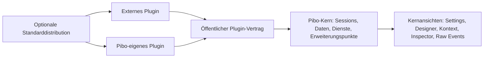
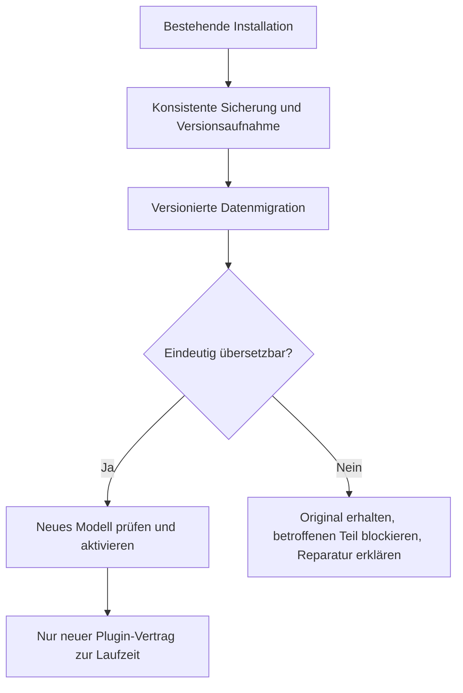

# Zweck und Verbindlichkeit

Dieser Plan beschreibt die verbleibende Arbeit bis zum sauberen Plugin-Modell von Pibo 4.0. Der große Umbau ist bereits vorhanden. Jetzt werden die verbliebenen Sonderwege entfernt, der Kern tatsächlich unabhängig ausgeliefert und alle Erweiterungen über denselben öffentlichen Vertrag angebunden.

Die nachfolgende Zielarchitektur ist **geplantes Verhalten**, keine Behauptung über bereits fertigen Code. Der Auftraggeber hat am 14. September 2026 die vollständige Umsetzung freigegeben. Die [laufende To-do-Liste](/plans/pibo-4-0-plugin-completion-todo.md) verfolgt F00–F10, neue Befunde und Nachweise. Die ursprüngliche Planänderung führte keine Implementierung aus; der aktuelle Umsetzungsauftrag autorisiert die Arbeit am gesamten Plan einschließlich seiner Validierung. Veröffentlichung und Merge bleiben separate Aktionen.

Dieser Plan führt die festgelegten Restentscheidungen aus dem [bisherigen Umbauplan](/plans/unified-plugin-system-rebuild.md) fort. Bei Widersprüchen zu dessen pauschaler Aussage „alle Produktoberflächen sind Plugins“, zur alten Default-Komposition, zu tolerierten Legacy-APIs oder zum OMP-Ausbau ist **dieser Plan maßgeblich**. Sonstige Anforderungen, insbesondere Daten-, Kontext- und UI-Parität, bleiben bestehen. Das [bisherige Ausführungsprotokoll](/plans/unified-plugin-system-execution.md) bleibt Nachweis vergangener Arbeit; alte offene Checkboxen bedeuten nicht automatisch, dass deren Implementierung erneut erforderlich ist.

Arbeitsbasis ist `beta/4.0-plugin-system`, Commit `8817384f465a6cfe7d9cc66b9a11f8d438196aa5`, im bestehenden Worktree `/root/code/pibo/.worktrees/plugin-system-rebuild`. Vor Umsetzung wird der dann aktuelle Beta-Stand erfasst; kein Neustart des Umbaus von einem älteren Development-Stand. Der Controller-Gateway bleibt unangetastet. Code und Laufzeitprüfungen gehören in einen isolierten Docker-Worker, spätere integrierte Nutzerabnahme nach Pibo2.

# 1. Überblick für Produktverantwortliche

**Das Ziel:** Pibo ist ein eigenständig startbarer Kern. Erweiterungen bringen ihre Werkzeuge, Dienste, Ansichten, Einstellungen und Kontextbeiträge selbst mit. Unsere eigenen Erweiterungen benutzen dieselben Schnittstellen wie Plugins anderer Entwickler. Der Kern kennt diese konkreten Plugins nicht.



Die Pfeile zeigen Abhängigkeiten. Es gibt keinen umgekehrten Import vom Kern zu Preview, Goal, einer bestimmten Runtime oder deren Werkzeugen. Ein allgemeiner Plugin-Loader darf installierte Pakete natürlich zur Laufzeit laden; das ist keine fest eingebaute Produktabhängigkeit.

Eine Standardinstallation darf weiterhin die vertraute Pibo-Ausstattung anbieten. Sie ist eine Zusammenstellung unabhängiger Pakete. Eine Minimalinstallation enthält dieselben Kernfunktionen, aber keine versteckt vorausgesetzten Erweiterungen.

Die Abschlussarbeit besteht aus fünf Teilen:

1. Kernverträge vervollständigen und alle konkreten Tool-/Plugin-Sonderfälle daraus entfernen.
2. Funktionspakete samt Backend, Tools, UI und Datenzuständigkeit wirklich trennen.
3. Minimaldistribution und externe Entwicklung ohne Zugriff auf interne Pibo-Dateien ermöglichen.
4. Alte Daten automatisch übernehmen und die alten ausführbaren Schnittstellen entfernen.
5. Bestehendes Verhalten gezielt nachweisen und Dokumentation an den fertigen Stand angleichen.

# 2. Festgelegte Zuständigkeiten

Diese Entscheidungen stammen vom Auftraggeber. Ihre grundsätzliche Produktzuordnung wird während der Umsetzung nicht erneut geöffnet.[^owner-completion]

| Bestandteil | Zielzuständigkeit | Konsequenz |
|---|---|---|
| Plugin-Host, Installation, Konfigurationsspeicher, öffentlicher SDK-Vertrag | Kern | Müssen ohne Erweiterung verfügbar sein; keine Abhängigkeit vom zu installierenden Paket. |
| Pibo Sessions, Rooms, Profile, ausgewählte Runtime-Bindings, neutrales Produktprotokoll | Kern | Identitäten und Daten bleiben bei Deinstallation von Erweiterungen bestehen. |
| Web-Zugang, Authentifizierung, grundlegende Chat-/Session-Oberfläche, Tab-Verwaltung | Kern | Die ausdrücklich notwendigen Kernansichten dürfen nicht durch ein fehlendes Web-/Produkt-Plugin ausfallen. Keine Modell-Ausführung ohne installierte Runtime. |
| Settings einschließlich Plugin-Verwaltung | Kernansicht | Immer vorhanden, nicht als Plugin deaktivierbar. Erweiterungen können ihre eigenen Einstellungen dort beisteuern. |
| Agent Designer | Kernansicht | Immer vorhanden; zeigt verfügbare Runtime-/Plugin-Angebote und verständliche Leerzustände. |
| Kontext einschließlich eigener Skills, Kontextdateien und Kontextinspektion | Kernansicht und Kernressourcen | Ohne Plugin nutzbar; Plugins dürfen eigene Ressourcen und Erweiterungen beitragen. |
| Session Inspector | Kernansicht | Bleibt runtime-neutral; adapterspezifische Details kommen über Beiträge der Runtime. Nicht mit Runtime Requests verwechseln. |
| Raw Events | Kernansicht | Neutrale Diagnose gespeicherter/live Ereignisse, ohne Import einzelner Runtime- oder Featureimplementierungen. |
| Preview | Eigenes Plugin | Preview-Dienst, Ansichten, dazugehörige Werkzeuge/CLI-Beiträge und Einstellungen kommen zusammen. |
| Web Annotations | Eigenes Plugin | Tools, API-/Ereignisbeiträge, Ansichten und Einstellungen gehören zum selben fachlichen Paket. |
| Goal/Loops | Eigenes Plugin | Appweiter Dienst und optionales Agent-Tooling bleiben getrennt aktivierbar; zugehörige Loop-Ansicht gehört zum Plugin. |
| Cron Jobs | Eigenes Plugin | Zeitplanlogik, Verwaltung, zugehörige Tools/Channels und UI sind Erweiterung. Allgemeine Persistenz-/Ausführungsdienste dürfen vom Kern bezogen werden. |
| Workflows | Erweiterung | Vorhandene Funktion erhalten und paketieren; keine neue Workflow-Engine im Rahmen dieses Plans. |
| Pi und Codex Native | Jeweilige Runtime-Plugins | Adapter, Implementierung und runtimeeigene Abhängigkeiten werden nicht vom Kern importiert. |
| Runtime Requests | Ziel: Beitrag des Codex-Native-Plugins | Tab und Inline-Interaktion gemeinsam anbinden; andere tatsächliche Nutzer vor Verschiebung prüfen, siehe Abschnitt 5. |
| Oh My Pi / OMP | Runtime-Plugin im Erhaltungsumfang | Muss installierbar und im bisherigen normalen Betrieb funktionsfähig bleiben. Keine neue Recovery, Migrationserweiterung oder Runtimewechsel-Unterstützung. |
| Pibo-eigene Tools, Run-Control, Delegation, File Editing, Browser Tools, Search, MCP-Integration, Speech/Transcription | Fachlich zugeordnete Plugins | Kein im Core verbleibender Tool-Katalog oder Namensdispatch. Allgemeine Ausführungsmechanismen und Lifecycle bleiben Kernverträge. |

**Harness-eigene Tools** wie native Pi-/Codex-Werkzeuge bleiben Sache der jeweiligen Runtime. „Keine eingebauten Tools“ bezieht sich auf Pibo-eigene Erweiterungswerkzeuge im Kern; native Harness-Werkzeuge werden nicht künstlich erneut als Pibo-Tools implementiert.

Ein Plugin braucht keinen Tab. Es kann nur Werkzeuge, nur Kontext, nur einen Systemdienst, nur UI oder eine Kombination liefern. Keine automatisch erzeugten leeren Tabs. Runtime-Auswahl ist weiterhin eine Auswahl installierter Runtime-Angebote; deren Systemaktivierung wird nicht als Agent-Capability umgedeutet.

# 3. Zielverträge und Architekturregeln

## C40-BOUNDARY-001: Keine fachlichen Plugin-Abhängigkeiten im Kern

Der ausgelieferte Kern MUSS ohne Import von Featurepaketen und ohne deren transitive Runtime-Abhängigkeiten bauen und starten. Er DARF keine Listen konkreter Erweiterungstoolnamen, Präfixabfragen, Plugin-ID-Sonderfälle, fest verdrahtete Feature-Renderer oder dynamische versteckte Imports besitzen, die eine konkrete Erweiterung funktionsfähig machen.

Zulässige Grenzen sind:

- allgemeine Schnittstellen, etwa Tool-Ausführung, Session-Zugriff, Persistenz, Ereignisse, UI-Beiträge und Runtime-Operationen;
- die ausdrücklich in Abschnitt 2 festgelegten Kernansichten;
- isolierte Datenmigration mit alten IDs/Formaten, ohne alten Ausführungscode;
- eine separate Standarddistribution, die konkrete Pluginpakete auswählt;
- Tests und Entwicklungsfixtures außerhalb des ausgelieferten Kerns.

Ein neuer Name für den bisherigen Built-in-Katalog oder eine ausgelieferte Default-Liste in einem Core-Unterordner erfüllt die Trennung nicht. Die Prüfung umfasst Importgraph, Paketinhalt, Startpfade und tatsächliche Installation, nicht nur Textsuche.

## C40-SDK-001: Gleicher Vertrag für eigene und externe Plugins

Ein externer Entwickler MUSS ein Plugin außerhalb des Pibo-Repositories bauen, paketieren, installieren und ausführen können, ohne Pibo-Quellcode zu verändern. Pibo-eigene Plugins erhalten keine private Abkürzung oder Zulassung nach Namen.

Der öffentliche Vertrag umfasst mindestens:

- Manifest, Identität, Version, Abhängigkeiten sowie deklarierte System- und Agent-Beiträge;
- Tool-Schema, Ausführungsfunktion bzw. Factory, Fehler, Abbruch, Fortschritt, Ergebnisse und Ausführungsmodus;
- deklarierte Anforderungen an Runtime-Fähigkeiten und öffentliche Host-Dienste;
- Skills, Kontextbeiträge und Reihenfolge/Ladeverhalten einschließlich Build-Context-Inspektion;
- Backend-/Browser-Beiträge, Ansichten, optionale Settings und Routing-/CLI-/Channel-Beiträge, soweit das Feature sie benötigt;
- Scope, Lebenszyklus, registrierte Ressourcen und geordnete Bereinigung;
- versionierte Plugin-Daten, Konfiguration sowie Upgrade-/Deinstallationsverhalten.

Backend- und Browser-SDK bleiben getrennt, damit keine Node-/Runtime-Abhängigkeiten versehentlich im Browser landen. Öffentliche Exports werden ausdrücklich aufgelistet. Interne Deep Imports und ein breiter Wildcard-Export sind kein Ersatz für fehlende SDK-Verträge.

## C40-SERVICE-001: Zugriff auf den Kern ohne Umkehr der Abhängigkeit

Plugins dürfen die Funktionsweise des Harness über definierte Hooks, Services, Runtime-Adapter und UI-Erweiterungspunkte verändern. Der Vertrag darf nicht auf additive Tabs beschränkt werden. Bestehende Annahme vertrauenswürdigen Plugin-Codes bleibt bestehen; eine neue Sandbox ist nicht Gegenstand dieses Plans.

Der Kern stellt Fähigkeiten bereit, etwa einen Session-Dienst, Ereigniszugriff oder einen Ausführungsdienst. Das Plugin implementiert die fachliche Bedeutung. Fehlende Dienste oder inkompatible Versionen führen vor Aktivierung zu einer erklärten Diagnose. Plugin-zu-Plugin-Abhängigkeiten sind zulässig, müssen aber ausdrücklich im Manifest stehen.

Vereinfachtes Pseudocode-Ziel, keine bereits existierende SDK-Syntax:

```text
Plugin.setup(scope):
    sessions = scope.requireService("sessions", version=1)
    scope.registerTool("beliebiger_name", schema, execute)

execute(input, invocation):
    session = sessions.forInvocation(invocation)
    return pluginEigeneFunktion(session, input)

Kern bei Tool-Aufruf:
    beitrag = effektiverPlan.findeTool(toolId)
    führeRegistrierteFunktionAus(beitrag, gebundenerAufrufkontext)
```

Der Aufrufkontext ist an Session, Runtime-Generation, Plugin-Revision und ausgewählte Beiträge gebunden. Plugin-Konfiguration oder Tool-Auswahl einer anderen Session darf nicht hineingeraten. Keine breite globale Session-Registry als Ersatz für einen öffentlichen Dienst.

Ersetzungen und Hooks benötigen definierte Reihenfolge, Konfliktverhalten, Fehlerbehandlung und Cleanup. Ein aufgehobenes Plugin darf keine Listener, Timer, Renderer, Tool-Credentials oder laufenden Controller unerkannt zurücklassen. Keine automatische Ausweitung auf beliebiges Hot-Reload oder parallele Pluginversionen.

## C40-TOOLS-001: Tool-Factories gehören zum Plugin

Die konkreten Definitionsgeneratoren für Goals, Runs, Delegation und ähnliche Werkzeuge wechseln in ihre fachlichen Pakete. Der zentrale Router darf allgemeine Ausführung, Scheduling, Abbruch und Session-Lifecycle koordinieren; er darf nicht anhand von `pibo_run_*`, `pibo_agents_*`, Goal-Namen oder sonstigen Namen entscheiden, welche Factory aufzurufen ist.

Auslagerbare Ausführung, Fortschritt, Cancel und Ergebnisabholung werden als Tool-Metadaten und allgemeine Dienste angebunden. Run-Control-Tools benutzen diese Dienste. Delegationslogik und ihre Toolnamen gehören zum Delegationspaket, während Session-Erzeugung und generische Parent-/Child-Lifecycle-Verträge beim Kern bleiben können. Goal-spezifische Weiterlaufbedingungen gehören zum Goal-Plugin. Jeder verbleibende Spezialfall erhält einen dokumentierten Owner und wird vor Abschluss beseitigt oder als echter allgemeiner Kernvertrag begründet.

Die bestehende Inkonsistenz in `profileFromPluginPlan()` – Prüfung auf `codex` bei tatsächlich anders benannten Compat-Tools – wird mit dieser Trennung behoben. Eine weitere harte Toolnamensliste als dauerhafter Fix ist nicht das Ziel. Kontext und Verhalten werden aus ausgewählten Beiträgen bzw. deklarierter Plugin-Konfiguration abgeleitet.

## C40-VIEWS-001: Gemeinsamer Tab-Lifecycle, unterschiedliche Eigentümer

Der Kern besitzt Tabs, Session-Zuordnung, Reihenfolge, aktive Instanz, Layout, Cache, Refresh und Before-Leave-Verhalten. Feature-Renderer gehören ihren Plugins. Die fünf festgelegten Kernansichten verwenden dieselbe Tab-Infrastruktur, benötigen aber keine Plugininstallation und dürfen explizite Kernziele haben.

Keine Feature-Allowlist in App, Desktop-Katalog oder Browser-Host. Manifestmetadaten und registrierte Renderer entscheiden über sichtbare Plugin-Module, unterstützte Runtime-Fähigkeiten und Navigation. Auch die zuletzt eingeführte Unterdrückung doppelter Navigation für bestimmte First-Party-IDs wird in eine allgemeine Darstellungsoption überführt.

Die bestehende Bedienqualität bleibt erhalten: kompletter Tab anklickbar, Plus direkt hinter dem letzten Tab, Drag/Resize, lokale Drawer bei schmalem Panel, mobile Navigation, gecachte Panels und gezielter Refresh. Plugin-Autoren dürfen ihr eigenes Layout gestalten. Das gemeinsame First-Party-Design ist eine wiederverwendbare öffentliche UI-Hilfe, kein Zwang zu privaten Core-Komponenten.

## C40-SCOPES-001: System, Agent und Session bleiben unabhängig

Systemaktivierung kontrolliert Plugin-Dienste. Der Agent Designer kontrolliert nur freigegebene agentbezogene Beiträge. Der Session-Arbeitsbereich speichert die für diese Session geöffneten Ansichten. Diese drei Entscheidungen dürfen einander nicht implizit überschreiben.

Beispiel Goal: Systemdienst aktiv; Agent A besitzt Goal-Tools; Agent B besitzt sie nicht; beide können bei vorhandener Berechtigung die appweite Verwaltung nutzen. Das Ausschalten der Agent-Tools stoppt keinen appweiten Dienst. Settings sind keine abwählbare Agent-Capability. Änderungen gelten an den bereits definierten sicheren Generation-Grenzen.

# 4. Paketierung und Minimalbetrieb

## C40-DELIVERY-001: Zwei Kompositionen aus denselben Paketen

Die Umsetzung trennt den Kern von einer optionalen Standardzusammenstellung:

| Komposition | Inhalt | Erwartetes Verhalten |
|---|---|---|
| Minimal | Kern und seine notwendigen Abhängigkeiten, null Plugininstallationen | Verwaltung, Auth, Sessions/History und Kernansichten funktionieren. Keine versteckte Pi-, Codex-, Goal-, Preview- oder Cron-Initialisierung. |
| Standard | Derselbe Kern plus ausdrücklich ausgewählte Pluginpakete | Vertrauter Produktumfang; Plugins bleiben einzeln installierbar und entfernbar. |
| Benutzerdefiniert | Kern plus beliebige kompatible externe/First-Party-Pakete | Keine Maintainer-Codeänderung nötig. |

Die Namen der npm-Pakete und der Distributionsbefehle werden im ersten Arbeitspaket festgelegt. Sie müssen vor der Paketextraktion dokumentiert sein. Ein Monorepo ist zulässig; separate Repositories sind keine Voraussetzung. Entscheidend sind eigenständige Artefakte und geschlossene öffentliche Abhängigkeiten.

**Konkrete Ausgangsbefunde am untersuchten Beta-Commit:** `src/plugins/product-runtime.ts` startet auch bei `installDefaultPlugins: false` noch den Management-Beitrag `pibo.plugin-management`. Dieser Mechanismus muss durch echten Core-Bootstrap ersetzt werden. Zudem erzeugt `src/plugins/default-packages.ts` Backend-Stubs mit Imports auf `@pasko70/pibo/plugin-builtin/...`. Ein separat benanntes Pluginartefakt ist damit noch keine unabhängige Featureauslieferung: Die Implementierung und ihre Abhängigkeiten müssen in das jeweilige Paket wechseln. Auch `src/core/default-profile.ts` darf keine Pi-Toolnamen oder aktiviertes Goal-Control als runtimefreien Default voraussetzen.

Im Minimalpaket dürfen Runtime-SDKs, Feature-Backend-Code und Feature-Browser-Bundles nicht bloß deaktiviert mitgeschleppt werden. Installationsskripte dürfen sie auch nicht heimlich nachladen. Die Standardzusammenstellung liegt außerhalb des Core-Einstiegspunkts. Ein deaktiviertes oder deinstalliertes Plugin wird bei einem Core-Neustart nicht automatisch wieder aktiviert.

Ohne Runtime ist Agent-Ausführung nicht verfügbar. Settings und Designer erklären, dass eine Runtime installiert/ausgewählt werden muss. Profile und bestehende Sessions bleiben sichtbar; fehlende Runtime-Angebote löschen weder Konfiguration noch Bindings. UI-Leerzustände sind keine Fehlerseite und lösen keine Endlosschleife aus. Die Paketgröße und Startabhängigkeiten werden für Minimal und Standard erfasst; ein willkürliches Megabyte-Ziel ersetzt keinen Import-/Inhaltsnachweis.

# 5. Runtime Requests und Runtime-Grenzen

Runtime Requests und Session Inspector sind zwei verschiedene Funktionen. Session Inspector bleibt Kern. Zielzuständigkeit für Runtime Requests ist das Codex-Native-Plugin, weil die ursprünglichen Approval-/User-Input-Anfragen von dessen Protokoll stammen.

Vor dem Verschieben wird der vollständige Pfad erfasst: Produzent, normalisiertes Ereignis, gespeicherter Request-Zustand, Tab, Inline-Darstellung im Chat und Rückantwort. Pi- und OMP-Produzenten oder -Konsumenten dürfen nicht allein aus UI-Namen ausgeschlossen werden.

**Quellenbefund vom 14. September 2026:** Codex Native erzeugt in `src/agent-runtimes/codex-native/requests.ts` die Approval-/User-Input-Anfragen. Pi und OMP deklarieren in ihren Adaptern `approvals.supported: false` und `structuredUserInput: false`. Damit ist Codex Native der in dieser Recherche belegte produktive Produzent; neue Pi-/OMP-Anfragen werden nicht vorausgesetzt. Die neutrale Ereignis-/Pending-/Control-Kette liegt in `src/agent-runtime/events.ts`, `contract.ts` und `routed-session.ts`, SSE in `src/apps/chat/stream.ts`, UI in `runtime-request-panel.tsx` und `session-trace-pane.tsx`. Die Antwortaktionen `runtime.approval.respond` und `runtime.user_input.respond` werden heute über `src/plugins/builtin.ts` und das Sammelpaket `pibo.core` registriert. F05 muss diese versteckte Registrierungsabhängigkeit zusammen mit dem Renderer auflösen. Diese Befunde sind statisch geprüft, kein neuer Laufzeitnachweis.

Zielverhalten:

- Das Codex-Paket liefert erforderliche Request-Renderer und deren Tab-Beitrag sowie die Inline-Anbindung gemeinsam mit dem Adapter.
- Die allgemeine Routing-/Ereignishülle darf im Kern liegen, sofern sie runtime-neutral ist. Die Interpretation nativer Codex-Methoden bleibt im Plugin.
- Der Tab wird über deklarierte Eignung für die gebundene Session angeboten, nicht über eine im Core codierte Prüfung auf `codex-native`.
- Antworten bleiben an Request-ID, Session und Runtime-Generation gebunden; doppelte/veraltete Antworten werden abgefangen. Tabwechsel und Cache dürfen keine Antworten verlieren oder Requests doppelt beantworten.
- Der Nutzer kann eine ausstehende Anfrage weiterhin im normalen Chat bearbeiten. Ein zusätzlicher Tab ist kein Pflichtweg und keine zweite unabhängige Request-Queue.
- Deaktivierung/Upgrade bei ausstehenden Anfragen beachtet den bestehenden Drain-/Busy-Vertrag. Kein stilles Verwerfen und kein automatisch erteiltes Approval.
- Falls andere Runtimes bereits denselben Vertrag produktiv benutzen, wird deren bestehendes Verhalten erhalten: durch eine öffentliche gemeinsame UI-/Protokollhilfe oder explizite Paketabhängigkeit. Das wird als konkrete Implementierungsentscheidung dokumentiert, ohne neue Pi-Request-Features zu entwickeln.

## OMP-Ausnahme

OMP bleibt als Plugin lieferbar. Die für neue Paketgrenzen notwendigen Imports und SDK-Anschlüsse werden angepasst; bestehende normale Session-Erzeugung, Nachrichten und bisher unterstützte Wiederaufnahme müssen weiter funktionieren. Es wird kein neuer automatischer History-Rebuild, keine zusätzliche Sessionwechsel-/Cross-Runtime-Anbindung und keine neue Migrationsgarantie entwickelt. Bereits vorhandene Identitäten, Dateien und Historie bleiben erhalten.

Bekannte fehlende Recovery nach nicht sicher auflösbarer nativer Session bleibt dokumentierte Einschränkung und blockiert 4.0 nicht. „Keine neue OMP-Migration“ erlaubt weder Datenlöschung noch das Fallenlassen des funktionierenden Plugins. Pi und Codex Native bleiben im vollständigen zugesagten Native-first-/Fallback-Umfang.

# 6. Migration und Entfernung des alten Modells

## C40-UPGRADE-001: Daten übernehmen, alte Ausführung entfernen

Das Upgrade unterstützt bestehende 3.6.2-Daten und den bereits migrierten 4.0-Beta-Zustand. Die zweite Quelle ist wichtig: Aktuelle Tabs, Plugin-IDs und teilweise migrierte Profile dürfen durch die neue Paketaufteilung nicht verloren gehen.



Vor Veränderungen werden Datenbanken einschließlich benötigter WAL-/Checkpoint-Konsistenz, Konfigurations-/Ressourcendateien, Installationsbestand und relevante native Session-Locators gesichert. Der Sicherungsplan unterscheidet Pibo Home von außerhalb liegenden Runtime-Transkripten. Eine reine Kopie von `pibo.sqlite` darf nicht als vollständiges Session-Backup bezeichnet werden. Keine Auth-Geheimnisse in Logs oder veröffentlichten Artefakten.

Migrationen sind versioniert, wiederaufnehmbar, konfliktbewusst und durch gesicherte Originalzustände nachvollziehbar. Plugin-Migrationscode wird erst aus einem verifizierten neuen Paket geladen; alte ausführbare Erweiterungen werden nicht als Datenimporter aktiviert. Soweit mehrere Datenbanken beteiligt sind, werden Schritte journalisiert und abgeglichen statt eine nicht vorhandene globale Transaktion zu behaupten.

Zu erhalten sind insbesondere:

- aktive/archivierte Profile, IDs, Aliase, Modelle, Runtime-Optionen, Tool-Auswahl und Ausführungsfilter;
- Skills und Kontextdateien samt Bytes, Reihenfolge, Quellen, Ladeverhalten und Referenzen;
- MCP-Auswahl, Subagent-Ziele und Overrides;
- Pibo Session-/Room-Identität, Historie, Runtime-Bindings und native Locator-Provenienz;
- appweite, agentbezogene und sessionbezogene Plugin-Konfiguration;
- tabbezogene IDs, Reihenfolge, aktive Instanz, Einstellungen und gespeicherte Zustände;
- Preview-/Annotations-/Goal-/Cron-/Workflow-Daten einschließlich Verknüpfungen und Job-Zustand.

Bereits fehlende Referenzen bleiben als solche erkennbar. Eine erfolgreiche Migration darf keine Defaults aktivieren, die vorher nicht aktiv waren. Bei nicht eindeutig zuordenbaren Beiträgen bleiben Daten erhalten und der betroffene Teil erhält einen konkreten Reparaturhinweis. Gesunde Profile sollen dadurch nicht unnötig blockiert werden.

Aufteilung bisheriger Sammelpakete braucht eine explizite alte-ID-zu-neuem-Owner-Tabelle: beispielsweise Produkt-UI zu Kernansicht oder eigenem Featurepaket. Interne Settings-/Tab-IDs werden übersetzt, ohne der aktuell ausgewählten Session fremde Tabs zuzuordnen. Diese Tabelle gehört zur Migration; der normale Tab-Renderer erhält keine dauerhafte Liste historischer Feature-Aliase.

Native-first bleibt erhalten: vorhandene native Session finden und weiterverwenden; nur sicher nachgewiesene Abwesenheit erlaubt den bestehenden begrenzten History-Import bei Pi/Codex. Auth-, Rechte-, Korruptions- oder vorübergehende Fehler führen nicht zu leerem Ersatz. OMP gilt gemäß Abschnitt 5.

## C40-LEGACY-001: Keine alten ausführbaren Erweiterungs-APIs im Delivery

Nach Umstellung der Aufrufstellen werden entfernt:

- synchrone Legacy-Registrierung einschließlich `registerPlugin`, der zugehörigen `createApi` und `definePiboPlugin`, soweit sie den alten Vertrag bilden;
- alte `PiboPlugin`-/`PiboPluginApi`-Exports und veraltete externe Tool-Assembly-Schnittstellen;
- `subagentRunner`-Kompatibilität und sonstige Übergangsparameter statt ihrer öffentlichen Nachfolger;
- die Registry-Kompatibilitätsfassade, nachdem ihre produktiven Leser auf Host-/Service-Verträge umgestellt sind;
- alte ausführbare Pi-Package-/Discovery-Fallbacks, Default-Registries und doppelte Ausführungspfade;
- Laufzeitinterpretation veralteter Manifestfelder, soweit diese durch versionierte Import-/Upgradeschritte ersetzt werden können;
- unkontrollierte öffentliche Deep Imports über Wildcard-Exports.

Legacy-Namen dürfen in isolierten Datenformatlesern, Zuordnungstabellen, historischen Dokumenten und Migrationsfixtures vorkommen. Sie dürfen nicht zur Ausführung eines alten Plugins führen. Neue Fehlermeldungen benennen den 4.0-Nachfolger statt eine alte API weiter als supported anzubieten.

Alte Tests werden nach bewiesenem Verhalten eingeordnet: Produktverhalten erhalten; Tests der ausdrücklich entfernten API dürfen auf die öffentliche Nachfolgeschnittstelle umgestellt werden. Tests nur deshalb zu löschen, weil sie die neue Architektur auf Fehler hinweisen, ist unzulässig.

## Rollback

Rollback verwendet das vorherige Paketset und eine dazu konsistente Sicherung. Kein Downgrade älterer Software auf bereits inkompatibel umgeschriebene Daten ohne unterstützten Rückweg. Während Cutover werden neue Schreibvorgänge entweder kontrolliert angehalten oder nachvollziehbar abgegrenzt. Nach dem Cutover neu entstandene Daten dürfen bei Rücksicherung nicht stillschweigend verworfen werden. Vor dem Release wird ein unterbrochener Upgrade-Lauf samt Wiederaufnahme und ein tatsächlicher Restore in isolierter Umgebung belegt.

# 7. Arbeitspakete und Reihenfolge

Alle folgenden Pakete sind bei Erstellung **offen**. „Implementiert“, „gezielt geprüft“ und „integriert akzeptiert“ werden getrennt dokumentiert. Ein Agent bearbeitet ein zusammenhängendes Paket bis zu einem reviewbaren Ergebnis; keine künstlichen Mini-Aufträge oder parallelen Änderungen an denselben zentralen Dateien.

## F00 – Abhängigkeiten und Paketgrenzen festziehen

- [ ] Vorhandene First-Party-Pakete, Core-Imports, transitive npm-Abhängigkeiten, Browser-Bundles, CLI-Kommandos, Dienste und Datenbesitzer inventarisieren.
- [ ] Management-Bootstrap, `plugin-builtin/*`-Artefaktstubs und Default-Profil als konkrete bestehende Hindernisse für pluginfreien Core-Betrieb erfassen.
- [ ] Für jede Erweiterung Owner für Backend, Tool-Factories, UI, Settings, Kontext, Datenmigration, Tests und Dokumentation festhalten.
- [ ] Alle Toolnamens-/Plugin-ID-Sonderfälle erfassen, einschließlich Router, Kontextaufbau, Tab-Katalog, Browser-Host, Debug und Startpfaden.
- [ ] Öffentliche Service-/Hook-Lücken und tatsächliche Runtime-Request-Nutzer benennen.
- [ ] Konkrete Paketnamen, Versionsbeziehungen, Exportgrenzen und Minimal-/Standard-Komposition festlegen; Entscheidungen im Plan ergänzen.

Einstieg: `src/plugins/default-packages.ts`, `src/plugins/product-runtime.ts`, `src/plugins/registry.ts`, `src/core/session-router.ts`, `src/tools/session-tool-set.ts`, `src/agent-runtime/plugin-plan.ts`, `package.json` und Browser-Komposition.

**Fertig, wenn:** Für jede heutige Funktion ein Zielowner existiert; kein „misc builtin“ versteckt Restlogik. Offene Schnittstellen sind als konkrete Folgearbeit beschrieben. Abhängigkeiten: keine.

### F00-Entscheidung: Paket-, Export- und Servicegrenzen

Die Quellinventur am Ausgangscommit bestätigt neben N-001 bis N-004 weitere harte Restgrenzen: Root-`./*`-Export, produktive `PiboPluginRegistry`-Leser, konkrete Toolfamilien in Session-Tool-Assembly und Context-Build, feste Feature-IDs in App/Desktop/Browser-Host, normale Interpretation alter Manifestfelder sowie statische Runtime-/Featureabhängigkeiten im Root-Artefakt. Der Arbeitsnachweis liegt in `/tmp/pibo4-f00-boundaries.md`; das laufende Ledger führt die Befunde N-005 bis N-010.

Der Core behält den Paketnamen `@pasko70/pibo`. Seine einzigen öffentlichen Code-Subpaths sind `./plugin-sdk` für JSON-/Browserverträge, `./plugin-host` für Backend-Setup und Host-Lifecycle sowie neu `./plugin-runtime` für Runtime-Adapter, sessiongebundene Tool-Provider und Runtime-Request-Beiträge. `./package.json` bleibt lesbar. Der Wildcard-Export und `./plugin-builtin/*` entfallen. First-Party-Pakete dürfen dieselben öffentlichen Subpaths wie externe Pakete verwenden, aber keine Repo-internen Deep Imports.

Die Standardzusammenstellung heißt `@pasko70/pibo-standard`. Fachpakete verwenden die Koordinate `@pasko70/pibo-plugin-<fachname>` und bleiben einzeln versioniert: `preview`, `web-annotations`, `goal-loops`, `cron`, `workflows`, `runtime-pi`, `runtime-codex-native`, `runtime-omp`, `code-runtime`, `file-editing`, `web-search`, `browser-tools`, `gateway-tools`, `codex-compat`, `run-control`, `agent-delegation`, `mcp-cli`, `transcription-openai-chatgpt`, `transcription-openai` und `standard-profiles`. Auth, Web-Grundzugang, Pluginverwaltung, User Resources, Settings, Agent Designer, Context, Session Inspector, Raw Events und Standard Shell bleiben Core.

Core stellt versionierte Host-Dienste für Pluginverwaltung, Sessionplan, Produktoptionen, Session-/Generation-Kontext, Ereignisse, Persistenz und allgemeine Runtime-Controls bereit. Ausführbare Pluginwerkzeuge kommen über einen öffentlichen sessiongebundenen Providervertrag; der Core iteriert ausgewählte Provider und deklarierte Services, ohne Namen oder Plugin-IDs auszuwerten. Runtime Requests verwenden die runtime-neutrale Pending-/Event-/Control-Hülle; Codex Native liefert Eignung, Renderer-Metadaten und Antwortaktionen. Pi und OMP behalten `false` für Approval und Structured Input.

Minimal startet Core-Dienste mit null Plugininstallationen. Standard ist eine explizite Paketliste außerhalb des Core-Starts und respektiert vorhandene Deaktivierung/Deinstallation. Weil der sichere Installer absichtlich keine fremden `npmDependencies` nachinstalliert, enthalten First-Party-Pakete self-contained Backend- und, soweit benötigt, Browser-Bundles; nur die öffentlichen Core-SDK-Subpaths bleiben externe Peer-Grenze. Kein erzeugtes Artefakt importiert Implementierung aus dem Core. Der bisherige zentrale `pibo-builtin-plugin.js`-Chunk wird in einen kleinen Core-Entry und fachliche Browserartefakte getrennt. Alte IDs bleiben ausschließlich in versionierten Datenmappings und historischen Fixtures.

Die Umwidmung von `@pasko70/pibo` vom Monolithen zum Minimal-Core erzeugt eine eigene Upgrade-Anforderung. Der reproduzierbare Distributionsweg ist zweistufig: Die noch alte, monolithische Installation erzeugt zuerst einen versionierten Cutover-Plan mit Paketversionen, Content-Hashes und der belegten Zuordnung jeder alten aktiven, deaktivierten oder deinstallierten Auswahl zu neuen Artefakten. Anschließend installiert ein expliziter 4.0-Upgrade-/Standard-Bundle-Schritt nur die laut Altzustand benötigten neuen Pakete, prüft ihre Artefakte und migriert die Daten; erst nach erfolgreicher Prüfung wird der neue Minimal-Core aktiviert. Ein direktes Paketupdate mit erkanntem, aber nicht vorbereitetem Monolith-/Beta-Zustand bricht mit einer konkreten Upgrade-Anweisung ab, statt still ohne bisher benötigte Features oder Runtimes zu starten. Frische Minimalinstallationen erzeugen keinen Cutover-Plan und installieren keine Defaults. Bewusst deaktivierte, deinstallierte oder nicht ausgewählte Pakete werden durch Cutover oder Standardzusammenstellung nicht reaktiviert.

## F01 – Öffentliche Host-Dienste und Tool-Verträge vervollständigen

- [ ] Sessiongebundene Tool-Factories, Ausführungsmodi und Lifecycle ausschließlich über öffentliche Verträge ermöglichen.
- [ ] Dienste und Hooks für benötigte Ausführung, Run-Steuerung, Delegation, Ereignisse, Persistenz und Kontext anbieten; fachliche Logik bleibt im Plugin.
- [ ] Versions-/Abhängigkeitsprüfung, deterministische Konflikte, Scope/Cleanup und sichere Generation-Bindung erhalten.
- [ ] Backend-/Browser-/Runtime-SDK-Exports explizit festlegen; keine private First-Party-API.
- [ ] Ein außerhalb des Repositories gebautes Plugin mit frei gewählten IDs und Toolnamen an diesem Vertrag erproben.

**Fertig, wenn:** Das externe Paket registriert Tool, Kontext, Settings und optional eine View ohne Core-Patch; inkompatible Pakete liefern eine verständliche Diagnose. Abhängigkeit: F00.

### F01-Entscheidung: einzeln ausgewählte Session-Tools

Ein `session-tool-provider` ist appweite Infrastruktur und keine pauschale Agent-Capability. Jedes von ihm erzeugbare Tool bleibt eine eigene agentbezogene `tool`-Contribution mit Name, Runtimeprädikat, Konfiguration, Auswahlzustand und expliziter `sessionToolProvider`-Abhängigkeit. Der Resolver übergibt dem Provider pro Generation ausschließlich diese tatsächlich ausgewählten und runtimekompatiblen Toolbeiträge. Die Materialisierung verwirft nicht deklarierte, abgewählte, doppelte, ausgelassene, namensfalsche oder schemafreie Definitionen. Der Ausführungskontext wird an den einzelnen Toolbeitrag gebunden, nicht nur an den Sammelprovider.

Provider-Cleanup darf synchron oder asynchron sein. Session- und Router-Drain widerrufen zuerst die Generation, warten dann alle Cleanup-Schritte in umgekehrter Reihenfolge ab und geben die Generation-Zulassung nur bei vollständigem Erfolg frei. Cleanup-Fehler bleiben aggregiert sichtbar. Der F01-Nachweis nutzt ein außerhalb des Repositorybaums erzeugtes TypeScript-Fixture über die öffentlichen Subpaths; der lokale Paketsymlink ist ausdrücklich nur API-Vorprüfung. Der symlinkfreie Nachweis aus gepackten Minimal-/Pluginartefakten bleibt F06.

## F02 – Pibo-Tools und fachliche Controller aus dem Kern lösen

- [ ] Goals, Runs, Delegation, Code Runtime, Codex Compat, File Editing, Browser Tools und weitere inventarisierte Familien über F01 anbinden.
- [ ] Toolnamenslisten und konkrete Factory-Auswahl aus Core/Router/Context-Build entfernen.
- [ ] Kontext-/Prompt-Erzeugung aus dem Plugin-Plan ableiten und Codex-Compat-Inkonsistenz ohne neue Namenssonderliste beheben.
- [ ] Run-Abbruch, Fortschritt, Ergebnisabholung, Parent-/Child-Korrelation und Ressourcencleanup in den bestehenden Verhaltensprüfungen erhalten.

Einstieg: `src/tools/session-tool-set.ts`, `src/core/context-build.ts`, `src/core/session-router.ts`, `src/plugins/packaged-control-tools.ts`, `src/plugins/packaged-tool-families.ts`, `src/agent-runtime/plugin-plan.ts`.

Eine generisch benannte Core-Service-Factory erfüllt diese Grenze nicht, wenn der Core weiterhin den konkreten Feature-Controller konstruiert, dessen Toolnamenkonstanten importiert oder featurebezogene Reminder und Metadaten formatiert. Das Featurepaket konstruiert und registriert seinen Controller selbst über generische Session-Orchestrierungs- und Lifecycle-Dienste. Allgemeine Run-Scheduling-/Cancellation-Primitiven dürfen Core sein; konkrete Toolcontroller, Remindertexte und Featuremetadaten nicht.

**Fertig, wenn:** Der Kern kann eine neue gleichartige Toolfamilie ohne Codeänderung ausführen und hat keine Kenntnis ihrer fachlichen Namen oder Implementierungsimports. Abhängigkeit: F01.

## F03 – Kernansichten aus Sammelplugins lösen

- [ ] Settings, Agent Designer, Kontext, Session Inspector und Raw Events als feste Core-Angebote registrieren.
- [ ] Benutzerressourcen, Verwaltung und grundlegenden Web-Zugang ohne `pibo.product-ui`, `pibo.user-resources` oder anderes zwingendes Featurepaket betreiben.
- [ ] Plugin-Erweiterungspunkte der Kernansichten erhalten; adapterspezifische Inspector-Details deklarativ anbinden.
- [ ] Sessiontab-Lifecycle unverändert verwenden; keine zweite Tab-Verwaltung für Core-Ansichten einführen.

**Fertig, wenn:** Die fünf Kernansichten sind ohne Plugins nutzbar und enthalten verständliche Leerzustände. Abhängigkeiten: F00, relevante UI-Verträge aus F01.

## F04 – Featurepakete einschließlich ihrer Oberflächen trennen

- [x] Preview, Web Annotations, Goal/Loops, Cron und Workflows als unabhängig auslieferbare Pakete abschließen; gepackte npm-Artefakte werden in F06 belegt.
- [x] Je Paket alle benötigten Dienste, API-/Channel-/CLI-Beiträge, Tools, Settings, Kontext und Ansichten mitliefern.
- [x] Feature-Einträge aus `DesktopSessionTool` und festem Plugin-ID-App-Dispatch entfernen; nur echte Kernziele behalten.
- [x] Gemeinsames First-Party-Navigationsdesign als wiederverwendbare Hilfe anbieten; keine Plugin-ID-Allowlist im Host.
- [x] Plugin-Abhängigkeiten explizit deklarieren; keine implizite Preview- oder Cron-Abhängigkeit über einen globalen Import.
- [x] Deinstallation erhält Daten/Tabzustände und zeigt fehlende Angebote verständlich; Wiederinstallation stellt zuordenbare Zustände wieder bereit.
- [ ] Run-/Delegation-Pakete konstruieren und registrieren ihre Controller über generische Session-Orchestrierungs-/Lifecycle-Dienste; Core importiert weder Feature-Factories noch Toolnamen oder konkrete Reminderformatter.

Einstieg: `src/apps/chat-ui/src/desktop-tabs-model.ts`, `src/apps/chat-ui/src/App.tsx`, `src/apps/chat-ui/src/plugins/plugin-workspace.tsx`, `src/apps/chat-ui/src/plugins/builtin-browser-entry.tsx`, jeweilige `packaged-*`-Module.

**Fertig, wenn:** Installation eines Featurepakets genügt für seine vollständige Funktion; Entfernen beeinträchtigt keine unabhängigen Kernansichten. Abhängigkeiten: F01–F03; Datencutover erst mit F07.

### F04-Zwischenstand: generische Run-/Child-Orchestrierung

N-022 ist im Quell- und Verhaltenspfad umgesetzt. Der Core stellt nur noch generationgebundene, fachlich neutrale Dienste für Yielded-Run-Scheduling sowie Parent-/Child-Session-Lifecycle, Ausgabe, Abbruch, Cursor und Cleanup bereit. Das Delegationspaket konstruiert seinen Controller selbst und besitzt Toolname, Child-Metadaten, Agentdarstellung und Beobachtungsprojektion. Das Run-Control-Paket besitzt seinen Remindertext und dessen Erkennung; der Core dispatcht nur nach der semantischen Service-Message-Fähigkeit. Die alte Controller-Injection der Portable-Tool-Session einschließlich `subagentRunner` ist entfernt.

Der fokussierte Nachweis umfasst Root-Emit und 56 Run-/Delegation-/Reminder-/Portable-/Codex-Ressourcentests; `/tmp/pibo4-f04-n022.md` protokolliert die Befunde. Diese Quellprüfung ersetzt den F06-07-Nachweis nicht: Erst Importgraph und Inhalt des gepackten Minimal-Core belegen die physische Delivery-Grenze.

### F04-Abschluss: getrennte Featureoberflächen

Preview, Cron und Workflows besitzen getrennte Backendmodule; Preview, Cron, Workflows, Goal/Loops, Web Annotations, Build Context und die Toolfamilien besitzen getrennte stabile Browserentries. `metadata.chatRoute` ordnet bestehende Produkt-Routen installierten Beiträgen zu, ohne konkrete Plugin-ID im App-Dispatch. `view.subviewNavigation` legt deklarativ fest, ob Host oder Renderer die interne Navigation zeichnet; die frühere First-Party-Allowlist ist entfernt. Preview und Web Annotations sind keine `DesktopSessionTool`-Werte mehr. Fehlende Featurepakete liefern einen verständlichen Leerzustand und lassen Sessiontab-/Datenzustand für eine Wiederinstallation bestehen.

Root-Emit, Chat-UI-Typecheck/-Build und 39 fokussierte Feature-/UI-/Cachetests sind grün; `/tmp/pibo4-f04-feature-packages.md` enthält den Nachweis. Die Module werden im Arbeitsbaum bereits nach Owner getrennt, aber der Beleg eigenständiger self-contained npm-Artefakte und der physische Minimal-Core-Importgraph gehören weiterhin zu F06. Historische Product-UI-IDs bleiben bis F07 ausschließlich Cutover-Eingang; F08 entfernt danach ihre ausführbaren Übergangsmodule.

## F05 – Runtimepakete und Runtime Requests abschließen

- [ ] Pi-/Codex-/OMP-SDKs und Implementierungen aus statischen Core-Imports und Installationsabhängigkeiten entfernen.
- [ ] Runtime Requests gemäß Abschnitt 5 zuordnen, inklusive Inline-Chat und Antwortweg; vorhandene andere Verbraucher erhalten.
- [ ] Registrierung der Antwortaktionen aus `pibo.core` lösen; Plugin-Requests über öffentliche Actions/Controls anbinden, ohne Codex-Fallunterscheidung im Kern.
- [ ] Session Inspector bleibt Kern und verwendet allgemeine Runtime-Inspektion.
- [ ] Pi-/Codex-Wiederaufnahme und vorhandene Reconstruction-/Binding-Verträge erhalten.
- [ ] OMP nur soweit für Paketgrenzen nötig anpassen und normalen Betrieb prüfen; bekannte Recovery-Grenze dokumentieren.

**Fertig, wenn:** Keine Runtime ist Voraussetzung für den Core-Start; eine installierte Runtime bringt ihre Angebote selbst mit. Request-Antworten bleiben funktionsfähig. Abhängigkeiten: F01, F03, gemeinsame UI-Verträge aus F04.

## F06 – Minimal- und Standarddistribution bauen

- [ ] Eigenständiges Core-Artefakt ohne Featurecode und Runtime-SDKs erstellen.
- [ ] Standardzusammenstellung aus separaten versionierten Pluginartefakten bauen; vorhandene Auswahl respektieren.
- [ ] Paketinhalt, installierte Abhängigkeiten und Browser-Bundles prüfen, nicht nur einen Start mit Disabled-Flags.
- [ ] Frische Minimalinstallation ohne Cache und ohne Quellcheckout starten; Plugin anschließend installieren und nutzen.
- [ ] Öffentliche Paket-/SDK-Kompatibilität und verständliche Diagnose bei Versionskonflikten prüfen.
- [ ] Einen gepackten alten Monolith-/Beta-Stand über den zweistufigen Cutover auf gepackten Minimal-Core plus exakt gemappte Artefakte aktualisieren; ein unvorbereiteter Direktwechsel muss fail-closed bleiben.
- [ ] Den gepackten Minimal-Core per Importgraph und Artefaktinhalt darauf prüfen, dass Run-, Delegation- und andere Featurecontroller, Toolnamen sowie konkrete Reminder-/Metadatenimplementierungen nicht benötigt oder mitgeliefert werden.

**Fertig, wenn:** Minimalbetrieb und nachträgliche externe Erweiterung sind aus echten gepackten Artefakten nachgewiesen. Abhängigkeiten: F02–F05; Migration von Bestand mit F07.

## F07 – Migration an neue Eigentümer und Paketgrenzen anpassen

- [ ] Bestehende versionierte Migration wiederverwenden und um neue Owner-/Paket-/Tab-Zuordnungen ergänzen.
- [ ] 3.6.2-Ausgangsdaten sowie aktuelle/teilmigrierte Beta-Daten abdecken.
- [ ] Konsistentes Backup, Wiederaufnahme, Konfliktpfade und Restore dokumentieren und gezielt prüfen.
- [ ] Effektive Tools und Kontext vor/nach Migration vergleichen; alle vorhandenen Benutzerressourcen und produktiven Daten erhalten.
- [ ] Alte Produkt-UI-Ziele zu Core- oder Plugin-Zielen übersetzen; fremde Sessiontabs nie übernehmen.
- [ ] Gesunde Profile bei isolierten Fehlern weiter migrieren; keine stillen neuen Defaults oder alte Ausführung aktivieren.
- [ ] Alte Auswahlzustände samt aktiv/deaktiviert/deinstalliert in einen versionierten Cutover-Plan und verifizierte neue Paket-/Artefaktzuordnungen überführen; Nachweis am gepackten Alt-zu-Neu-Installationsweg statt nur an vorbereiteten DB-Fixtures.

Einstieg: `src/apps/chat/agent-store.ts`, `src/plugins/migration-journal.ts`, `src/plugins/product-state-migration.ts`, `src/plugins/browser-v1-upgrade.ts`, `src/gateway/server.ts` und Datenmigrationen.

**Fertig, wenn:** Wiederholter Start verändert bereits migrierte Daten nicht erneut; Unterbrechung und Konflikte führen weder zu Datenverlust noch Doppelaktivierung. OMP-Ausnahme bleibt explizit. Abhängigkeiten: endgültige Owner aus F00/F03–F05 und Artefakte aus F06.

## F08 – Legacy-Delivery vollständig entfernen

- [ ] Produktive Registry-Leser auf neue Host-/Service-Abfragen umstellen.
- [ ] Alte Registrierung, Typen, Helper, Übergangsparameter, Wildcard-Exports und ungenutzte alte Entrypoints entfernen.
- [ ] Tests alter API-Flächen mit begründetem Verhaltensersatz migrieren; keine zweite Registry als dauerhafte Testinfrastruktur mitliefern.
- [ ] Paket- und Importaudit über Server, CLI, Browser und Adapter ausführen; dokumentierte Ausnahmen nur für Datenmigration/Core-Ansichten.
- [ ] Keine Legacy-Manifeste im normalen Laufzeitvertrag akzeptieren; notwendige Übersetzungen am Import-/Upgrade-Eingang isolieren.

**Fertig, wenn:** Das ausgelieferte System besitzt einen ausführbaren Erweiterungsvertrag und keinen alten Registrierungsweg. Abhängigkeiten: F01–F07.

## F09 – Dokumentation und Entwicklerweg abschließen

- [ ] Die Matrix in Abschnitt 9 paketweise abarbeiten; implementierte Verträge in aktuelle Specs übertragen.
- [ ] Öffentliche Dienste, Hooks und externe Paketentwicklung mit einem tatsächlich ausführbaren Beispiel erklären.
- [ ] Minimal-/Standardinstallation, Upgrade, Backup, Konfliktreparatur und Deinstallation beschreiben.
- [ ] OMP-Ausnahme und Unterstützungsumfang präzise angeben.
- [ ] Überholte Planaussagen, Indizes und doppelte aktuelle Wahrheiten bereinigen, historische Evidenz erhalten.

**Fertig, wenn:** Ein Entwickler ohne Repo-internes Wissen ein Plugin hinzufügen kann und ein Betreiber den Upgrade-/Restore-Weg nachvollziehen kann. Abhängigkeiten: laufend zu F01–F08, endgültige Reconciliation nach Codeabschluss.

## F10 – Integrierte Abschlussabnahme

- [ ] Einen commit- und paketgenauen Kandidaten mit dokumentierten Core-/Pluginversionen festlegen.
- [ ] Die Abschlussmatrix aus Abschnitt 8 mit bestehenden Tests und gezielten Ergänzungen belegen.
- [ ] Relevante Desktop-/Mobile-Flows headful prüfen und auf Pibo2 denselben Kandidaten abnehmen.
- [ ] Aktuelle vollständige relevante Regressionssuite einmal zum integrierten Abschluss ausführen; Altfehler, Scope-Ausnahmen und neue Fehler getrennt ausweisen.
- [ ] Planstatus und normative Dokumentation auf belegte Implementierung setzen; keine alten Testzahlen neu etikettieren.

**Fertig, wenn:** Jede Zusage hat aktuelle Evidenz oder eine ausdrücklich vereinbarte Einschränkung. Abhängigkeiten: F00–F09. Release/Tag/Publish bleiben getrennte spätere Aktionen.

# 8. Validierungsphilosophie und Abschlussmatrix

Bestehende Tests sind der primäre Verhaltensvertrag. Sie werden so wenig wie möglich verändert. Neue Tests schließen tatsächliche Architektur-, Migrations- oder Lifecycle-Lücken. Änderungen an Tests werden damit begründet, welches alte Verhalten weiterhin geprüft wird oder welcher alte API-Vertrag ausdrücklich entfällt.[^owner-test-policy]

Während der Implementierung: relevante fokussierte Prüfungen, nötige Typechecks/Builds und schnelle UI-Iteration. Keine Fullsuite nach jedem CSS-/Tab-Edit, keine Dauertests und keine künstlichen Gates zwischen kleinen Schritten. Stabile Testergebnisse werden nur bei neuen Änderungen oder konkreten Zweifeln wiederholt. Beim integrierten Abschluss folgt die vollständige relevante Prüfung des festen Kandidaten.

| ID | Nachzuweisendes Szenario | Erfolgskriterium |
|---|---|---|
| A-C40-01 | Core installieren, null Plugins, null Runtimes | Start und Kernansichten funktionieren; keine Feature-/Runtime-Module werden benötigt oder nachinstalliert. |
| A-C40-02 | Externes Paket außerhalb des Repositories bauen | Tool mit unbekanntem Namen, Kontext, Settings und View ohne Core-Patch installierbar; keine privaten Imports. |
| A-C40-03 | Mehrere unabhängige Pluginpakete einzeln installieren/entfernen | Alle fachlich zugehörigen Beiträge erscheinen/verschwinden; unabhängige Funktionen bleiben intakt. |
| A-C40-04 | Gemischtes Goal-Plugin, zwei unterschiedlich konfigurierte Agents | Appdienst bleibt unabhängig von Agent-Toolauswahl; keine implizite Capability-Freigabe. |
| A-C40-05 | Ausführung mit Fortschritt, Cancel, Delegation und ausgelagertem Run | Gleicher Verhaltensvertrag ohne Namensdispatch; korrekte Session-/Generation-Zuordnung und Cleanup. |
| A-C40-06 | Runtime-/Service-Abhängigkeit fehlt oder ist inkompatibel | Präzise Aktivierungsdiagnose, kein teilaktives Plugin oder stiller Ersatz. |
| A-C40-07 | Plugin deaktivieren bei laufender Arbeit/ungespeicherter UI | Bestehende Guards/Drain greifen; keine verlorenen Daten, automatisch beantworteten Requests oder Geisterprozesse. |
| A-C40-08 | Session A mit Tabs, B leer, schnelle/langsame Wechsel und Refresh | Kein Tab-Übertrag; Reihenfolge/aktive Instanz pro Session; Cache und expliziter Refresh bleiben korrekt. |
| A-C40-09 | Desktop und Mobile, Core-/Plugin-Ansichten | Vorhandene Navigation, Fokus, optimistisches Session-Rename, Resize, Drawer, Plus-Position und vollständige Tab-Klickfläche bleiben erhalten. |
| A-C40-10 | Codex Approval und User Input in Chat und Tab | Eine gemeinsame Anfrage, richtige Rückantwort, keine Doppelantwort; falsche Session/veraltete Anfrage abgewiesen. |
| A-C40-11 | 3.6.2-Upgrade und Upgrade bereits migrierter Beta | Profile, Kontext, Plugin-Auswahl, Feature-Daten und Sessiontabs bleiben äquivalent; Core-/Plugin-Owner korrekt. |
| A-C40-12 | Unterbrechung, Wiederholung, Konflikt und Restore | Journal setzt sicher fort; Quellen bleiben gesichert; kein Datenverlust, keine neue Default-Auswahl. |
| A-C40-13 | Bestehende Pi-/Codex-Sessions, echtes Fehlen sowie Auth-/Rechtefehler | Original bevorzugt; Rekonstruktion nur bei belegtem Fehlen; keine fälschlich leere Ersatzsession. |
| A-C40-14 | OMP installieren und normalen bestehenden Betrieb nutzen | Plugin funktionsfähig; keine neue Recovery-/Cross-Runtime-Garantie verlangt. |
| A-C40-15 | Gepackte Minimal-/Standardartefakte und öffentliche Exports prüfen | Keine Legacy-Ausführung und keine versteckten Featureabhängigkeiten im Kern. |
| A-C40-16 | Dokumentation und Beispiel aus frischer Umgebung verwenden | Öffentlicher Installations-/Entwicklerweg funktioniert; Beschreibungen stimmen mit Kandidat überein. |

Für fachliche Refactorings dienen bestehende Runtime-, Context-, Session-, Plugin-, Tool- und UI-Tests als Ausgangspunkt. Ein bloßer Source-Stringtest beweist keine unabhängige Paketierung; ein Healthcheck beweist weder Migration noch funktionierende Tool-Ausführung. Neue externe Paketfixtures sollen allgemeine Verträge prüfen, nicht eine kopierte First-Party-Allowlist.

## Vorhandene Tests als konkrete Einstiegspunkte

Diese Dateien wurden für den Plan identifiziert, nicht in diesem Planungsschritt als Anwendungstests ausgeführt. Die Implementierung ergänzt die betroffenen Testnamen und tatsächlichen Befehle zu jedem Arbeitspaket.

| Arbeit | Vorhandene Tests / Hilfen | Was erhalten oder gezielt ändern? |
|---|---|---|
| Runtime Requests | `test/codex-native-requests.test.mjs`, `test/chat-runtime-request-stream.test.mjs`, `test/chat-ui-runtime-request-stream.test.mjs`, `test/chat-ui-runtime-request-panel.test.mjs` | Anfrage-/Antwort-/SSE-Verhalten, Redaction und UI erhalten; ergänzend Paketinstallation und gemeinsame Inline-/Tab-Quelle prüfen. |
| Web-Actions und Runtime-Vertrag | `test/web-channel.test.mjs`, `test/output-event-policy.test.mjs`, `test/agent-runtime-registry.test.mjs` | Allgemeines Routing, Ereignisse und Capability-/Control-Konsistenz erhalten. |
| Plugin-Lifecycle / Komposition | `test/plugin-system-lifecycle.test.mjs`, `test/plugin-system-runtime.test.mjs`, `test/plugin-system-product-runtime.test.mjs` | Gleiche Aktivierungs-/Cleanup-Verträge über öffentliche Host-Fixtures prüfen. |
| Alte Registry und Delivery | `test/plugin-system-v4-source-audit.test.mjs`, `test/plugin-registry.test.mjs`, `test/helpers/plugin-legacy-fixtures.mjs`, `test/helpers/plugin-product.mjs` | Bisher erlaubte Registry-Ausnahme entfernen; Hilfen auf neuen Host umstellen, Produktverhalten weiter abdecken. |
| Sessions und Runtime-Lifecycle | `test/runtime-routed-session.test.mjs`, `test/session-actions.test.mjs`, `test/codex-native-turn.test.mjs`, `test/codex-native-thread.test.mjs` | Keine Regression durch neue Dependency-Injection und getrennte Pakete; alte Registrierungs-Setups ersetzen. |
| OMP-Erhalt und vorhandene Portability | `test/omp-runtime.test.mjs`, `test/omp-resources.test.mjs`, `test/runtime-portability.test.mjs` | Bestehendes Verhalten einschließlich expliziter Unsupported-Grenzen erhalten; keine neue OMP-Recovery-Funktion verlangen. |

Der vorhandene [Session-Workspace-Vertrag](/specs/web/session-workspace-lifecycle.md) bleibt zusätzlich Einstieg für seine konkreten UI-/Persistenztests. F00 ergänzt die existierenden testspezifischen Pfade der weiteren Featurepakete; diese Liste ist kein Ersatz für deren Verhaltensabdeckung.

Reale Pi-/Codex-Modell- und Request-Pfade werden zum Abschluss begrenzt geprüft. OMP erhält einen Funktionserhaltungsnachweis, keine zusätzliche Recovery-Matrix. Fehlt externe Authentifizierung, wird genau dieser Nachweis als offen ausgewiesen; lokale Implementierung und unabhängige Prüfungen können weiterlaufen.

# 9. Dokumentationsarbeit als Teil der Implementierung

Dieser Plan wird jetzt in `docs/plans/` gespeichert. Aktuelle Specs werden erst geändert, wenn das beschriebene Verhalten tatsächlich implementiert und gegen den jeweiligen Commit geprüft ist. Neue Soll-Zustände werden nicht als bereits geltende Ist-Verträge ausgegeben.

| Dokument / Bereich | Geplante Änderung |
|---|---|
| `docs/plans/unified-plugin-system-rebuild.md` | Vorrang dieses Abschlussplans sichtbar machen; nach Umsetzung alte pauschale Pluginisierung aller Kernansichten und überholte Scope-/Legacy-Aussagen konsolidieren. |
| `docs/plans/unified-plugin-system-execution.md` | Historische Evidenz behalten; Fortschritt von F00–F10 verlinken; Implementierung, Prüfung und Abnahme auseinanderhalten; OMP-Recovery nicht länger als offenen Pflichtblocker führen. |
| `docs/specs/product/plugin-profile-catalog.md` | Alte Registry-/Default-Konstruktoren durch wirklichen öffentlichen Plugin-/Profilvertrag ersetzen; Core-Zuständigkeit und externe Beiträge erklären. |
| `docs/specs/product/app-context.md` | Entfernte Web-Pfade korrigieren; Kernzugang und Datenbesitz von installierbaren Featurebeiträgen unterscheiden. |
| `docs/specs/resources/external-mcp-and-pi-packages.md` | Aktuelles MCP-Verhalten einem gültigen aktuellen Owner zuordnen; entfallene Pi-Package-Ausführung als Historie/Migration behandeln. Keine benötigten MCP-Verträge beim Archivieren verlieren. |
| `docs/specs/resources/index.md` | Überholte aktuelle Einstiege nach Übertragung/Archivierung regenerieren. |
| `docs/specs/web/session-workspace-lifecycle.md` | Gemeinsamen Tab-Lifecycle für Core-/Plugin-Ansichten, generische Beitragssichtbarkeit, Migration alter Ziele und unveränderte Sessionbindung nachziehen. |
| `docs/specs/gateway/web-host-and-channel.md` | Registry-Eigentümerschaft durch Host-/Service-Verträge ersetzen; Web-Kern und optionalen Channel-/Featureumfang sowie Minimal-Boot beschreiben. |
| `docs/specs/orchestration/loops-goals-and-ralph.md` | Alte Default-Registry-Traceability ersetzen; Goal-/Loop-Paket besitzt die fachliche Logik, System-/Agent-Scope und Dienstabhängigkeiten. |
| `docs/specs/resources/transcription-and-speech-providers.md` | Paketierbare Provider und generische Kernverträge statt Registry-basierter Produktannahmen beschreiben. |
| `docs/specs/runtime/adapter-contract.md` | Runtime-neutrale Request-/Pending-/Control-Verträge und unabhängig paketierbare Adapter festhalten. |
| `docs/specs/runtime/codex-native-adapter.md` | Codex-eigene Requests, UI-Beiträge, Antwortweg und deklarierte Unterstützung an neue Paketgrenze anpassen. |
| `docs/specs/runtime/pi-adapter.md`, `docs/specs/runtime/omp-adapter.md` | Tatsächliche Request-Unterstützung und Recovery-Grenzen erhalten; OMP-Erhaltungsumfang ohne neue Featurezusage dokumentieren. |
| `docs/specs/web/context-settings-and-agent-designer.md` | Kernansichten, unabhängige Benutzerressourcen, Plugin-Erweiterungspunkte und Leerzustände ohne Runtime dokumentieren. |
| `docs/specs/web/app-shell-bootstrap-navigation-and-pwa.md`, `docs/specs/web/streaming-cache-and-live-projection.md` | Core-Shell, Bootstrap, Streaming/Cache und optionale Feature-/Request-Renderer auf neue Komposition abstimmen. |
| Weitere Tool-, Context-/Build-Context- und Migration-Spezifikationen | Öffentliche Dienste und Owner in den bestehenden Domain-Verträgen nachziehen; verbleibende genaue Pfade in F00 ergänzen. |
| Architektur-/Entscheidungsdokument unter `docs/project/` | Dauerhafte Kern-/Plugin-Grenze, Dependency-Richtung, öffentliche Serviceverträge und Minimal-/Standard-Komposition erklären. |
| Entwickler-Guide unter `docs/project/` | Externes Paket von null bis Installation: Manifest, SDK, Tools, Kontext, UI, Settings, Dependencies, Fehler, Tests, Lifecycle und Versionswechsel. Neue Pfade als Guide anlegen. |
| Operator-Guide/Runbook unter `docs/project/` | Minimal-/Standardinstallation, vollständiges Backup, 3.6.2-/Beta-Upgrade, Konfliktreparatur, Deinstallation, Wiederinstallation und Restore dokumentieren. |
| `GLOSSARY.md` | „Kern“, „Plugin“, „Kernansicht“, „Runtime Request“, „Session Inspector“, „Distribution“ und Services konsistent unterscheiden; keine alte Registry als alternative Architektur erklären. |
| `DESIGN.md` | Gemeinsames First-Party-Design als wiederverwendbare UI-Konvention, Core-Ausnahmen und Plugin-Gestaltungsfreiheit festhalten. |
| `README.md`, öffentliche Paket-READMEs und CLI-Hilfe | 4.0-Installationswege, benötigte Runtime, externe Pluginentwicklung und klare Breaking Changes aktualisieren; CLI-Hilfe schrittweise entdeckbar halten. |
| `docs/index.md`, nächste Indizes, `docs/log.md`, `docs/project/okf-migration-ledger.json` | Neue/verschobene Konzepte korrekt erfassen, Indizes generieren und Änderungen nachvollziehbar protokollieren. |

Jedes neue aktuelle Verhalten erhält einen einzigen normativen Domain-Owner, passende stabile Anforderungs-IDs und echte Source-/Test-Zuordnung. Geschlossene Planteile werden nach Konsolidierung historisiert. Veröffentlichte Evidenz bleibt unverändert; Korrekturen erhalten eigene Nachweise. Keine künstliche Neuschreibung alter Prüfungen als aktuelle Abnahme.

Dokumentationsprüfungen gemäß Projektprofil: `npm run docs:validate`, `npm run docs:validate:okf`, `npm run docs:validate:migration`, `npm run docs:indexes:check`, `npm run docs:log:check`, `npm run docs:validator:test`. `docs:validate` deckt den strikten Modus ab. Die planende Änderung benötigt keine App- oder Pibo2-Abnahme, weil sie keine Laufzeit ändert.

# 10. Risiken, Entscheidungen und Abschluss

| Risiko | Umgang |
|---|---|
| Nur sichtbare Registrierung wandert, fachlicher Code bleibt im Core | Importgraph und gepackte Minimalinstallation prüfen; sämtliche Feature-Controller dem Paketowner zuordnen. |
| Bisher globale Dienste werden durch naive Extraktion mehrfach gestartet | Eine klare Dienstinstanz pro definiertem Scope, explizite Provider-Abhängigkeiten und Cleanup-Nachweis. |
| Sammelpakete aufzuteilen verliert IDs, Tabzustände oder Settings | Versionierte Owner-Zuordnung und Migration sowohl von 3.6.2 als auch aktuellem Beta-Zustand. |
| SDK ist zu eng, First-Party-Plugins greifen wieder auf Interna zu | Externes Beispiel früh ausführen; fehlende allgemeine Verträge zuerst ergänzen. |
| SDK bietet unklare Hooks mit zufälliger Reihenfolge | Reihenfolge, Konflikte, Austausch und Fehler explizit definieren; kein implizites Verhalten nach Pluginname. |
| Request-UI wird verschoben und blockiert andere Runtimes | Tatsächliche Produzenten/Konsumenten vor F05 prüfen; existierende Unterstützung erhalten, keinen neuen OMP-Ausbau beginnen. |
| Default-Komposition installiert entfernte Plugins erneut | Installationsabsicht von aktuellem Aktivierungszustand trennen; bestehende Benutzerauswahl ist maßgeblich. |
| Teständerungen verdecken Regressionen | Verhaltenstests erhalten, API-bedingte Anpassungen begründen, endgültige Parität am festen Kandidaten nachweisen. |

Noch zu konkretisierende Implementierungsentscheidungen sind Paketnamen/Versionierung, genaue öffentliche Service-Schnittstellen und die kleinste gemeinsame Request-Hilfe für tatsächlich vorhandene andere Verbraucher. Diese Details werden in F00/F01 anhand der Quellen entschieden; sie ändern nicht die vereinbarte Kern-/Plugin-Grenze. Ein neues Framework, Marketplace, Sandbox, unbegrenztes Hot-Reload, neues Pi-Request-Produkt oder OMP-Featureausbau gehören nicht zum Auftrag.

**Abgeschlossen ist der Umbau, wenn:** Der Kern ohne Plugins aus einem echten Minimalartefakt startet; sämtliche Erweiterungen einschließlich unserer eigenen über öffentliche Verträge separat lieferbar sind; keine alte ausführbare Registrierung oder konkrete Toolnamenslogik im Kern bleibt; die fünf Core-Ansichten erhalten sind; bestehende Daten über den dokumentierten Upgrade-Weg übernommen werden; Pi/Codex den zugesagten Sessionumfang erfüllen, OMP im vereinbarten Erhaltungsumfang funktioniert; UI-Parität und Dokumentation am exakten Kandidaten belegt sind.

[^owner-completion]: Produktentscheidungen des Auftraggebers vom 14. September 2026: harter 4.0-Schnitt, pluginfreier Kern, ausdrücklich benannte Kernansichten, extern lieferbare Erweiterungen und begrenzter OMP-Umfang.
[^owner-test-policy]: Bestehende Tests bewahren und für Verhaltensparität nutzen; gezielte Iteration während Entwicklung, integrierte Prüfung zum Abschluss.
