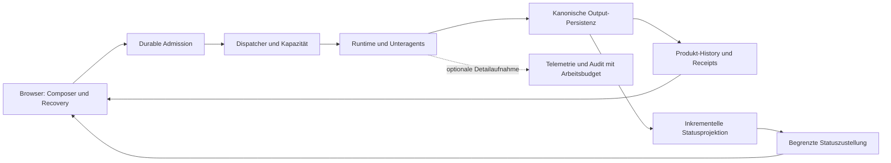

# 1. Kontext und Ziel

## Ausführung ab 2026-09-12

Der Nutzer hat zunächst die vollständige Umsetzung dieses Plans mit hoher Parallelität beauftragt. Wegen des verbleibenden Kontingents begrenzt die neueste Anweisung die laufende Ausführung auf einen gesunden Zwischenstand: keine neuen Sub-Agents, den noch laufenden Audit-Agent fertigarbeiten lassen und begonnene Änderungen prüfen und committen. Der Gesamtumbau ist noch nicht kurz vor Abschluss. Die integrierte Arbeitsbasis ist `cac4dcd03945b9754db7be9ab2ab4324f10c335c`; der Plan-Worktree bleibt als Eingangsdokument erhalten. Die folgenden Besitzer und getrennten Docker-Worktrees bleiben für die spätere Fortsetzung nachvollziehbar. Angefangene Arbeit gilt erst nach nachgewiesener Integration und passender Abnahme als abgeschlossen.

| Besitzer / Branch | Verantwortung | Schnittstellengrenze | Stand |
|---|---|---|---|
| `latency-browser` | AP-01/02/09 Client, Receipt-/Warteanzeige AP-06/07 | Ein Browser-Lifecycle und ein Statusbesitzer; Serververtrag mit Gateway abstimmen | Ruhend; noch keine Codeänderung |
| `latency-gateway` | AP-03, AP-06/07 Server, AP-02/09 Server | Router-/Statusrevisionen, passive Runtime-Leser, additive API-Erweiterungen | Ruhend; AP-03a und Dispatcher inzwischen in Integration |
| `latency-storage` | AP-04 Producer/Identität, AP-05, Storage-Messung AP-00 | Kanonische Identität und Worker-RPC; Debug-Reparatur mit Audit abstimmen | Ruhend; reiner Klassifizierer inzwischen in Integration |
| `latency-audit` | AP-08, AP-04 Debug-Reconciliation, AP-00/10 Lastharness | Begrenzte read-only Diagnose und reproduzierbare Integritätslast | Delegiert |
| `latency-capture` | AP-11, Telemetrievergleich AP-00 | Vorhandener Capture-Plan bleibt Eigentümer; keine konkurrierenden Produktdaten | Ruhend; noch keine Codeänderung |
| `latency-integration` | Orchestrierung, Evidenz, Dokumentation, Reviewintegration, AP-10 | Ein Abnahmeverantwortlicher für alle F1–F9 und PIBO-LATENCY-001–012 | In Arbeit |

Gemeinsame Änderungen werden additiv abgestimmt: alte Status-/Bootstrap-Clients bleiben lesbar; neue Clients erkennen Unterstützung und recovern über Snapshots. Produkt-History und Output-Cursor bleiben unabhängig von zusammengefassten Statusanzeigen. Gemeinsame Dateien haben genau einen Schreiber; notwendige Hooks werden diesem als konkrete Schnittstellenanforderung übergeben.

Abnahmereihenfolge: fokussierte Docker-Prüfungen je Paket, Review und Integration, integrierter Build und relevante Gesamtsuiten, unverändertes committed Paket mit SHA-256, authentifizierte Pibo2-Abnahme, 30-Minuten-Providerlast und 2-Stunden-Dauerlauf. Der Test auf dem tatsächlich betroffenen Smartphone bleibt ein eigenes Gerätegate; Desktopemulation schließt ihn nicht. Messergebnisse und verbliebene Gates stehen im [Abnahmebericht](/reports/latency-reliability-validation-2026-09-12.md), ohne Zielbudgets nachträglich anzupassen. Die frühere Zurückstellung eines Dauerlaufs im Performance-Oberplan gilt für diese neue Abnahme nicht. Der gemeinsame lokale Admission-Vergleich verwendet 10.000 Proben und erfüllt damit auch das hier verlangte Minimum von 1.000; der reale Providerlauf weist seine eigene tatsächliche Stichprobengröße aus.

Neue Nachrichten sollen unter paralleler Agent-Arbeit zügig angenommen werden; eine ruhende Web-App soll nach dem Zurückkehren zuerst bedienbar werden und anschließend kontrolliert ihren aktuellen Zustand herstellen. Dauerhafte Nachrichten, Tool-Ergebnisse und Delegationsabschlüsse müssen dabei vollständig und konsistent bleiben. Das ist das gemeinsame Ziel dieses Plans, nicht lediglich eine niedrigere mittlere SQL-Latenz.

Der Gesamtbericht umfasst den ursprünglichen Streaming-/Resume-/Kaltstart-Run und den anschließend angeforderten Multi-Agent-Run. Im zweiten Run wurden sechs Apps mit zwölf echten Unteragents gebaut und erweitert: zeitweise 18 arbeitende Sessions, zehn parallele Provider-Aufrufe, 699 Tool-Ausführungsabschlüsse und 134.820 rohe Provider-Events. Die genaue ursprüngliche Verzögerung von ungefähr 20 Sekunden wurde nicht reproduziert; nachgewiesen sind mehrere eigenständige Fehler- und Wartepfade.[^pibo2-investigations]

Dieser Plan beschreibt beabsichtigte Arbeit. Er behauptet weder, dass die Änderungen bereits implementiert sind, noch dass jede denkbare Latenzquelle dauerhaft ausgeschlossen werden kann. Erfolg heißt: Die nachgewiesenen Mechanismen sind beseitigt oder kontrolliert begrenzt, Regressionen werden erkannt, und Überlast führt zu einem erklärbaren, sicheren Zustand statt zu unbegrenztem Rückstau oder unklarem Nachrichtenverlust.

Die Pibo2-Messbasis ist Commit `0fe71c72a1d3bcb3b0d06295d323317a452b367a`. Die nach Fetch festgestellte Planbasis ist `upstream/dev` bei `cac4dcd03945b9754db7be9ab2ab4324f10c335c`. Diese Stände sind verschieden. Der vorliegende Source-Abgleich ist in Abschnitt 1.2 festgehalten. Jedes Arbeitspaket beginnt zusätzlich mit einem Abgleich der verantwortlichen Symbole, bestehenden Tests und später hinzugekommener Fixes; der historische Messstand wird nicht als aktueller Produktzustand ausgegeben.[^planning-baseline]

## 1.1 Befunde und vollständige Zuordnung

| Befund | Nachweis | Arbeitspakete | Zu schließende Lücke |
|---|---|---|---|
| F1 Browser-Stau beim Resume | 1.041 Statuspatch-Callbacks, 2.434 ms Long Task | AP-01, AP-02, AP-10 | Überholte Statusarbeit vor Benutzereingaben |
| F2 Globale Statusprojektion | Andere Health-Requests blockiert; globaler Status bis 1.592 ms | AP-03, AP-10 | Wiederholte synchrone Vollprojektion pro Runtime |
| F3 Doppelte Resume-Recovery | Visibility und Focus starten konkurrierende Timeline-Requests | AP-01, AP-10 | Mehrere widersprüchliche Recovery-Vorgänge |
| F4 Kaltstart-/Runtime-Warten | Dritte native Session etwa 3,9 s bis Start, 7,2 s bis Ende | AP-07, AP-10 | Unsichtbare Wartephasen und optionale Runtime-Abhängigkeiten |
| F5 Dauerpolling | Dispatcher alle 50 ms, Receipts jede Sekunde im Idle | AP-06, AP-10 | Unnötige Control-/Storage-Arbeit |
| F6 Output-Identitätskollision | Gleicher Text und ID; Fingerprint unterscheidet sich nur durch Provenance | AP-04, AP-10 | Widersprüchliche Repräsentation derselben delegierten Ausgabe |
| F7 Writer-Ersetzung | Zwei automatische Ersetzungen; unklarer Commit nach Deadline | AP-05, AP-10 | Deadline-/Commit-Reconciliation und Diagnoseklarheit |
| F8 Diagnoseaufwand unbeschränkt | Read-only Dead-Letter-Audit trotz kleinem Limit ungefähr 90 s | AP-08, AP-10 | Ergebnislimit begrenzt nicht den Arbeitsaufwand |
| F9 Initialer Bootstrap teuer | 1,26–1,42 s, etwa 571–573 KB decodiert | AP-09, AP-10 | Zu viel Arbeit vor erster Nutzbarkeit |
| Offene SQLite-/Telemetriehypothese | busy-Vorfälle, aber kein isolierter dominanter Writer-Stau | AP-00, AP-11 | Kausale Entscheidung über zusätzliche Speichertrennung |

## 1.2 Abgleich mit aktuellem `upstream/dev`

Der read-only Abgleich an `cac4dcd03945b9754db7be9ab2ab4324f10c335c` unterscheidet bereits vorhandene Infrastruktur von verbleibender Arbeit. Die nachfolgend genannten Tests wurden für diesen Plan identifiziert, nicht als Produktabnahme ausgeführt.

| Bereich | Bereits im aktuellen Code vorhanden | Verbleibende Umsetzung beziehungsweise Verifikation |
|---|---|---|
| Signal-/Trace-Updates | Monotone Statusversionen und Refresh bei Lücken; ausgewählte Trace-Events bereits pro Animation Frame gebündelt | Globale Statuspatches nutzen diese Bündelung nicht und laufen weiter durch den Bootstrap-Baum; AP-01/02 setzt dort an |
| Gateway-Projektion | Eine einzelne Vollprojektion liest Sessions bereits gesammelt und vermeidet wiederholtes Ancestor-Lesen | Wiederholung pro Runtime und zweimal pro globaler Antwort bleibt; AP-03 entfernt diese Multiplikation |
| Output-Identität | `OUTPUT_IDENTITY_FINGERPRINT_VERSION = 2`; Provenance ist aus semantischer Identität ausgeschlossen, Aliase und explizite Legacy-v1-Kandidaten werden normalisiert | Historischen Fall gegen beide realen Producer und Replay bestätigen; keine pauschale Neuerfindung des Hashschemas; Altfehler separat reconciliieren |
| Dispatcher/Kapazität | Durable Commands, differenzierte Zustände, begrenzte Kaltstarts/Provider, Wakeups nach Admission/Terminalevent, parallele Claims | 50-ms-Idle-Fallback und pauschales Receipt-Polling reduzieren; vorhandene Wakeups auf Rennen prüfen statt ein zweites System einzubauen |
| Worker | Queue-/Byte-/Altersgrenzen, Control-Reserve, Ersatz erst nach Worker-Exit | In-flight Deadline/Caller-Stall weiterhin exakt prüfen; vorhandenes Fencing und Commit-Reconciliation erhalten |
| Diagnose | Storage-Maintenance, Backup und killbare Prüfung bereits begrenzt | Output-Integrity-/Dead-Letter-Audit ist eine getrennte, weiterhin breite Scan-Lücke |
| Bootstrap | Navigation-Fastpath, Katalogcache und Generationen gegen alte Navigationsergebnisse vorhanden | Kernpayload und Kopier-/Statuskosten reduzieren, vorhandene Kohärenz nicht ersetzen |
| Telemetrie | Optionaler Diagnosepfad, minimierte Standardaufnahme, begrenzter Worker und Retention; scoped Capture mit run-eigener Datei, Stop-Fencing, Archivmanifest und paginiertem Lesen vorhanden | AP-11 härtet den bestehenden Lifecycle, automatische Expiry, Crash-/Partial-Finalisierung, Disk-full, begrenzte Archivinspektion und Backup/Restore und liefert den kausalen Vergleich; kein zweites Capture-System |

Daraus folgt keine Aussage, dass der aktuelle Dev-Stand den alten Pibo2-Fall bereits vollständig bestanden hätte. Insbesondere braucht die Identitätskorrektur dieselbe reale delegierte Zustellung und Altversionsprüfung wie das historische Fehlerbild.

# 2. Geltungsbereich und verbindliche Schutzregeln

Enthalten sind Chat Web einschließlich PWA-Lifecycle, Status-/Trace-Schnittstellen, Gateway-Projektionen, Message-Admission und Dispatcher, native Runtime-Kaltstarts, delegierte Output-Persistenz, Storage-Worker und relevante Diagnosepfade. Änderungen sind in kleinen integrierbaren Schritten vorgesehen, nicht als Austausch der gesamten Plattform.

Die folgenden Zielanforderungen haben stabile IDs. Sie sind Plananforderungen; nach Umsetzung erhalten sie in den zuständigen aktuellen Spezifikationen Quellcode-/Test-Traceability.

| ID | Zielanforderung | Verantwortliche Pakete |
|---|---|---|
| PIBO-LATENCY-001 | Eine bereits angenommene Nutzernachricht bleibt nach Fehler, Retry oder Restart nachvollziehbar; kein stiller Verlust oder ungeprüfter zweiter Side Effect. | AP-04/05/06/10 |
| PIBO-LATENCY-002 | Status-Recovery hat pro Browser-Kontext eine Generation; Antworten und Events älterer Generationen ändern den aktuellen Zustand nicht. | AP-01/02 |
| PIBO-LATENCY-003 | Hintergrunddauer darf keine unbegrenzt wachsende Liste veralteter Statuspatches erzeugen, die beim Resume vor Eingaben abgearbeitet wird. | AP-01/02 |
| PIBO-LATENCY-004 | Statusabfragen verändern keine Runtime-Aktivierung und führen keine vollständige Sessionprojektion pro angefragter Runtime aus. | AP-03/07 |
| PIBO-LATENCY-005 | Produkt-History, Output-Identität und Commit-Nachweise bleiben unabhängig von optionaler Detailtelemetrie korrekt. | AP-04/05/11 |
| PIBO-LATENCY-006 | Worker-Admission-Warten, laufende Ausführung, unklarer Commit und tatsächlicher Ausfall sind unterscheidbar. | AP-00/05 |
| PIBO-LATENCY-007 | Kein Idle-Polling im kurzen Aktivtakt ohne offene Arbeit; Recovery bleibt auch bei verpasstem Wakeup möglich. | AP-06 |
| PIBO-LATENCY-008 | Warten auf Session, Kaltstart und Provider wird getrennt von HTTP-Annahme und Modellarbeit ausgewiesen. | AP-00/07 |
| PIBO-LATENCY-009 | Diagnose besitzt ein überprüfbares Arbeitsbudget und meldet Teilresultate als unvollständig. | AP-08 |
| PIBO-LATENCY-010 | Nutzbarkeit beim Öffnen/Resume wird vor der ersten HTTP-Anfrage und bis zur sichtbaren Reaktion gemessen. | AP-00/09/10 |
| PIBO-LATENCY-011 | Jeder neue Puffer ist nach Anzahl, Bytes und Alter begrenzt und besitzt ein fachlich definiertes Überlastverhalten. | AP-01/02/05/08/11 |
| PIBO-LATENCY-012 | Authentifizierungs-, Raum-/Session-Zugriffs- und Mandantengrenzen gelten für Snapshots, Caches und Recovery unverändert. | Alle |

## 2.1 Was gezielt nicht vorweg entschieden wird

Ein pauschaler Wechsel zu PostgreSQL oder ein pauschales Abschalten von Telemetrie ist kein Eingangsschritt. Die nachgewiesenen Browser-/Gateway-Blockaden würden dadurch nicht verschwinden. AP-11 enthält jedoch einen verbindlichen Mess- und Entscheidungsauftrag, damit die Speicherfrage nicht lediglich vertagt wird.

Provider-Antwortgeschwindigkeit ist kein garantiertes Pibo-SLO. Globale und raumbezogene Kapazitätslimits werden nicht blind erhöht. Dauerhafte Output-Ereignisse werden nicht nach den Regeln für flüchtige Statusanzeigen zusammengefasst. Eine sichtbare Sofortbestätigung darf nicht vor erfolgreicher dauerhafter Admission behaupten, die Nachricht sei serverseitig angenommen.

# 3. Zielarchitektur

## 3.1 Drei getrennte Pfade mit klarer Verantwortung

1. **Nachrichten und dauerhafte Ergebnisse:** Authentifizierung, idempotente Admission, kontrollierte Dispatch-Zulassung, kanonische Output-Persistenz, Commit-Reconciliation. Dieser Pfad besitzt die Produktwahrheit.
2. **Aktueller Anzeigezustand:** Inkrementelle Projektion der Sessions, revisionsgebundene Snapshots, zusammenfassbare Statusupdates, begrenzte Browser-Verarbeitung. Dieser Pfad ist wiederaufbaubar und darf veraltete Zwischenzustände ersetzen.
3. **Diagnose und Detailtelemetrie:** Kleine Basiszähler plus begrenzte, isolierbare Detailaufnahme und Audit-Arbeit. Dieser Pfad darf nicht zum unbeschränkten Mitbewerber um den Interaktionspfad werden.

Die Diagrammkanten definieren Verantwortlichkeiten, keine neue atomare Transaktion über alle Stores. Insbesondere darf ein erfolgreicher Produkt-Commit nicht durch eine optionale nachgelagerte Telemetrieaufzeichnung wieder als fehlgeschlagen erscheinen.

## 3.2 Geplante Modulgrenzen

Die Namen sind Arbeitsnamen und keine Behauptung bereits existierender APIs. Bestehende passende Abstraktionen sollen erweitert werden; Doppelimplementierungen sind zu vermeiden.

| Verantwortlicher Baustein | Kleine öffentliche Schnittstelle | Verbirgt intern |
|---|---|---|
| Browser-Recovery-Koordinator | Sichtbarkeit/Online/Auth/Session-Wechsel melden, Zustand abonnieren | Lifecycle-Deduplizierung, Generation, Abbruch, Reconnect, Retry |
| Browser-Statusspeicher | Snapshot ersetzen, gültige Änderung anwenden, Session selektieren | Versionierung, Strukturteilung, begrenzte Änderungsmenge |
| Gateway-Statusprojektor | Aktuellen Snapshot lesen, Sessionänderung übernehmen | Aufbau, Indexierung, Invalidierung, Generation und Teilbaumkosten |
| Output-Normalisierung | Kanonisches Event und versionierte Identität erzeugen | Herkunftsmetadaten, Producer-Varianten, Legacy-Kompatibilität |
| Storage-RPC-Supervisor | Auftrag zulassen, Status abfragen, unklaren Commit reconciliieren | Queue-Budgets, Worker-Epochen, Deadline-/Restart-Regeln |
| Audit-Runner | Begrenzte Anfrage, Cursor, Fortschritt und Ergebnis | Read-Snapshot, Abbruch, Scan-/Zeitbudget, Teilresultate |

Keine Zustandswahrheit darf gleichzeitig unabhängig im Browser-Bootstrap, in einem zweiten Statuscache und in einer dritten Recovery-Schleife gepflegt werden. Unterschiedliche Ansichten erhalten abgeleitete Selektoren und eindeutige Revisionsbesitzer.

# 4. Messbare Abnahmeziele

Dies sind **neue Zielbudgets**, keine bereits gemessenen Leistungen. AP-00 fixiert Hardware, Browser, Datenbestand, Netzprofil und Messfenster vor dem Vergleich. Zieländerungen brauchen eine dokumentierte Begründung; Grenzwerte dürfen nicht nach einem roten Test stillschweigend angehoben werden.

Referenzprofil: Pibo2 mit reproduzierbarem Bestand von mindestens 3.250 Sessions; zusätzlich lokale Fixtures mit 10.000 Sessions. Echte Last mindestens sechs Parents und zwölf Unteragents mit Luna/low; kontrollierter Event-Replay deckt darüber hinaus gleichmäßige Spitzen ab. Alle Größen werden als Profilparameter protokolliert.

| Messgröße | Vorgeschlagenes Abnahmebudget | Bewertung |
|---|---|---|
| Sichtbarkeit bis nutzbarer Composer | p95 ≤ 500 ms nach 5-minütigem Freeze im Referenzprofil | Vor dem ersten Request messen; Snapshot kann noch laden |
| Browser-Verarbeitung eines Statusbatches | höchstens 8 ms geplante Arbeit pro Slice; kein statusbedingter Long Task > 100 ms | Frames nicht durch Nachholen tausender Patches blockieren |
| Kontrollnachricht: HTTP-Admission | p95 ≤ 200 ms, p99 ≤ 500 ms | Öffentlicher Pfad, lokaler Serveranteil separat |
| Slash-Befehl ohne Provider, sichtbare Reaktion nach nutzbarem Composer | p95 ≤ 500 ms | Zusätzlich gesamtes Resume bis Reaktion ausweisen |
| Globaler Status bei 20 Runtimes/Referenzbestand | p95 ≤ 100 ms; unabhängiger Health-Request ≤ 50 ms zusätzliche lokale Verzögerung | Vorher bis 1.592 ms; mindestens 30 gepaarte Versuche |
| Warmes Dispatching ohne Session-/Provider-Warten | p95 ≤ 100 ms serverintern | Keine Provider-Tokens in dieses Budget einrechnen |
| Bootstrap-Kernantwort | ≤ 150 KB decodiert im Referenzprofil; erste Nutzbarkeit p95 ≤ 1 s im festgelegten LAN-/Pibo2-Profil | Weitere Daten paginiert, keine Metadatenvollsammlung als Kern |
| Idle ohne offene Receipts | keine fortlaufenden sekündlichen Receipt-Requests; Dispatcher-Recovery-Poll im Sekundenbereich | Startwert 5 s ± Jitter; aktive Admission wird sofort geweckt |
| Speicher/Queues im Dauerlauf | jeder Puffer hält seine konfigurierten Limits; nach Drain keine anhaltende Wachstumstendenz | RSS und Heap nach vergleichbarer Ruhephase, gleiche Prozesse vergleichen |
| Datenintegrität | null verlorene angenommene Commands; null unerkannte doppelte Wirkungen; null bekannte Provenance-Kollisionen | Sicherheitskriterium, kein Perzentil |
| Worker-Neustarts durch Caller-Stall | null im deterministischen Test „Worker hat bereits committed“ | Echte Worker-Hänger separat testen |

Für p99 werden mindestens 1.000 lokale deterministische Admission-Proben erfasst. Der reale 30-minütige Providerlauf liefert bei 30-s-Takt ungefähr 60 Kontrollnachrichten: dort Median, p95, Maximum und Stichprobenzahl ausweisen; kein statistisch belastbares p99 vortäuschen. Reale Smartphone-Ergebnisse werden zusätzlich gerätespezifisch berichtet, nicht aus Desktop-Drosselung abgeleitet.

# 5. Arbeitspakete

## AP-00 – Baseline, Artefakte und leichte Messung

**Ergebnis:** Ein wiederholbarer Test trennt Browser, Admission, Session-/Kaltstart-/Provider-Warten, Storage und Rendering, ohne durch globale Statusabfragen selbst einen wesentlichen Teil der Last zu erzeugen.

- [ ] Den Gesamtbericht und erforderliche Rohbelege aus den Controller-Verzeichnissen `/tmp/pibo2-latency-evidence` und `/tmp/pibo2-multiagent-0912` mit SHA-256-Manifest in dauerhafte Untersuchungsablage übernehmen; keine Zugangsdaten oder ungesichteten Nutzinhalte veröffentlichen.
- [ ] Jede F1–F9-Quelle gegen die aktuelle Implementierungsbasis abgleichen. Bestehende Fixes mit Tests belegen und nur die verbleibende Lücke umsetzen.
- [ ] Kleine aggregierte Zähler/Histogramme ohne Session-Vollprojektion ergänzen: RPC-Admission, Queue-Warten, Ausführungszeit, Antwortzustellung, Deadlineart, Worker-Epoche, busy-Dauer, Status-Callback-Anzahl/-Zeit, zusammengefasste Updates, Recovery-Generation.
- [ ] Unterschiedliche Fehlerzähler benennen: Admission-Overload, queued Deadline, in-flight unknown, Domainfehler/Kollision, Worker-Ausfall. Historisches `rejected` kompatibel lassen und nicht als Overload ausgeben.
- [ ] Monotone lokale Dauerwerte verwenden; für Prozessgrenzen Korrelations-ID und Worker-Epoche statt ungeprüft subtrahierter Uhrzeiten. Counter-Resets sichtbar machen.
- [ ] Baseline-Fixtures, Replay-Last und echte App-Aufgaben aus beiden Runs als konfigurierbaren, zeitlich begrenzten Testlauf erfassen. Für Altbestand anonymisierte/synthetische Daten verwenden.
- [ ] Den Messaufwand mit/ohne Sampler vergleichen; billige Sampler sollen im Referenzprofil weniger als 5 % zusätzliche Kontrolllatenz erzeugen. Teure Audits erhalten ein separates Experimentfenster.

**Quellen:** Untersuchungsartefakte; `src/data/bounded-worker-client.ts`, `src/data/async-chat-storage.ts`, bestehende Ressourcen-/Telemetrieendpunkte und `src/web/channel.ts`. Exakte bestehende Testdateien werden im Source-Mapping ergänzt.

**Abhängigkeiten:** Keine. **Abnahme:** gleiche Last ohne globale Statuspolls reproduzierbar; alle Phasen getrennt; keine Secrets in Artefakten. **Rollback:** zusätzliche Detailmessung deaktivierbar, Basisintegritätszähler bleiben klein.

## AP-01 – Ein Browser-Lifecycle mit Recovery-Generation

**Ergebnis:** Ein Tab besitzt einen gemeinsamen Recovery-Vorgang. Hintergrundstatus wird nicht unbegrenzt nachgeholt; Composer und gespeicherter Entwurf bleiben sofort nutzbar.

**Primäre Quellen:** `src/apps/chat-ui/src/App.tsx`, `api-trace-signals.ts`, die im Bericht referenzierte `recoverSelectedLiveStream()`-Logik und `session-trace-pane.tsx`.

- [ ] Vorhandene Listener für `visibilitychange`, `focus`, `pageshow`, `pagehide`, online/offline und Session-/Auth-Wechsel in einem Besitzer zusammenführen. Zustände: `live`, `suspended`, `recovering`, `offline`, `disposed`.
- [ ] Bei hidden/pagehide Status-EventSource schließen, Generation erhöhen und ausstehende Status-/optionale Recovery-Arbeit abbrechen. Ein Abbruch einer Abfrage darf keinen akzeptierten Message Command abbrechen.
- [ ] Eventhandler zuerst gegen Source-/Generation prüfen; alte Handler kehren vor JSON-Parsing und Zustandskopien zurück. Schließen allein genügt nicht, weil bereits eingereihte Callbacks noch zugestellt werden können.
- [ ] Beim Wiederaufnehmen genau einen frischen autorisierten Snapshot laden; parallele Focus-/Visibility-Ereignisse verwenden denselben Vorgang. Keine lückenlose Zwischenzustands-Replaypflicht für Status.
- [ ] Snapshot und neuen Stream über Baseline-Revision/Epoche verbinden: Änderungen zwischen Snapshot-Lesen und Subscribe dürfen nicht verloren gehen. Entweder atomarer Subscribe-mit-Snapshot oder explizite Snapshot-Revision plus begrenzte Gap-Recovery.
- [ ] Alte HTTP-Antworten anhand Generation, ausgewählter Session, Auth-Kontext und Server-Epoche verwerfen. Revisionssprung/Gateway-Restart löst Snapshot-Ersatz aus.
- [ ] Entwurf und Nachrichten-Transaktions-ID unabhängig vom Status-Recovery halten. Lokale Sendeanzeige, dauerhafte Annahme und Wartephase bleiben unterscheidbar.
- [ ] Auth-Ablauf, BFCache, Offline-Resume, schneller Raum-/Session-Wechsel und mehrfache Online-Events definieren; Reconnect mit begrenztem Backoff/Jitter.

**Tests:** Gleichzeitige Lifecycle-Events; 1.000 alte bereits eingereihte Callbacks; Snapshot/Subscribe-Rennen; Tokenwechsel und verspätete Antworten; Offline-Senden mit anschließendem Receipt-Abgleich; BFCache-Entwurfserhalt. Einheitstests müssen Zustandswechsel testen, nicht nur die neue Implementierung nachzeichnen.

**Abnahme:** PIBO-LATENCY-002/003/010/012 und Resume-Zeitbudgets. **Rollback:** alter Client kann alten Server weiter verwenden; neue Generation-/Abbruchlogik darf keine Protokollmigration erzwingen. Für ein Verhalten-Rollback kontrollierte Umschaltung, nicht dauerhafte Pflege zweier konkurrierender Recovery-Besitzer.

## AP-02 – Statusupdates bündeln und Sessionzustand inkrementell ändern

**Ergebnis:** Änderungsarbeit wächst primär mit den tatsächlich geänderten Sessions, nicht mit Anzahl aller Events mal Größe aller Sessions.

**Quellen:** `src/apps/chat-ui/src/app-signal-status.ts`, `App.tsx`, `src/apps/chat/web-app.ts` und bestehende Signal-/SSE-Verträge.

- [ ] Clientstatus nach Session-ID normalisieren. Unveränderte Einträge/Teilbäume behalten ihre Referenz; Bootstrap-Navigation und aktueller Aktivitätsstatus werden nicht für jeden Patch als vollständiger Baum kopiert.
- [ ] Statusänderungen pro Session in begrenztem Pending-Set zusammenführen und innerhalb eines Zeitbudgets anwenden. Auch die Herstellung eines einzelnen zu großen Updates muss begrenzt sein; ein Timer um eine weiterhin riesige Kopie löst das Problem nicht.
- [ ] Unread-/Read-Zeitpunkte, gelöschte Sessions, Parent-Wechsel und abgeleitete Sessions als explizite Änderungen modellieren. Keine Heuristik „letzter Timestamp gewinnt“, wenn die Revision die Reihenfolge vorgibt.
- [ ] Versionierte Delta-Semantik definieren. Aufeinanderfolgende Patches nicht beliebig zusammenwerfen: `fromVersion` muss zur letzten angewendeten Revision passen. Bei Lücke oder Pufferbudgetüberschreitung Pending-Deltas verwerfen und einen frischen Snapshot anfordern.
- [ ] Serverseitige Statuszustellung pro authentifiziertem Client begrenzen. Langsame Leser erhalten höchstens begrenzte Deltas oder einen `resync required`-Zustand; niemals eine unbegrenzte Liste von Statuszwischenständen.
- [ ] Einen bereits gefüllten TCP-/Browserpuffer nicht durch noch mehr Recovery-Ereignisse „reparieren“. Für Status kann der Stream beendet und mit Snapshot neu geöffnet werden; Produkt-Eventcursor bleibt davon getrennt.
- [ ] Format-/Feature-Erkennung für alte Clients festlegen. Ein neuer Server sendet keine nicht unterstützten Snapshot-Ersatznachrichten an einen alten Client; Fallback ist ein kompatibler Reconnect.
- [ ] Gesamtkosten von Datenaufbereitung, React-Updates, DOM und GC gemeinsam messen. Callbacks und Paints nicht gleichsetzen.

**Tests:** 3.250/10.000 Sessionknoten, einzelne Blattänderung, 10.000 Statusereignisse, langsamer Leser, Delete/Reparent, Revisionslücke, Server-Epochenwechsel, Snapshot mit parallelen neuen Änderungen, zwei unterschiedlich berechtigte Clients.

**Abnahme:** Kein Statuspuffer wächst mit der Pausendauer; korrekter Endzustand; unveränderte Selektoren lösen keine flächigen Updates aus; Batch-/Resume-Budgets erfüllt. **Abhängigkeit:** AP-00; Recovery-Protokoll mit AP-01 gemeinsam festlegen. **Rollback:** Protokoll additiv, Feature-Erkennung und alter Snapshotweg bleiben bis nach Cache-/Clientwechsel gültig.

## AP-03 – Gateway-Projektion einmal pflegen, billig lesen

**Ergebnis:** `/gateway/status` und sessionbezogene Statusleser verwenden dieselbe aktuelle Projektion. Eine Leseanfrage startet keine Vollprojektion des Stores.

**Quellen:** `src/core/session-router.ts` (`snapshotSignalSession`, `projectKnownSessionSignals`), `src/web/channel.ts` und bestehende Signalprojektion.

- [x] Als kleiner erster Fix innerhalb einer Statusantwort nur einmal Runtime-Status erzeugen und dieselbe Projektion wiederverwenden; doppelte Ausgabevarianten dürfen keine zweite Berechnung auslösen. Lokal integriert mit `6c0e4ff6170f987cf6252589c8dadf6a7e79a5de`; integrierte Pibo2-Abnahme bleibt separat offen.
- [ ] Einen Projektor mit eindeutigem Besitzer und monotoner Revision definieren. Session-Anlage, Statusänderung, Parent-Wechsel, Archivierung/Löschung, Runtime-Bindung und gelesener Zustand invalidieren gezielt betroffene Einträge/Teilbäume.
- [ ] Globalen Erstaufbau außerhalb wiederkehrender Request-Hotpaths durchführen. Solange die Projektion noch aufbaut, explizit `initializing`/Alter liefern; Admission und Health dürfen nicht von einem Vollaufbau abhängen.
- [ ] Immer einen konsistenten Snapshot veröffentlichen, niemals einen teilweise mutierten Baum. Änderungen während des Aufbaus nach Revision nachziehen oder einen neuen Aufbau beginnen.
- [ ] Prozessübergreifende Store-Änderungen, Import, Reparatur und Wiederanlauf berücksichtigen. Ein Memorycache ohne Invalidierung für CLI-/andere Prozessänderungen ist nicht korrekt. Bestehende Revisions-/Change-Mechanismen nutzen und ergänzen, statt einen unbemerkten zweiten Writer einzuführen.
- [ ] Seltene vollständige Reconciliation budgetiert und außerhalb des Interaktionspfads; Autorisierung vor oder während der Auswahl, kein ungefilterter globaler Snapshot im Clientcache.
- [ ] Property-/Referenztests: inkrementelle Ergebnisse gegen die bestehende vollständige Projektion als Test-Orakel vergleichen, einschließlich Löschung/Reparent und verspäteter Änderung.

**Abnahme:** F2-Status-/Health-Versuch bei 1/10/20 Runtimes und 100/3.250/10.000 gespeicherten Sessions; Anzahl Store-Vollscans ist unabhängig von Runtime-Anzahl pro Request und im warmen Pfad null. **Rollback:** Rebuild-on-revision als begrenzter Fallback; kein Zurückfallen auf Vollprojektion pro Runtime unter Last. **Abhängigkeit:** AP-00; kann neben AP-01/02 implementiert werden.

## AP-04 – Kanonische Output-Identität und kontrollierte Altfehler-Reconciliation

**Ergebnis:** Die bereits vorhandene Identitätsversion 2 wird gegen das konkrete historische Fehlerbild verifiziert und nur bei einer nachgewiesenen Restlücke ergänzt. Dieselbe delegierte Ausgabe besitzt in Live-, Abschluss-, Retry- und Replay-Zustellung dieselbe semantische Identität. Echte Konflikte bleiben erkennbar.

**Quellen:** `src/core/output-render-sequence.ts`, `src/data/ingest-service.ts`, delegierte Output-Producer, `src/core/output-persistence-retry.ts`; vorhandene Identitäts-/Reliability-Spezifikationen sind maßgeblich.

- [ ] Den bewiesenen Fall mit identischem Text, ID und fehlender Provenance als deterministische Fixture sichern. Beide tatsächlichen Producer-Pfade bis vor die Fingerprint-Bildung nachvollziehen.
- [ ] Den bestehenden v2-Normalisierungsbesitzer erhalten und beide Producer daran ausrichten. Fehlende Provenance bleibt ein eigenes Herkunftsproblem; nur aus vertrauenswürdigem Delegationskontext ergänzen, niemals aus Modelltext. Für semantisch identische Ausgaben darf ein Unterschied reiner Zustellprovenance nach dem vorhandenen v2-Vertrag keine Kollision auslösen.
- [ ] Die vorhandene Trennung von semantischer Identität, Herkunft und Transport-/Rendering-Metadaten dokumentieren. Den bestehenden gezielten Ausschluss von Zustellprovenance aus v2 beibehalten; darüber hinaus nicht pauschal weitere variierende Felder ignorieren. Geänderter semantischer Inhalt muss weiterhin kollidieren.
- [ ] Bestehende Identitätsversionen und historische Fingerprints erhalten. Falls eine neue Fingerprint-Version nötig ist, Version explizit speichern und Legacy-Vergleich begrenzen. Nicht sämtliche vorhandenen Events neu hashen oder IDs umnummerieren.
- [ ] Jede Delivery separat reconciliieren: Erfolg von `message_finished` darf trotz vorheriger kollidierter Delivery erhalten bleiben; Retry darf bereits committed Side Effects nicht wiederholen.
- [ ] Vorhandene 31 Fehler/32 Diagnosen getrennt und nach konkreter Ursache klassifizieren. Erst Dry-run mit Altzustand, neuem Urteil und vorgesehenem Effekt; dann auditierter, idempotenter Apply für eindeutig reparierbare Fälle. Unklare echte Konflikte bleiben sichtbar erhalten.
- [ ] Rollback-/Restart-Test über alte und neue Eventversionen. Reparatur und gewöhnliche Zustellung müssen bei erneuter Ausführung dieselben Ergebnisse liefern.

**Abnahme:** Keine bekannten Provenance-Kollisionen im neuen Multi-Agent-Run; echte Text-/Session-/semantische Konflikte werden abgewiesen; Herkunftsauthentizität wird gesondert geprüft; History, Receipt und Run-Endzustand korrekt; keine verlorenen Deliveries. **Abhängigkeit:** AP-00. **Rollback:** alte gespeicherte Identitäten bleiben lesbar; kein destruktiver Masseneingriff. Ein absichtliches neues Bedeutungsmodell für Historie verlangt eine eigene Migrationsentscheidung.

## AP-05 – Storage-Deadlines, Commit-Zustand und Worker-Lebenszyklus

**Ergebnis:** Ein blockierter Caller verwechselt eine verspätete Antwort nicht automatisch mit einem gescheiterten Commit. Echte Hänger bleiben begrenzt und sichtbar.

**Quellen:** `src/data/bounded-worker-client.ts`, `src/data/chat-storage-worker.ts`, `src/data/async-chat-storage.ts` und Message-Command-Reconciliation.

- [ ] Queue-Admission-Deadline und Ausführungsdeadline trennen. Startzeit und Request-ID/Epoche werden explizit übertragen; Ablauf vor Ausführung hat garantiert keinen Commit.
- [ ] Antworten und Worker-Fortschritt so erfassen, dass Caller-Event-Loop-Lag von Worker-Ausführungszeit unterscheidbar wird. Geeigneten Mechanismus nach bestehendem RPC-Modell wählen; zusätzliche Heartbeats müssen selbst begrenzt sein.
- [ ] Beim verzögerten Caller-Timer nicht allein aus `inFlight` sofort Terminierung ableiten. Bereits vorliegende Completion mit passender ID/Epoche verarbeiten; bei Unklarheit zunächst Zustand abfragen/reconciliieren und kontrollierte Quarantäne verwenden.
- [ ] Erfolgreich committed, sicher nicht gestartet, tatsächlich fehlgeschlagen und noch unklar als unterschiedliche Resultate modellieren. Keine genau-einmalige Ausführung versprechen, sondern idempotente Wirkung mit dauerhaftem Command-/Output-Nachweis.
- [ ] Neue Mutationen bei unklarem alten Writer nicht unkontrolliert parallel auf einem Ersatz starten. Vor Ersatz den alten Worker zuverlässig beenden/fencen; verspätete Antworten alter Epochen können nichts mehr bestätigen.
- [ ] Externe Tool-Side-Effects von Datenbankwirkungen unterscheiden. Ein unsicherer SQL-Receipt darf nicht zum automatischen erneuten Start eines bereits ausgeführten externen Tools führen.
- [ ] Wirklich blockierende SQLite-Arbeit im vorgesehenen isolierten Thread/Prozess halten, harte Watchdoggrenze und begrenzte Restart-Rate. Wartende Commands erhalten erklärbare Fehler-/Retryzustände statt einer Restart-Schleife.
- [ ] Counter über Worker-Epochen korrekt aggregieren; Domainfehler nicht mit Overload gleichsetzen. Fehlertext darf keine Payload-/Credentialdaten ausgeben.

**Tests:** Worker commit vor Caller-Stall; Caller-Stall vor Antwort; Worker hängt in SQL; queued Timeout; Crash vor/nach Commit; Antwort nach Worker-Ersatz; doppelter Client-Retry; echte busy-Konkurrenz; Restart-Sturm. Deterministische fake-clock/Barrier-Tests und realer Worker-Integrationstest sind beide nötig.

**Abnahme:** PIBO-LATENCY-001/006/011; null falsche Ersetzung im Commit-fertig/Caller-blockiert-Fall; begrenzte Erholung bei echtem Ausfall. **Abhängigkeit:** AP-00, Identitätsregeln aus AP-04. **Rollback:** additive RPC-Versionierung; alte DB-Nachweise nicht entfernen. Nicht bloß alle Timeouts vergrößern.

## AP-06 – Dispatcher und Receipts bei tatsächlicher Arbeit wecken

**Ergebnis:** Im Idle entfällt die Dauerarbeit im Aktivtakt; neue Nachrichten werden trotzdem unmittelbar verarbeitet.

**Quellen:** `src/apps/chat/message-command-dispatcher.ts`, `src/data/message-command-store.ts`, `src/apps/chat-ui/src/session-trace-pane.tsx` und vorhandene Receipt-Endpunkte.

- [ ] Bestehende Wakeups nach dauerhaftem Admission-Commit und Terminalereignis wiederverwenden; fehlende Wakeups bei frei gewordenem Session-/Provider-/Kaltstartplatz ergänzen. Keine parallele zweite Dispatch-Schleife anlegen.
- [x] Lost-wakeup-Rennen vermeiden: monotone Generation und zusammengefasster Folgedurchlauf in `eace24be3b893512d649de96b30a34ed713d91ae`; lokaler Race-/Burst-Nachweis im [Validierungsbericht](/reports/latency-reliability-validation-2026-09-12.md). Integrierte Pibo2-Abnahme bleibt separat offen.
- [ ] Mehrere Gateway-/CLI-Prozesse und Wiederanlauf berücksichtigen. Leases, Ownership und Fencing aus dem bestehenden Dispatcher bleiben bestehen; periodische budgetierte Reconciliation fängt verpasste Signale ab.
- [ ] Aktiven Drain begrenzen und zwischen Räumen fair planen, mit vorhandener Control-Reserve und Aging. Ein lauter Raum darf andere neue Nachrichten nicht verhungern lassen.
- [ ] Im Browser Receipts nur bei offenen/unklaren Clienttransaktionen pollen. Terminalevent stoppt den Poll; Reconnect reconciliiert die offene Menge einmal. Hidden-Tab pausiert optionales Polling, ohne Annahmezustand zu vergessen.
- [ ] Backoff und Jitter; keinen gleichzeitigen Pollsturm vieler Tabs bei Reconnect. Kurzfristiger API-Fehler löscht offene Commands nicht.

**Tests:** Admission genau zwischen Leerprüfung und Parken, Coalescing vieler Wakeups, Start ohne Signal nach Crash, zwei Dispatcher, unerreichbarer Tab, verlorenes Terminalevent, Raum-Fairness unter Burst. **Abnahme:** Idle-/Dispatchbudgets und kein verlorenes Wakeup. **Abhängigkeit:** AP-00/05; Lifecycle aus AP-01. **Rollback:** Fallback-Poll möglich, aber sichtbar gemessen und nicht dauerhaft alle 50 ms im Idle.

## AP-07 – Wartephasen und Runtime-Aktivierung entkoppeln

**Ergebnis:** Nutzer und Operator sehen, ob eine Nachricht angenommen ist, auf eine Session/Initialisierung/Providerkapazität wartet oder ausgeführt wird. Optionales UI-Lesen weckt keine Runtime unnötig.

- [ ] Bestehende durable Command-/Receiptzustände auf UI verständlich abbilden; kurze Texte wie „Angenommen“, „Wartet auf laufende Aufgabe“, „Agent wird gestartet“ und „Wartet auf Kapazität“. Interne Writer-Begriffe gehören in Debug, nicht in den normalen Composer.
- [ ] Kaltstart-Queue, Öffnungsdauer, Provider-Warten und erste Ausgabe separat messen; keine falsche „bereit“-Anzeige aus `queuedMessages=0` ableiten.
- [ ] Fork-Candidates, Status, Toolkatalog und ähnliche optionale Requests auf `activate=false`/passive Metadaten prüfen. Daten ohne aktive Runtime liefern oder klar als noch nicht verfügbar anzeigen; Composer/Admission nicht davon abhängig machen.
- [ ] Initialisierung pro Session deduplizieren; parallele UI-/Dispatchanforderungen teilen denselben Initialisierungsvorgang. Keine doppelten Provider-/Harness-Starts.
- [ ] Limits zunächst erhalten. `global=2`/`perRoom=1` für native Kaltstarts anhand gleicher und verschiedener Räume sowie realer Ressourcen testen. Eine Änderung braucht konkrete bessere Tail-Latenz ohne Kapazitäts-/Stabilitätsregression.
- [ ] Cancel und Retry während Initialisierung nach bestehender Session-/Command-Semantik; UI schließt nicht versehentlich fremde aktive Arbeit.

**Quellen:** Runtime-Kapazitäts-/Scheduling-Modul, Chat Status/Fork-Candidates-Routen und Composer-/Receiptprojektion. **Tests:** drei native Starts im selben Raum wie Run 1; verschiedene Räume; aktive warme Sessions unter Hintergrundinitialisierung; Modell-/Authfehler. **Abnahme:** alle Abschnitte nachvollziehbar und nicht durch optionale UI-Abfragen verlängert. **Abhängigkeit:** AP-00/03, gemeinsame UI-Zustände mit AP-01/06.

## AP-08 – Diagnoseaufwand begrenzen

**Ergebnis:** Ein kleiner Dead-Letter-Aufruf führt keinen impliziten Gesamtaudit aus. Große Prüfungen sind ausdrücklich budgetiert, abbrechbar und von normalen Requests isoliert.

**Quellen:** `src/debug/output-integrity.ts`, `src/debug/index.ts`, `src/debug/stores.ts`, bestehende Storage-Maintenance-/Audit-Kommandos.

- [ ] Dedizierte Dead-Letter-Listing-Abfrage mit Keyset-Pagination und passenden vorhandenen Indizes; separate allgemeine Integrity-Prüfung behalten.
- [ ] Ergebnislimit, Scope, Scan-/Zeitbudget und Vollständigkeit getrennt darstellen. Teure globale Counts optional; Teilresultate nie als „keine Fehler vorhanden“ ausgeben.
- [ ] Session-/Zeit-/Stream-Grenzen so früh anwenden, wie die fachliche Semantik erlaubt. `HAVING` nicht mechanisch nach `WHERE` verschieben, wenn dadurch Lifecycle-Gruppen falsch bewertet werden.
- [ ] Query-Pläne und Indizes auf großem Altbestand prüfen. Ausdrucks-/JSON-Scans über alle historischen Jobs nur im expliziten Deep-Audit.
- [ ] Abbrechbare Read-Worker/Prozesse nutzen; Read-Snapshot-Dauer begrenzen, Fortschritt/Resume-Cursor außerhalb langer Transaktion sichern. Abbruch muss den Snapshot wirklich schließen.
- [ ] Hilfe iterativ halten: kleine Oberfläche, tiefer liegende Budget-/Semantikbeschreibung. Alte CLI-Ausgaben kompatibel erweitern oder Formatversion deklarieren.

**Tests:** großes Storefixture, begrenztes Resultat mit nachgewiesen begrenzter Arbeit, korrekte gruppierte Lifecycle-Prüfung, Abbruch, Restart des Audits, kein Write/Migration bei Read-only, verzögerter Checkpoint unter langem Reader. **Abnahme:** interaktives Listing lokal p95 ≤ 250 ms im Referenzbestand; Standard-Arbeitsbudget höchstens 1 s mit explizitem Partial/Cursor statt implizitem Vollscan. **Abhängigkeit:** AP-00; vorhandene killable Maintenance wiederverwenden. **Rollback:** alter vollständiger Audit nur explizit, keine überraschende Standardaktivierung.

## AP-09 – Bootstrap auf sofort benötigte Daten reduzieren

**Ergebnis:** Kernnavigation, ausgewählte Session, Composer-Fähigkeiten und nötiger Authzustand reichen zur ersten Bedienung; lange Historie und globale Detailmetadaten folgen begrenzt.

- [ ] Bestehende Bootstrap-/Navigation-/Trace-Verträge inventarisieren und Antwortbytes nach Feldern messen. Neue Aufteilung darf keinen N+1-Requeststurm erzeugen.
- [ ] Kernantwort vom paginierten Sessionbaum, Tracefenster, Fork-Candidates, Tool-/Debug-/Detaildaten trennen; vorhandene Lazy-Loading-Verträge nutzen.
- [ ] Navigation- und Statusrevisionen getrennt halten; ETag/Conditional Requests mit Auth-/Scopebindung. Ein Cacheeintrag eines Nutzers oder Raums darf keinem anderen zugänglich werden.
- [ ] Ausgewählte Session auch dann öffnen, wenn sie nicht auf der ersten Navigationsseite liegt. Deep Links, Parent-/Child-Pfade, Archivierung und leere Räume erhalten definierte Antworten.
- [ ] Lade-/Fehlerzustände lokal begrenzen: Historie darf nachladen, Entwurf und bereits angenommene Nachricht bleiben erhalten. Erstes Senden hängt nicht vom gesamten Datenbestand ab.
- [ ] PWA-Service-Worker-/Assetcache und alte Clients berücksichtigen; API-Erweiterung kompatibel oder explizit versioniert, keine alten gespeicherten Drafts verlieren.

**Quellen:** Chat Bootstrap-/Navigation-Routen, Browser `App.tsx`, Sessionnavigation und History-/Trace-APIs. **Tests:** Cold open, warm resume, alte Clientassets, ETag nach Rechte-/Datenänderung, Deep Link, Offline-Resume, großer Baum. **Abnahme:** Kernbytes-/Nutzbarkeitsbudgets; kein bloßes Verschieben derselben Blockade auf den ersten Klick. **Abhängigkeit:** AP-01/02/03 und vorhandene Navigations-/History-Verträge.

## AP-10 – Integrierte Abnahme, Fehlerfälle und Dauerlauf

**Ergebnis:** Jeder Fix ist isoliert geprüft; die Gesamtlösung besteht denselben realen Multi-Agent-/Resume-Pfad und Datenintegritätskontrollen.

Die detaillierte Matrix und Ausführungsreihenfolge stehen in Abschnitt 7. Ein bestandener Healthcheck ist kein Ersatz für Browser-, Modell-, Persistenz- oder Wiederanlaufabnahme. Fehler sind nach Modell-/Toolfehler, absichtlichem Cancel, Produktfehler und Messartefakt getrennt zu zählen.

- [ ] Alle F1–F9-Reproduktionen vor/nach dem zuständigen Paket mit identischem Fixture ausführen.
- [ ] Gemischte Last mit echten Parent-/Child-Apps und deterministischem Statusburst; Test-Agents anweisen, temporäre Server zu schließen. Gateways nicht als App-Testprozess verwenden.
- [ ] Jeden angenommenen Command anhand Transaktions-ID bis Terminal-/Reconciliationzustand nachverfolgen; keine bloße Zählung „genauso viele Antworten wie Requests“.
- [ ] Foreground und eingefrorener Browser parallel mit unabhängiger Kontroll-Session messen. Freezephasen mit laufender Last, nicht erst nach Ende aller Kinder.
- [ ] Fehlende Updates, Revisionslücken, Auth-Ablauf, langsame Leser, Server-Neustart und Commit-Ambiguität gezielt injizieren; Schutz vor doppelten Wirkungen prüfen.
- [ ] Nach Drain keine versteckten pending Runs/Commands, keine bekannte Kollisions-DLQ und keine unbounded Queues; verbleibende echte Konflikte einzeln dokumentieren.
- [ ] Kandidat, Paket-Hash, UTC-Zeitfenster, Hardware, Limits, tatsächlicher Peak, Provider-/Toolfehler, Trace und Counter-Epochen im Abnahmebericht festhalten.

**Abhängigkeit:** Inkrementell nach jedem Paket; finale Gateprüfung nach allen verpflichtenden Paketen und AP-11-Entscheidung. **Rollback:** getesteter vorheriger Kandidat und kompatible Datenstände verfügbar; ungeklärte Side Effects niemals automatisch replayen.

## AP-11 – Telemetrie isolieren und SQLite-Frage kausal entscheiden

**Ergebnis:** Detaildiagnose erhält einen klar begrenzten Ressourcenpfad. Zusätzliche Speichertrennung wird anhand eines reproduzierbaren Vergleichs entschieden und gegebenenfalls vollständig umgesetzt.

- [ ] Bestehenden Plan zur Telemetrie-/Archiv-Isolation und bereits implementierte Capture-/Maintenance-Funktionen als Eigentümer verwenden. Kein zweites konkurrierendes Capture-System anlegen.
- [ ] Basismetriken und für Admission/History/Reconciliation notwendige Daten von optionalen Raw-Provider-Details trennen. Fachlich notwendige Nutzung-/Abrechnungsdaten nicht versehentlich als wegwerfbare Telemetrie behandeln.
- [ ] Gleicher synthetischer Event-/Write-Workload, identischer Datenbestand und gleiche Sampler in Varianten: aktueller Capture-Modus; Detailaufnahme aus bei gleichen Basisdaten; vorgesehener isolierter Capture-Pfad. Varianten mindestens dreimal in wechselnder Reihenfolge, Warmup und gleiche Ruhephase.
- [ ] Reale Luna-Last zusätzlich, aber Providerjitter nicht als Datenbankwirkung interpretieren. `busy` nach Dauer/Operation, Commit-/RPC-/Event-Loop-Latenz und Kontrolllatenz korrelieren.
- [ ] Bestehende Capture-/Batch-Budgets beibehalten und für neue run-eigene aktive Stores erweitern. Scoped Capture mit Ablauf, Finalisierung, unveränderlichem Archivmanifest, Crash-Recovery und expliziter begrenzter Archivinspektion nach dem Eigentümerplan umsetzen; Archive bei Startup, Health und Navigation nicht öffnen. Bei Budgetende optionale Aufnahme sichtbar als unvollständig markieren; keinen Erfolg vollständiger Aufnahme vortäuschen.
- [ ] Wenn getrennte aktive Capture-Datei den Produktpfad messbar entlastet, in einem eigenen Paket Capture-Write/Read, Dateilebenszyklus, Retention, Backup und Restore umsetzen. Keine atomare Transaktion über Produkt- und Capture-Store voraussetzen; ein Produkt-Commit darf nicht auf optionale Capture-Haltbarkeit warten.
- [ ] Vorhandene Telemetriedaten kompatibel lesen oder explizit archivieren. Keine Online-Massenmigration des gesamten Stores auf dem Hotpath; Resume-/Crashfälle und Speicherplatzlimit berücksichtigen.

**Entscheidungskriterium:** Zusätzliche Speichertrennung priorisieren, wenn Detailaufnahme in wiederholten kontrollierten Läufen beispielsweise mindestens 20 % der p95-Admissionverschlechterung verursacht oder kontrollierte Storage-Deadlineverletzungen auslöst und Isolation diesen Effekt beseitigt. Dies ist ein vorab vorgeschlagener praktischer Schwellwert, kein statistischer Kausalitätsautomat; Laufstreuung und andere Änderungen müssen ausgeschlossen sein.

Bleiben nach Capture-Isolation und Hotpath-Fixes relevante serialisierte Produkt-Write-Limits bestehen, folgt eine eigene dokumentierte Entscheidung zwischen anderem Transaktionsschnitt, Sharding nach fachlicher Grenze oder Serverdatenbank. Diese Entscheidung enthält Konsistenzmodell, Migration, Backup/Restore, Betriebsaufwand und gemessenen Nutzen. Ist die Ursache nicht bestätigt, wird der Hypothesenpunkt als untersucht mit Belegen geschlossen, nicht als „SQLite grundsätzlich problemlos“.

**Abnahme:** klare Ownership und begrenztes Capture; Produktintegrität auch bei Capture-Ausfall; schriftlicher A/B-Entscheid mit verbleibenden Risiken. Eine beschlossene Speicheränderung gilt erst nach Implementierung und AP-10-Abnahme als erledigt.

# 6. Reihenfolge, Abhängigkeiten und überprüfbare Lieferungen

| Lieferung | Inhalt | Muss vorher feststehen | Ergebnis für den Review |
|---|---|---|---|
| L0 | AP-00 | Messbasis und aktueller Codeabgleich | Reproduktionen, kleine Messung, Artefaktmanifest |
| L1 | AP-01 | Lifecycle-/Revisionseigentümer | Ein gemeinsamer Recovery-Ablauf, Entwurf/Admission geschützt |
| L2 | AP-02 | Mit L1 abgestimmtes Snapshot-/Stream-Protokoll | Begrenzte Statuszustellung und inkrementeller Clientzustand |
| L3 | AP-03 | Revisions-/Invalidierungsvertrag | Billiger Gateway-Status, gepaarter Health-Nachweis |
| L4 | AP-04 | Aktuelle Identitäts-/Legacy-Verträge | Kanonische Producer und begrenzte Altfehler-Reconciliation |
| L5 | AP-05 | Commit-/Identitätsregeln aus L4, Messung L0 | Sichere Deadline- und Worker-Recovery |
| L6 | AP-06 | L1/L5 sowie durable Wakeup-Modell | Reduziertes Polling ohne verlorene Arbeit |
| L7 | AP-07 | Passive Statusleser L3 | Ehrliche Wartephasen, entkoppelte optionale Initialisierung |
| L8 | AP-08 | Vorhandene Audit-/Maintenance-Ownership | Kleine Diagnose bleibt klein |
| L9 | AP-09 | L1/L2/L3 | Kleiner Kernbootstrap, unabhängige erste Eingabe |
| L10 | AP-11 | L0; kausaler Vergleich nach L2/L3/L5/L8 | Capture-Isolation und Speicherentscheid mit Evidenz |
| L11 | AP-10 integriert | Alle Pflichtlieferungen; L10 entschieden/gegebenenfalls umgesetzt | Vollständige lokale und Pibo2-Abnahme |

L3, L4 und L8 können nach L0 parallel zu L1/L2 vorbereitet werden. AP-01/02 und AP-09 greifen in dieselbe Browserzustandsverwaltung ein; sie dürfen nicht unabhängig konkurrierende Besitzer einführen. L4/L5 teilen Commit-/Reconciliation-Verträge und müssen gemeinsam auf Legacy-Fälle geprüft werden. Pro Paket eigener fokussierter Branch/Review; gemeinsame API-/Schemaänderungen vor paralleler Implementierung fixieren.

Aufwandsklassen: klein für isolierte Status-Doppelberechnung und gezielte Dead-Letter-Query; mittel für Lifecycle-Zusammenführung, Polling und Wartephasen; groß für normalisierten Browserzustand, inkrementellen Gateway-Projektor und sichere Worker-Recovery. Kalendertermine hängen vom Baseline-Abgleich und bestehenden Implementierungen ab. Kein Paket wird allein wegen einer Zeitschätzung als fertig betrachtet.

# 7. Testmatrix und Ausführung

## 7.1 Lokale deterministische Prüfung im isolierten Docker-Worker

| Szenario | Zweck | Verifikation |
|---|---|---|
| 1.000/10.000 alte Statuspatches, danach Snapshot | F1/F3-Recovery und begrenzte Zustandsarbeit | Endzustand, keine alte Generation, Callback-/Long-Task-Budget |
| 3.250/10.000 Sessions, einzelne Blattänderungen | Client-/Gateway-Kosten | Anzahl bearbeiteter Knoten, Referenzstabilität, Vergleich mit vollständigem Orakel |
| Statusrequest parallel zu Health/Admission | F2 | Gepaarte lokale Zeiten, keine globale Loop-Blockade |
| Gleiche Child-Antwort live/final/retry | F6 | Identität, Provenance, keine DLQ, echte Konflikte bleiben rot |
| Barrier-gesteuerter Commit und Caller-Stall | F7 | Kein ungeprüfter zweiter Commit, richtige Unknown-Reconciliation |
| Park-/Admission-Rennen und zwei Dispatcher | F5 | Kein lost Wakeup, Fencing und Raum-Fairness |
| Snapshot/Authwechsel/alte Assets | Kompatibilität | Keine Daten anderer Scopes, keine veraltete Antwortübernahme |
| Audit-Cancel und großer Altbestand | F8 | Arbeitsbudget, korrekte Teilresultate, geschlossene Read-Transaktion |
| Cold open und Deep Link | F9 | Nutzbarkeit und Kernpayload, keine N+1-Abfrageexplosion |
| Capture aus/an/isoliert | SQLite-Hypothese | Wiederholbarer kontrollierter Effekt bei gleichem Workload |

Vorhandene passende Tests erweitern. Neu anzulegende Tests erhalten im jeweiligen Implementierungs-PR konkrete Dateinamen, Testnamen und Befund-/Anforderungszuordnung. Source-only Stringprüfungen ersetzen keine Ablauf-/Datenintegritätstests.

### Bestehende Test- und Vertragsanker an der Planbasis

Die Pfade sind bestehende Dateien an der genannten Planbasis. Jeder Implementierungs-PR muss daraus konkrete Testfälle auswählen beziehungsweise um Ablaufregressionen ergänzen und den tatsächlich ausgeführten Befehl protokollieren.

| Pakete | Bestehende Tests | Aktueller Vertragsbesitzer |
|---|---|---|
| AP-01/02 | `test/chat-ui-app-signal-status.test.mjs`, `test/chat-ui-live-overlay.test.mjs`, `test/trace-live-reducer.test.mjs`, `test/chat-signals-api.test.mjs` | [Signale](/specs/data/signals.md), [Terminal/Trace](/specs/web/trace-terminal-scrolling-and-workflow-projection.md) |
| AP-03 | `test/session-router-store.test.mjs`, `test/chat-signals-api.test.mjs`, `test/chat-ui-navigation-cache-coherence.test.mjs` | [Signale](/specs/data/signals.md), [Gateway](/specs/gateway/web-host-and-channel.md) |
| AP-04 | `test/output-identity-regression.test.mjs`, `test/data-v2-ingest-service.test.mjs`, `test/chat-trace-materialization.test.mjs` | [Product Store](/specs/data/product-store-history-and-read-models.md), [Reliability](/specs/data/reliability.md) |
| AP-05 | `test/storage-worker-isolation.test.mjs`, `test/runtime-restart-recovery.test.mjs`, `test/web-outbox-process-crash.test.mjs` | [Admission/Restart](/specs/security/gateway-admission-and-restart.md), [Product Store](/specs/data/product-store-history-and-read-models.md) |
| AP-06 | `test/message-command-dispatcher.test.mjs`, `test/message-command-store.test.mjs`, `test/chat-ui-pending-message-delivery.test.mjs` | [Kapazität/Scheduling](/specs/runtime/capacity-and-scheduling.md), [Gateway](/specs/gateway/web-host-and-channel.md) |
| AP-07 | `test/runtime-routed-session.test.mjs`, `test/runtime-capacity.test.mjs`, `test/cold-fork-candidates.test.mjs`, `test/chat-ui-pending-message-delivery.test.mjs` | [Kapazität/Scheduling](/specs/runtime/capacity-and-scheduling.md) |
| AP-08 | `test/output-integrity-debug.test.mjs`, `test/storage-maintenance.test.mjs`, `test/storage-backup.test.mjs` | [Storage-Maintenance](/specs/data/storage-maintenance.md), [Operator-CLI](/specs/operator/operator-cli.md) |
| AP-09 | `test/chat-ui-app-navigation-merge.test.mjs`, `test/chat-ui-navigation-cache-coherence.test.mjs`, `test/chat-web-app-sessions.test.mjs`, `test/chat-ui-bootstrap-error-state.test.mjs` | [Terminal/Trace](/specs/web/trace-terminal-scrolling-and-workflow-projection.md), [Sessionbäume](/specs/web/rooms-and-session-trees.md) |
| AP-11 | `test/telemetry-store.test.mjs`, `test/telemetry-writer.test.mjs`, `test/telemetry-worker-isolation.test.mjs`, `test/telemetry-staleness.test.mjs`, `test/telemetry-retention-service.test.mjs`, `test/telemetry-capture.test.mjs` | [Telemetrie](/specs/data/telemetry.md), [Capture-Plan](/plans/telemetry-capture-archive-isolation.md) |

Relevante aktuelle Symbole: `recoverSelectedLiveStream` in `src/apps/chat-ui/src/tracing/use-session-trace-live-stream.ts`; `createGatewayRuntimeStatuses`/`createGatewayStatusResponse` in `src/web/channel.ts`; `OUTPUT_IDENTITY_FINGERPRINT_VERSION`/`outputIdentityFingerprint` in `src/core/output-render-sequence.ts`; `inspectOutputIntegrity` in `src/debug/output-integrity.ts`; `AsyncTelemetryWriter` in `src/data/telemetry-writer.ts`.

## 7.2 Headful Browser und reale Pibo2-Abnahme

1. Kandidat aus unverändertem, committed und lokal geprüftem Paket auf isolierter Pibo2-Lease abnehmen. Den kanonischen Pibo2-Pfad nur für notwendige Public-/Auth-/Shared-Host-Eigenschaften verwenden; Zielhost immer explizit.
2. Ausgangsbestand und installierten Paket-Hash prüfen. Bestehende authentifizierte headful Browser-Targets entdecken oder dokumentierten Machine-Identity-Browser aufbauen; keine künstliche Fake-Auth auf Pibo2.
3. Desktop und 390×844 testen: normales Öffnen, warmes Zurückkehren, 1/5/30 Minuten hidden/frozen, Offline-/Online-Wechsel, Sessionwechsel und Auth-Ablauf. Mindestens zehn Fünfminuten-Recovery-Zyklen im kontrollierten Browser-Replay; reale lange Last mindestens mit zwei Freeze-/Resume-Zyklen.
4. Mindestens 30 Minuten echte Multi-Agent-App-Arbeit mit sechs Parents und je zwei Children, Luna/low, begrenzten Follow-ups und unabhängiger Kontroll-Session. Tatsächlich erreichte Gleichzeitigkeit und Eventrate belegen; ein Arbeitsauftrag allein beweist keine Last.
5. Separat drei native Kaltstarts im selben und in verschiedenen Räumen, damit Run 1 nicht nur durch einen Pi-Test ersetzt wird.
6. Ein 2-Stunden-Soak mit deterministischer gemischter Last und headful Reconnects als eigenes integriertes Gate; Providerkosten dafür nicht durch endlose Modellloops erzeugen. Wenn dieser Lauf aus Ressourcengründen nicht stattfindet, Dauerlaufabnahme ausdrücklich offen lassen.
7. Physical-device-PWA-Test auf dem tatsächlich betroffenen Smartphone mit längerem Hintergrundzustand und Netzwechsel. Geräte-/Browserstand und Capturemöglichkeit im Ergebnis angeben. Solange dieses Gerät nicht zugänglich ist, gilt der Nutzerfall „20 Sekunden auf Smartphone“ als noch nicht vollständig abgenommen; die übrigen Gates laufen weiter.
8. Nach jedem Lauf angenommene Commands, Run-Ergebnisse, History, Dead Letters, Queue-Drain, Worker-Epochen und Prozesse prüfen; nur eigene Testressourcen aufräumen.

## 7.3 Build- und Prüfkommandos

CLI-Schritte zunächst mit `--help` entdecken. Lokale Codearbeit und ausführbare Produktchecks folgen `pibo-docker-system`, Worker-Auth `pibo-debug-auth`, Remote-Abnahme `pibo-v2-server-development`, Git/PRs `pibo-v2-github-flow`. Kein experimentelles Deployment und kein Neustart des Controller-Gateway.

Konkrete Build-/Suite-Kommandos werden aus `package.json` des Implementierungskandidaten übernommen und im jeweiligen PR festgehalten; sie werden hier nicht für einen unbekannten späteren Stand erfunden. Ziel sind relevante Unit-/Integrationstests, Typ-/Buildprüfung, bestehende Gesamtprüfungen des betroffenen Bereichs und dann die authentifizierte Pibo2-Abnahme desselben Pakets. Ein vollständiger Release verlangt zusätzlich den integrierten Releasekandidaten, nicht nur grüne Einzelpakete.

# 8. Migration, Rollback und Betrieb

Statusprotokolländerungen additiv einführen: neuer Server zuerst kompatibel mit altem Client; neuer Client erkennt Unterstützung und hält einen sicheren Snapshot-Fallback. Server-Epoche und Snapshotrevision verhindern, dass nach Rollback alte Cursor als aktuelle Delta-Basis verwendet werden. Browsercache/Service Worker kann alte Assets länger halten; deshalb nicht allein auf gleichzeitiges Deployment vertrauen.

Output-Identitäten und Commitnachweise benötigen einen strengeren Rollback: historische IDs bleiben gültig, neue Versionen sind explizit, Reader verstehen beide. Eine neue Bedeutungsdefinition bestehender Fingerprints wird nicht rückwirkend still geändert. Altfehler werden erst nach Dry-run, eindeutiger Klassifikation und Sicherung repariert; Auditbelege bleiben erhalten.

Capture-Store-Trennung ist eine eigene Migration mit Bestandserkennung, inkrementeller Übernahme/Archivierung, Backup-/Restoreprobe und Crash-Wiederaufnahme. Kein globales WAL-/synchronous-Tuning ohne definierte Haltbarkeitswirkung. Bei knappem Speicher wird optionales Capture begrenzt und als unvollständig markiert; bereits angenommene Produktdaten verlieren dadurch nicht ihre Zusage.

Rollout-Signale: Admission-Tails, statusbedingte Long Tasks, Recoveryfehler, Revisionslücken, Domainkollisionen, unklare Commits, Restart-Rate, Queuealter und Drain. Bei Integritätsregression oder wiederholtem Unknown-Commit keine weitere Ramp-up-Last; betroffene Funktion kontrolliert zurücknehmen und Datenzustand reconciliieren. Neue Rollout-Schalter erhalten Besitzer und Entfernungstermin nach stabiler Abnahme, damit keine dauerhafte zweite Architektur entsteht.

# 9. Bestehende Pläne, Ownership und Abschluss

Dieser Plan ist die Klammer für die Befunde beider Runs. Bestehende aktuelle Spezifikationen bleiben Eigentümer bereits implementierter Verträge. Folgende benachbarte Pläne sind vor Umsetzung gezielt abzugleichen:

- [Gateway-/Trace-Roadmap](/plans/pibo-fast-gateway-and-trace-roadmap.md): bestehende Gateway- und Projektionsarbeit wiederverwenden.
- [Trace-V2-Follow-up](/plans/chat-web-trace-v2-follow-up.md): keine konkurrierende Trace-Projektion oder zweite Recovery-Pipeline anlegen.
- [Gateway-Ressourcen-/Worker-Follow-up](/plans/gateway-resource-protection-workers.md): bestehende Isolation und Kapazitätsregeln erhalten.
- [Telemetrie-/Archiv-Isolation](/plans/telemetry-capture-archive-isolation.md): Eigentümer von Capture-Speicher- und Archivarbeit; AP-11 liefert Reproduktion und Entscheidungsnachweis.
- [Rejected-Message-Signale](/plans/reconcile-rejected-message-signals.md): Admission-/UI-Reconciliation und abgewiesene Nachrichten konsistent behandeln.

Zu Beginn jedes Pakets wird genau eine Eigentümerstelle für jedes betroffene Verhalten benannt. Der vorhandene [Performance-/Skalierbarkeitsplan](/plans/pibo-performance-and-scalability.md) bleibt der übergeordnete Lieferstatus; dieser Plan konkretisiert die durch die beiden späteren Untersuchungen identifizierten Restlücken und überschreibt keine historischen Abnahmeaussagen. Bereits geschlossene Pakete werden nur mit konkretem Gegenbeleg wieder geöffnet. Falls eine aktuelle Spezifikation bereits das Ziel garantiert, ist die Arbeit eine Lücke zwischen Vertrag und Implementierung/Test; sie wird nicht als neu erfundene Architektur doppelt dokumentiert.

## Definition of Done

- [ ] F1–F9 besitzen geschlossene oder ausdrücklich verbleibende Teilbefunde mit Source-/Test-/Pibo2-Nachweis; kein Punkt verschwindet durch Umbenennung.
- [ ] Alle zwölf Zielanforderungen sind passenden Tests und aktuellen Spezifikationen zugeordnet.
- [ ] Die Pflichtlieferungen sind integriert; alle im Telemetrieentscheid beschlossenen Änderungen sind ebenfalls umgesetzt und abgenommen.
- [ ] Browser, Gateway, Storage und native Kaltstarts sind getrennt und im gemeinsamen Lastfall geprüft.
- [ ] Bekannte Identitätsfehler sind für neue Arbeit ausgeschlossen; Altfehlerzustände kontrolliert reconciliiert oder begründet als echte Konflikte erhalten.
- [ ] Dauerlauf- und Smartphone-Gates sind abgeschlossen oder als konkrete noch offene Abnahme mit Auswirkung ausgewiesen. Keine pauschale Behauptung „der 20-Sekunden-Fall ist behoben“, wenn er nicht geprüft werden konnte.
- [ ] Messartefakte enthalten Teststand, Paket-Hash, Konfiguration, Stichprobengröße und Diagnoseeinfluss; keine Secrets.
- [ ] Bestehende Pläne sind um eindeutige Eigentümer-/Nachfolgerverweise ergänzt; implementierte Verträge wandern in aktuelle Spezifikationen, abgeschlossene Ausführungspläne später in die historische Ablage.

## Quellen und Planstatus

[^pibo2-investigations]: Gesamtbericht auf dem Controller: `/tmp/pibo2-multiagent-0912/REPORT.md`, etwa 5.200 Wörter, mit Run-1-/Run-2-Einzelprotokollen und Rohbelegen. AP-00 macht die temporären Belege vor Implementierung dauerhaft nachvollziehbar.
[^planning-baseline]: Dieser Plan wurde auf einem separaten Dokumentations-Worktree von `upstream/dev` erstellt. Produktänderungen, Lasttests oder Deployments sind durch die Erstellung des Plans nicht ausgeführt worden.
