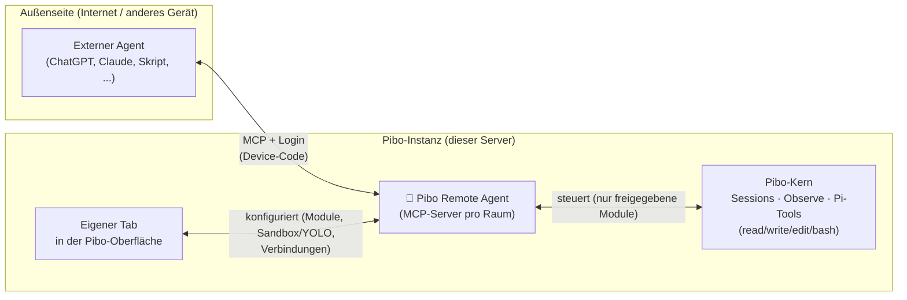
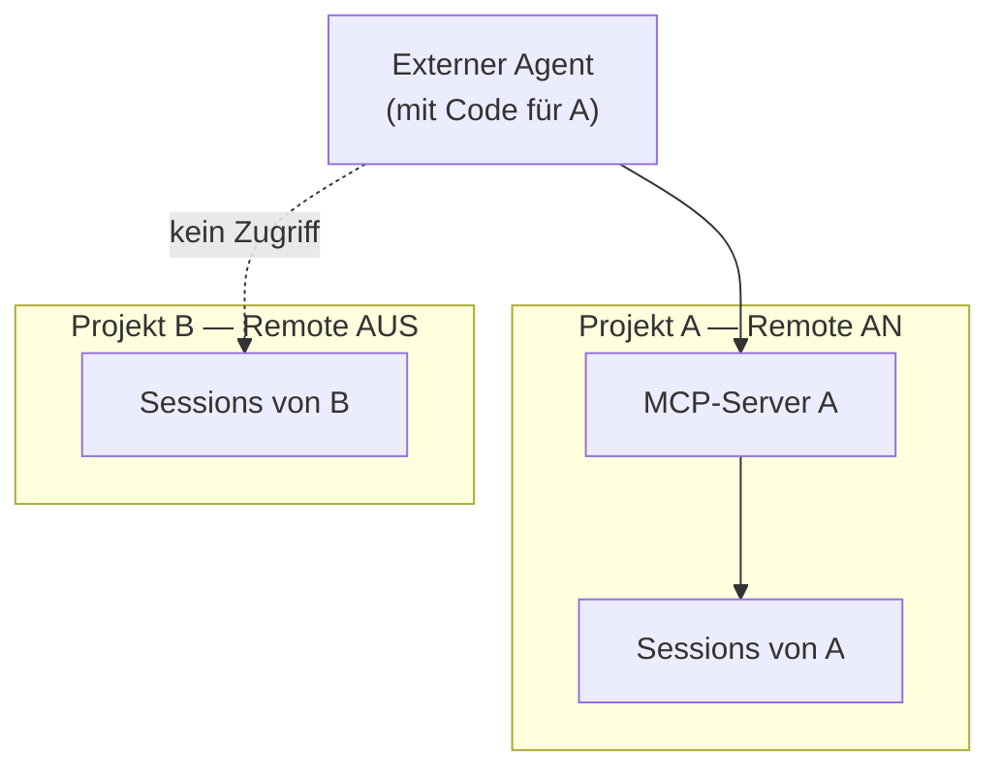
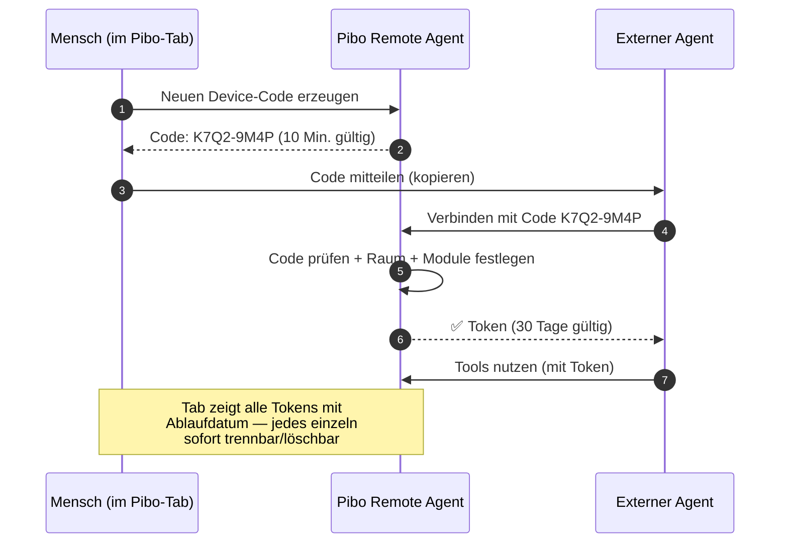
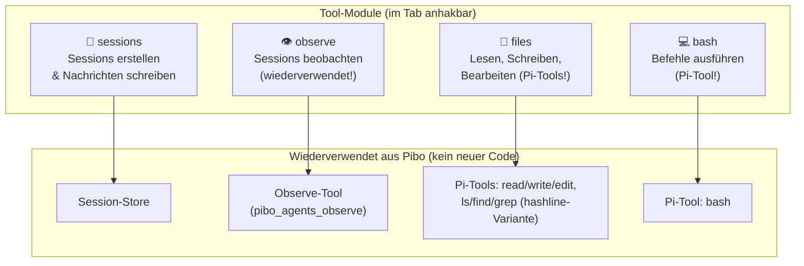
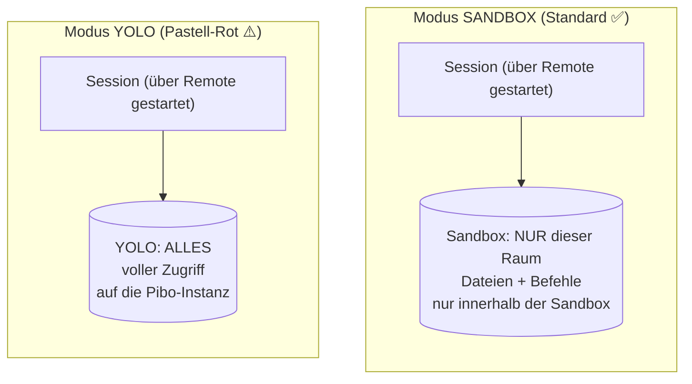
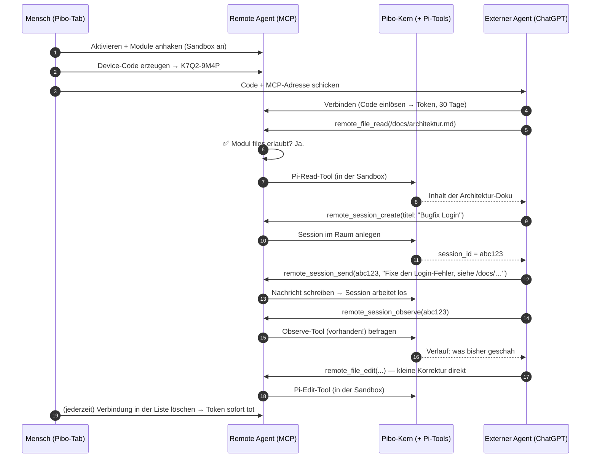

# Pibo Remote Agent — Entwurf V2 (nach CEO-Feedback)

**Stand:** 19.09.2026 · **Basis:** Beta-Branch `beta/4.0-plugin-system` (Pibo 4.0 Plugin-System)
**Status:** Alle 5 CEO-Entscheidungen eingearbeitet (siehe Kapitel 13).
**Sprache:** bewusst einfach gehalten. Technik nur dort, wo sie Entscheidungen erklärt.

---

## 1. Die Idee in einem Satz

> **📡 Pibo Remote Agent ist eine Fernbedienung für Pibo.**
> Ein externer Agent (z. B. ein anderer KI-Agent, ChatGPT, ein Skript) verbindet sich
> von außen über einen Standard-Anschluss (MCP-Server) mit **einem** Pibo-Projekt
> und kann dort — je nach Freigabe — Sessions erstellen, Nachrichten schreiben,
> Dateien lesen und bearbeiten, Befehle ausführen und den Fortschritt beobachten.

**Warum MCP?** MCP ("Model Context Protocol") ist ein offener Standard dafür, wie
KI-Agenten Tools benutzen. Fast jedes Agenten-Framework und jede Chat-Plattform
kann MCP sprechen. Wenn wir **einmal** einen sauberen MCP-Server bauen, können
uns **viele** externe Clients steuern — ohne dass wir pro Client etwas neu bauen.

**Leitprinzip dieser Version (CEO-Vorgabe):** Maximale Wiederverwendung.
Wir erfinden keine Tools neu, sondern geben dem externen Agenten **dieselben
Werkzeuge, die Pibo-Sessions intern schon haben** (Pi-Tools, Observe-Tool).
Wenig neuer Code, keine doppelten Interfaces. DRY.

---

## 2. Überblick: Wer spricht mit wem?



**Die drei Bauteile in Worten:**

- **MCP-Server** = der Anschluss nach außen. Der externe Agent ruft hier Funktionen auf. (Die Steckdose.)
- **Eigener Tab** = die Bedienoberfläche in Pibo: aktivieren, Module wählen, Sandbox/YOLO, Verbindungen verwalten. (Der Sicherungskasten.)
- **Pibo-Kern-Anbindung** = nutzt vorhandene Funktionen wieder: Sessions, Observe-Tool, Pi-Datei- und Bash-Tools. (Die vorhandene Verkabelung.)

---

## 3. Das Raum-Prinzip (wichtigste Regel)

**Jede Fernbedienung gehört zu genau einem Raum.**

- Ein "Raum" ist entweder **ein Projekt** oder der **Shared Chat**.
- Im Tab des Projekts wird Remote Agent **pro Raum ein- oder ausgeschaltet**.
- Der externe Agent sieht und steuert **nur diesen Raum**: nur dessen Sessions.
- Will man zwei Projekte fernsteuern, gibt es zwei Remote-Verbindungen
  (zwei "Fernbedienungen") — sauber getrennt.



**Warum so?** Damit ein externer Agent niemals aus Versehen in einem falschen
Projekt liest oder schreibt. Die Grenze ist immer klar: **ein Code = ein Raum.**

**Und Sub-Agents?** Gestrichen — bewusste Entscheidung. Der externe Agent spricht
**immer nur mit Sessions**. Ob eine Session intern Sub-Agents benutzt, ist allein
Sache dieser Session. Über den MCP-Anschluss gibt es **kein** Sub-Agent-Tool,
keine Sub-Agent-Liste, keine Sub-Agent-Steuerung. Eine Ebene, kein Sonderweg.

```text
Externer Agent  →  Session ("Ansprechpartner")  →  (intern evtl. Sub-Agents)
     ✅ MCP-Tools            ✅ MCP-Tools               ❌ unsichtbar für Remote
```

---

## 4. Der eigene Tab: So sieht die Bedienung aus

Das Plugin bekommt einen **eigenen Tab** in der Pibo-Oberfläche (wie andere
Plugin-Tabs auch: Titel, Icon, Einstellungs-Unteransicht). Skizze:

```
┌─────────────────────────────────────────────────┐
│  📡 Pibo Remote Agent          [Status: ● AN]   │
├─────────────────────────────────────────────────┤
│  Raum: Projekt "Website-Relaunch"               │
│                                                 │
│  VERBINDUNG                                     │
│  [ Neuen Device-Code erzeugen ]                 │
│  Aktiver Code:  K7Q2-9M4P   (läuft ab in 9:58)  │
│                                                 │
│  FREIGEGEBENE VERBINDUNGEN (Tokens, 30 Tage)    │
│  • "ChatGPT-Arbeitsagent"  aktiv seit 3 Tagen   │
│    Module: Sessions, Observe, Dateien, Bash     │
│    läuft ab in 27 Tagen        [ Trennen ]      │
│  • "Nacht-Skript"          aktiv seit 12 Tagen  │
│    Module: Sessions, Observe                    │
│    läuft ab in 18 Tagen        [ Trennen ]      │
│                                                 │
│  FREIGEGEBENE FUNKTIONEN (Module, für neue      │
│  Verbindungen)                                  │
│  ☑ Sessions erstellen & Nachrichten schreiben   │
│  ☑ Sessions beobachten (Observe)                │
│  ☑ Dateien lesen, schreiben & bearbeiten        │
│  ☑ Befehle ausführen (Bash)                     │
│                                                 │
│  SICHERHEIT                                     │
│  Modus: (●) Sandbox  ( ) YOLO                   │
│  Runtime: Muse (Sandbox wird unterstützt)       │
│  Sandbox-Pfad: /räume/website-relaunch          │
└─────────────────────────────────────────────────┘
```

**Was der Tab leistet:**

1. **Ein/Aus-Schalter** pro Raum.
2. **Device-Code erzeugen** für neue Verbindungen.
3. **Verbindungsliste:** Alle aktiven Tokens mit Name, Modulen, Ablaufdatum —
   **jede Verbindung einzeln trennbar/löschbar**, jederzeit.
4. **Module an-/abhaken** (siehe Kapitel 6): Welche Funktionen bekommt eine neue Verbindung?
5. **Sandbox oder YOLO** wählen (siehe Kapitel 8) — die einzige Sicherheitsgrenze.

**Design-Vorgabe (CEO):** Schlankes ("slim") Design wie sonst in Pibo auch —
aber der **YOLO-Modus bekommt eine herausstechende Farbe**: ein Pastell-Rot
(kein grelles Alarm-Rot, aber deutlich anders als das Standard-Blau).
Man soll auf den ersten Blick sehen: **Hier läuft YOLO.**

---

## 5. Anmeldung: Der Device-Code (wie bei Netflix & Co.)

Der externe Agent meldet sich **nicht** mit Passwort an, sondern mit einem
**kurzlebigen Code**, den man im Tab erzeugt und "frisch" bestätigt.
Das kennt man vom Fernseher: Code am TV ablesen, am Handy bestätigen.



**Die Regeln in einfach:**

- Der Code ist **kurz gültig** (z. B. 10 Minuten) und **nur einmal** einlösbar.
- Nach dem Einlösen bekommt der Agent einen **Sitzungsschlüssel (Token)**.
- Das Token gilt **standardmäßig 30 Tage**, nur für **diesen einen Raum**
  und nur für die **angehakten Module**.
- Der Tab führt **Buch über alle Tokens**: Name, Module, Ablaufdatum —
  und jedes kann per Klick **sofort getrennt/gelöscht** werden.
- Nach Ablauf (oder Trennung) muss sich der Agent mit einem frischen Code neu verbinden.

**Pseudocode des Ablaufs (vereinfacht):**

```text
MENSCH klickt "Neuen Device-Code erzeugen":
    code = erzeuge_zufalls_code()          # z.B. "K7Q2-9M4P"
    speichere(code, raum="projekt-A", gültig_bis=jetzt+10min, benutzt=nein)
    zeige(code)

EXTERNER AGENT sendet (code):
    WENN code unbekannt ODER abgelaufen ODER schon benutzt:
        antworte FEHLER ("Code ungültig")
    SONST:
        markiere code als benutzt
        token = erzeuge_sitzungsschlüssel(
            raum="projekt-A",
            module=[angehakte Module],
            gültig_bis=jetzt+30tage
        )
        trage token in Verbindungsliste ein
        antworte OK + token

BEI JEDEM TOOL-AUFRUF mit token:
    WENN token unbekannt ODER abgelaufen ODER vom Mensch getrennt:
        antworte FEHLER ("Bitte neu verbinden")
    SONST:
        prüfe: darf dieses Token dieses Modul in diesem Raum nutzen?
        WENN nein: antworte FEHLER ("Keine Berechtigung")
        WENN ja:  führe aus
```

---

## 6. Was der externe Agent kann: Die Tool-Module

Das Plugin stellt seine Funktionen als **einzelne Module** bereit.
Jedes Modul ist ein Päckchen von MCP-Tools, das man im Tab **an- oder abhakt**.
So bleibt das Ganze **modular und erweiterbar**: Neue Funktion = neues Modul.

**Entscheidung:** 4 Module in V1 — Sessions, Observe, Dateien, Bash.
Kein Sub-Agent-Modul (gestrichen, siehe Kapitel 3).

### 6.1 Die V1-Module



**Hinweis zu Tool-Namen:** Die MCP-Spezifikation erlaubt in Tool-Namen nur Buchstaben, Ziffern, `_` und `-` — daher Unterstriche statt Punkte (z. B. `remote_session_create`).

**Modul 1 — Sessions (`sessions`)**

- `remote_session_create` — Neue Session im Raum anlegen (Titel, Profil wählbar).
- `remote_session_list` — Sessions des Raums auflisten (Titel, Status, Zeit).
- `remote_session_send` — **Nachricht an eine Session schreiben** (Auftrag geben).

**Modul 2 — Beobachten (`observe`)**

- `remote_session_observe` — Verlauf/Fortschritt einer Session lesen
  (Was wurde gesagt? Welche Tools liefen? Gab es Fehler?).
- **Wiederverwendung:** Baut auf dem **vorhandenen Observe-Tool** auf
  (`pibo_agents_observe` aus dem Pibo-Kern). Dasselbe Interface — nur durch
  die Remote-Brille (Raum + Token + Modul geprüft).

**Modul 3 — Dateien (`files`) — inkl. Schreiben schon in V1**

- `remote_file_list` — Ordnerinhalt auflisten.
- `remote_file_read` — Datei lesen (z. B. Docs des Projekts).
- `remote_file_write` — Datei neu schreiben.
- `remote_file_edit` — Datei gezielt bearbeiten.
- **Wiederverwendung:** Dahinter stecken **1:1 die Pi-Coding-Agent-Tools**
  (`createReadToolDefinition`, `createWriteToolDefinition`,
  `createEditToolDefinition`, plus `ls`/`find`/`grep`; Lesen in Pibos
  `hashline`-Variante mit Zeilen-Hashes). Der externe Agent bekommt also
  **genau das Tooling, das Pibo-Sessions intern auch benutzen** — gleiche
  Namen, gleiche Parameter, gleiches Verhalten. Kein neues Interface lernen,
  kein doppelter Code.

**Modul 4 — Befehle (`bash`)**

- `remote_bash_run` — Shell-Befehl ausführen (z. B. Tests starten, Dateien suchen).
- **Wiederverwendung:** Dahinter steckt das **Pi-Bash-Tool**
  (`createBashToolDefinition`) — ebenfalls 1:1.

### 6.2 Spätere Module (Ideen, nicht in V1)

- `gateway-send` — Nachricht über Gateway-Kanäle senden.
- `workflows` — Gespeicherte Abläufe (Workflows) auslösen.
- `admin` — Statistiken, Token-Verwaltung für Profis.

### 6.3 Warum modular?

- Der Mensch entscheidet pro Raum: **"Du darfst lesen und beobachten,
  aber keine Befehle ausführen."**
- Jedes neue Modul ist **eine kleine Datei plus ein Eintrag in der Plugin-Beschreibung**
  (Manifest) — der Rest (Tab, Auth, MCP-Server) bleibt unverändert.
- Externe Clients sehen automatisch nur die Tools, die freigegeben sind.

**Pseudocode eines Moduls (vereinfacht):**

```text
MODUL "sessions":
    name = "sessions"
    titel = "Sessions erstellen & Nachrichten schreiben"
    tools = [
        TOOL "remote_session_create":
            eingabe: { titel, profil? }
            prüfe: token darf Modul "sessions" in diesem Raum nutzen
            tue: lege Session im Raum an (Pibo-Kern-Funktion)
            ausgabe: { session_id, titel }

        TOOL "remote_session_send":
            eingabe: { session_id, nachricht }
            prüfe: session gehört zu diesem Raum?
            tue: schreibe Nachricht (Pibo-Kern-Funktion)
            ausgabe: { ok, event_id }
    ]

MODUL "files":
    name = "files"
    titel = "Dateien lesen, schreiben & bearbeiten"
    tools = Pi-Tools direkt durchgereicht:
        "remote_file_read"  → Pi createReadToolDefinition  (als hashline-Variante)
        "remote_file_write" → Pi createWriteToolDefinition
        "remote_file_edit"  → Pi createEditToolDefinition
        "remote_file_list"  → Pi createLsToolDefinition (+ find/grep)
    prüfe pro Aufruf: token darf Modul "files" in diesem Raum nutzen
```

---

## 7. Keine Ordner-Freigaben mehr: Die Sicherheitsgrenze ist Sandbox oder YOLO

**Entscheidung:** Die Idee aus V1 des Entwurfs ("nur bestimmte Ordner freigeben")
ist **gestrichen**. Begründung:

- Wer das Lese-Tool hat, kann alles lesen. Wer das Bash-Tool hat, kann sowieso alles tun.
- Ordnerlisten wären Schein-Sicherheit mit viel Klickarbeit — und würden bei jedem
  neuen Ordner brechen.
- Stattdessen gibt es **genau eine Sicherheitsgrenze**, die leicht zu verstehen ist:
  **Sandbox oder YOLO** (Kapitel 8).

```text
FRÜHER (gestrichen):                    JETZT (gültig):
"Agent darf /docs lesen,               "Agent hat das files-Modul an?
 sonst nichts."                         → Ja: er kann alles lesen/schreiben,
                                         ABER nur innerhalb der Sandbox
                                         (oder überall, wenn YOLO an ist)."
```

Das ist einfacher zu erklären, einfacher zu bedienen — und ehrlicher:
Die echte Grenze ist die Ausführungsumgebung, nicht eine Ordnerliste.

---

## 8. Sandbox oder YOLO: Wie groß ist der Spielplatz?

Über Remote gestartete Sessions laufen in einer **Runtime** (Ausführungsumgebung).
Die Kernfrage: **Wie groß ist ihr Spielplatz?**



**Die Regeln:**

- **Standard ist Sandbox:** Dateien lesen/schreiben und Bash-Befehle laufen
  nur innerhalb der Sandbox des Raums. Der Tab zeigt den Sandbox-Pfad an.
- **YOLO ist umschaltbar:** Wer will ("der Agent soll alles dürfen"),
  stellt im Tab auf YOLO. Die Raum-Grenze für Sessions gilt weiterhin
  (ein Code = ein Raum, nur Sessions dieses Raums) — aber Dateien und
  Befehle haben vollen Zugriff.
- **YOLO sieht man sofort:** Pastell-Rot statt Standard-Blau, damit der Modus
  auf den ersten Blick erkennbar ist (Design-Vorgabe, siehe Kapitel 4).

**Runtime-Unterschied (wichtig für die Anzeige im Tab):**

```text
Runtime "Muse"  → unterstützt Sandbox ✅
                  (Sandbox ist Standard, YOLO umschaltbar)

Runtime "Pi"    → unterstützt KEINE Sandbox ❌ → immer YOLO
                  (Der Tab zeigt das ehrlich an: "Pi-Runtime läuft immer
                   mit vollem Zugriff" — kein falsches Sicherheitsgefühl.)
```

Der Tab zeigt deshalb immer auch die **aktive Runtime** an, damit klar ist,
welche Garantie gerade gilt.

---

## 9. Wie passt das ins Pibo-4.0-Plugin-System? (Technik-Überblick)

Für die Entwickler: Das Plugin folgt exakt den Mustern des Beta-Branches.

**Plugin-Beschreibung (Manifest) — Skizze:**

```jsonc
{
  "schemaVersion": 1,
  "id": "pibo-remote-agent",
  "name": "Pibo Remote Agent",
  "version": "0.1.0",
  "sdk": "1.0.0",
  "config": {
    // Raumbezogene Einstellungen (pro Projekt / Shared Chat)
    "schemaVersion": 1,
    "scopes": ["session"],
    "schema": { "...": "siehe Kapitel 10" }
  },
  "contributions": [
    {
      "id": "remote-tab",
      "kind": "view",             // → der eigene Tab
      "scope": "app",
      "required": false,
      "defaultEnabled": true,
      "schemaVersion": 1,
      "context": { "kind": "none", "reason": "UI only" },
      "view": {
        "title": "Remote Agent",
        "icon": "satellite-dish",      // 📡 final
        "exportName": "PiboRemoteAgentTab",
        "presentation": "workspace",   // vom Mensch öffenbar
        "instance": "singleton",
        "mount": "keep-alive",
        "stateSchemaVersion": 1,
        "subviews": [
          { "id": "overview", "title": "Übersicht", "purpose": "content" },
          { "id": "settings", "title": "Einstellungen", "purpose": "settings",
            "settingsScopes": ["session"] }
        ]
      }
    },
    { "id": "module-sessions", "kind": "remote-module", "scope": "app", "...": "..." },
    { "id": "module-observe",  "kind": "remote-module", "scope": "app", "...": "..." },
    { "id": "module-files",    "kind": "remote-module", "scope": "app", "...": "..." },
    { "id": "module-bash",     "kind": "remote-module", "scope": "app", "...": "..." }
    // KEIN subagents-Modul (gestrichen). KEINE Ordner-Freigaben.
  ]
}
```

**Backend-Prinzip (eine Zeile pro Bauteil):**

```text
pibo-remote-agent/
├── manifest (pibo.plugin.json)   … beschreibt Tab + 4 Module (s.o.)
├── tab/                          … Oberfläche: Schalter, Codes, Module,
│                                   Verbindungsliste, Sandbox/YOLO (Pastell-Rot)
├── mcp-server/                   … der Anschluss: nimmt MCP-Aufrufe entgegen
│     └── prüft bei JEDEM Aufruf: Token gültig? Nicht abgelaufen?
│                                   Raum ok? Modul erlaubt?
├── auth/                         … Device-Codes erzeugen/prüfen,
│                                   Tokens verwalten (30 Tage, einzeln löschbar)
└── modules/                      … ein Ordner pro Modul, alles wiederverwendet:
      ├── sessions/               … ruft Pibo Session-Store auf
      ├── observe/                … ruft vorhandenes Observe-Tool auf
      ├── files/                  … reicht Pi-Tools durch (read/write/edit/ls/…)
      └── bash/                   … reicht Pi-Bash-Tool durch
```

**Wiederverwendung im Überblick (DRY-Check):**

| Was der externe Agent bekommt | Woher es kommt | Neuer Code? |
|---|---|---|
| Sessions anlegen/auflisten | vorhandener **Session-Store** | nur MCP-Hülle + Prüfung |
| Nachrichten schreiben | vorhandene **Session-/Nachrichten-Funktionen** | nur MCP-Hülle + Prüfung |
| Beobachten | vorhandenes **Observe-Tool** (`pibo_agents_observe`) | nur MCP-Hülle + Prüfung |
| Lesen/Schreiben/Bearbeiten | **Pi-Tools** (`createRead/Write/Edit/Ls/…ToolDefinition`) | nur Durchreichen + Prüfung |
| Befehle ausführen | **Pi-Bash-Tool** (`createBashToolDefinition`) | nur Durchreichen + Prüfung |
| Sandbox/YOLO-Grenze | **Runtime** (Muse-Sandbox bzw. Pi = immer YOLO) | nur Anzeige + Umschalter |

Echte Neuentwicklung ist also nur: **Tab + MCP-Server + Auth + Modul-Hüllen.**
Alles, was "arbeitet", gab es schon.

---

## 10. Daten-Objekte: Was wird gespeichert? (Schemas)

Vereinfachte Objekte — so "denkt" das Plugin. (Feldnamen auf Englisch,
weil Code Englisch ist; Erklärung auf Deutsch.)

**Raum-Konfiguration (pro Projekt / Shared Chat):**

```jsonc
{
  "roomId": "projekt-website-relaunch",  // zu welchem Raum gehört das?
  "enabled": true,                       // Remote AN oder AUS?
  "mode": "sandbox",                     // "sandbox" (Standard) oder "yolo"
  "runtime": "muse",                     // "muse" (Sandbox ok) oder "pi" (immer YOLO)
  "sandboxPath": "/räume/website-relaunch",
  "modules": {                           // welche Module bekommen neue Tokens?
    "sessions": true,
    "observe": true,
    "files": true,
    "bash": true
  }
  // KEINE fileGrants mehr (gestrichen). KEIN subagents-Modul.
}
```

**Device-Code (kurzlebig):**

```jsonc
{
  "code": "K7Q2-9M4P",         // was der Mensch abtippt/weitergibt
  "roomId": "projekt-website-relaunch",
  "expiresAt": "2026-09-19T18:30:00Z",  // 10 Min. gültig
  "used": false                // nur einmal einlösbar
}
```

**Verbindung/Token (30 Tage, einzeln löschbar):**

```jsonc
{
  "token": "geheim-schlüssel…",          // Sitzungsschlüssel des Agenten
  "label": "ChatGPT-Arbeitsagent",       // Anzeigename im Tab
  "roomId": "projekt-website-relaunch",
  "modules": ["sessions", "observe", "files", "bash"],  // Kopie der Freigaben
  "createdAt": "2026-09-19T18:21:00Z",
  "expiresAt": "2026-10-19T18:21:00Z",   // 30 Tage Standard
  "revoked": false                       // true = Mensch hat getrennt/gelöscht
}
```

---

## 11. Beispiel: So läuft eine Fernsteuerung ab

Einmal konkret durchgespielt — der "Happy Path":



---

## 12. Vorschlag: In Phasen bauen

| Phase | Inhalt | Ergebnis |
|---|---|---|
| **1 — Gerüst** | Plugin-Manifest, eigener Tab (An/Aus, Status), MCP-Server-Skelett, 1 Test-Tool (`ping`) | Man sieht den Tab und kann sich "anpingen" |
| **2 — Auth** | Device-Code erzeugen/einlösen, Token-Verwaltung (30 Tage, Liste, einzeln löschen), Raum-Bindung | Sicheres Verbinden pro Raum funktioniert |
| **3 — Kern-Module** | `sessions` (erstellen/listen/schreiben) + `observe` (wiederverwendet) | Fernbedienung für Sessions steht |
| **4 — Dateien + Bash** | `files` (Pi read/write/edit/ls durchgereicht) + `bash` (Pi-Bash durchgereicht) | Agent kann in der Sandbox arbeiten wie eine Pibo-Session |
| **5 — Sandbox/YOLO** | Runtime-Anbindung (Muse-Sandbox), YOLO-Umschalter in Pastell-Rot, Pi-Hinweis ("immer YOLO") | Ehrliche, sichtbare Sicherheitsgrenze |
| **6 — Politur** | Fehler-Texte in einfach, Doku, Ablauf-Erinnerungen für Tokens | V1 fertig |

**Faustregel:** Nach jeder Phase ist das Plugin benutzbar — es wird nur
Schritt für Schritt mächtiger. Nichts muss "Big Bang" live gehen.

**Was NICHT gebaut wird (gestrichen):** Sub-Agent-Modul, Ordner-Freigaben,
eigene Datei-Tools (stattdessen Pi-Tools wiederverwenden).

---

## 13. CEO-Entscheidungen (alle eingearbeitet ✅)

1. **Modul-Umfang V1:** `sessions` + `observe` + `files` (lesen/schreiben/bearbeiten)
   + `bash`. **Sub-Agents komplett gestrichen** — Remote spricht nur die
   Session-Ebene an; was die Session intern tut, ist ihre Sache.
2. **YOLO-Sichtbarkeit:** Slim-Design, aber YOLO in **Pastell-Rot**
   (herausstechend, kein Standard-Blau, kein grelles Alarm-Rot).
3. **Token-Laufzeit:** **30 Tage Standard**, alle Tokens in einer Liste im Tab
   mit Ablaufdatum, **jede Verbindung einzeln trennbar/löschbar**, jederzeit.
4. **Schreiben in V1:** **Ja** — Write-/Edit-Tools plus Bash, **1:1 die
   Pi-Coding-Agent-Tools** (gleiches Interface, gleiche Funktionen), nur durchgereicht.
5. **Name & Icon:** **📡 Pibo Remote Agent** — final.

**Zusatz-Entscheidung:** Keine Ordner-Freigaben. Sicherheitsgrenze ist
**ausschließlich Sandbox vs. YOLO** (Muse-Sandbox; Pi immer YOLO).
Maximal DRY: keine eigenen Datei-/Bash-Tools bauen.

---

---

## 14. Umsetzungsnotizen (Branch `feature/pibo-remote-agent`)

Technische Entscheidungen, die bei der Implementation gefallen sind:

1. **Ein MCP-Endpunkt für alle Räume:** Der Server hört auf einer Loopback-Adresse
   (`http://127.0.0.1:<port>/mcp`). Der Token bestimmt den Raum — in der URL steht
   kein Raum. Vorteil: eine URL zum Konfigurieren, Raumtrennung über Auth.
2. **Loopback-Default:** Wie Pibos bestehende Tool-Bridge bindet der Server nur
   lokal. Zugriff "von außen" läuft über die bestehende Gateway-/Deployment-
   Infrastruktur (Tunnel/Reverse-Proxy) — kein offener Port per Default.
3. **Adress-Datei:** Der laufende Server schreibt seine URL nach
   `~/.pibo/remote-agent/mcp-address.json` (nur für den Besitzer lesbar),
   damit Tab und CLI sie anzeigen können.
4. **Pi-Tools laufen headless:** Die Datei-/Bash-Tools werden außerhalb einer
   Pi-Session aufgerufen (mit minimalem Kontext, ohne Pi-Session-Umgebung).
   Verhalten und Parameter sind identisch zu den Pi-Tools.
5. **Sandbox-Grenze, ehrlich:** Datei-Tools werden in Sandbox-Modus per
   Pfadprüfung eingezäunt; Bash startet mit Arbeitsverzeichnis = Sandbox.
   Kernel-Jail ist das nicht — für nicht vertrauenswürdige Agents das
   Bash-Modul einfach abhaken.
6. **Server startet bei Bedarf:** Der MCP-Listener startet, sobald der erste Raum
   aktiviert wird (oder beim Gateway-Start, wenn Räume aktiv sind), und stoppt,
   wenn kein Raum mehr aktiv ist.
7. **Deaktivieren = sofort dicht:** Raum deaktivieren schließt alle
   MCP-Verbindungen des Raums und widerruft alle seine Tokens.

*Ende des Entwurfs V2 (mit Umsetzungsnotizen). Branch: `feature/pibo-remote-agent`,
Worktree: `.worktrees/pibo-remote-agent`.*
