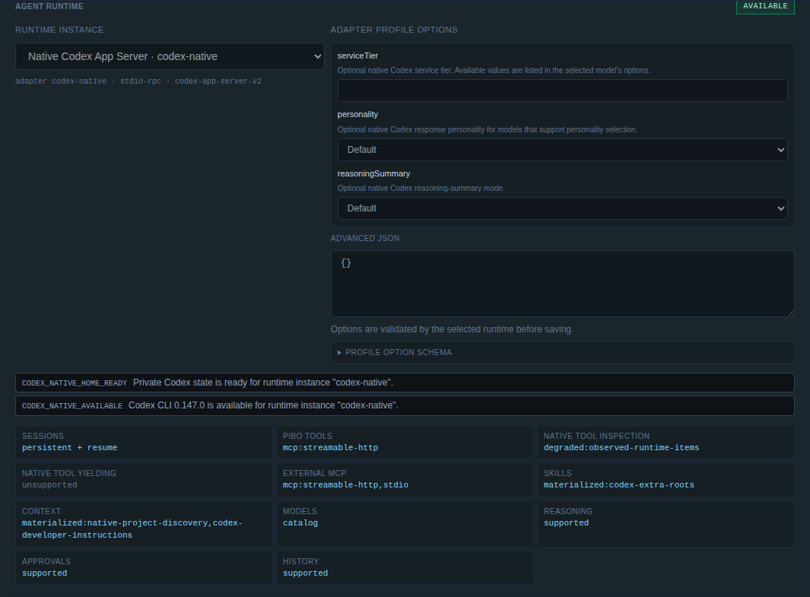

# Native Codex Profile Registration Validation — 2026-08-16

## Scope

This report records native Codex checkpoint 9.11 for `@pasko70/pibo@1.7.2` at profile implementation commit `6c969f68ccc58e572b7c5948196f9667f9ce1868` and final isolation fix commit `3a52d1acbbb01302f40534a42b664ba902e87f03`, delivered in PR #501 stacked on subagent PR #499.

The checkpoint adds a built-in `codex-native` profile and configured runtime instance while preserving the established compatibility boundary: native Codex does not claim `codex`, and an explicitly registered or persisted `codex` reference can remain a Pi-backed compatibility instance/profile.

## Implemented contract

### Separate native plugin

`piboCodexNativePlugin` is separate from `piboCorePlugin`. The default and gateway-producer registries include it, while tests or products that intentionally assemble only the core Pi plugin do not receive an implicit Codex dependency or duplicate driver registration.

The plugin registers:

- adapter driver: `codex-native`;
- configured runtime instance: `codex-native`;
- read-only profile: `codex-native`;
- display name: `Native Codex App Server`;
- no profile aliases.

The profile selects runtime instance `codex-native`, keeps Pi built-in tools disabled and unselected, enables Pibo goal control through the portable MCP path, preserves automatic native project-instruction discovery, and leaves model/runtime options unset so the exact App Server catalog/defaults remain authoritative.

### Compatibility boundary

The default registry continues to reject `codex` and `codex-compat-openai-web`; native registration does not silently recreate either retired built-in profile.

Compatibility remains possible only through explicit persisted/operator definitions:

- a configured runtime instance named `codex` may still use adapter `pi`;
- an explicitly registered `codex-compat-openai-web` profile may expose alias `codex` and select that Pi-backed instance;
- a persisted session binding with runtime instance `codex` and adapter `pi` remains unchanged;
- `codex-native` remains an independent profile/runtime/adapter identity.

### Private diagnostic process state

Public profile registration made runtime diagnostics part of normal Agent Designer catalog loading. Exact Pibo2 validation exposed that the earlier `codex --version` probe inherited only the configured allowlist and could let the Codex launcher derive `/root` as its home before App Server isolation existed. The old candidate created a temporary global `/root/.codex/tmp/arg0` launcher directory.

Checkpoint 9.11 was not completed with that behavior. The final implementation prepares a private disposable diagnostic generation first, builds the same protected `CODEX_HOME`, `HOME`, `USERPROFILE`, XDG, and temp environment used by owned App Server processes, runs the bounded version probe there, and removes the generation on every result. A deterministic fixture fails and writes a sentinel if any protected field is absent. The exact final candidate leaves global `/root/.codex` content unchanged after CLI, catalog, browser, and model-list inspection.

## Deterministic validation

Primary coverage:

- `test/agent-runtime-registry.test.mjs` — default Pi/native registrations, native profile shape, absent implicit `codex`, explicit Pi-backed instance/alias behavior;
- `test/profile-cli.test.mjs` — `pibo profile codex-native` succeeds while implicit `pibo profile codex` fails;
- `test/plugin-registry.test.mjs`, `test/codex-compat.test.mjs`, and `test/web-annotations-tools.test.mjs` — default registry/catalog behavior with the additional read-only profile;
- `test/codex-native-process.test.mjs` and `test/fixtures/codex-runtime-process-fake.mjs` — private version-probe environment and cleanup regression.

Final focused checkpoint set:

- 51 tests;
- 51 passed;
- 0 failed.

Final workspace validation:

- `npm run typecheck -- --pretty false` — passed;
- `npm run build` — passed;
- canonical full suite — 1,733/1,733 passed across 12 suites;
- `git diff --check` — passed.

## Exact Codex 0.147.0 validation on Pibo2

The exact committed package was installed and activated on the dedicated Pibo2 development service. The operator-only service PATH selects the pinned Codex installation; no executable path is hard-coded in product profile data.

Validated artifacts:

- final commit: `3a52d1acbbb01302f40534a42b664ba902e87f03`;
- package SHA-256: `b3a8f56aa00554ca4121e2a51a27bc6e016ef4f7f1b22551886f9b223f0fc95e`;
- Codex CLI/App Server: `0.147.0`;
- exact native binary SHA-256: `cb0a15567e9a60a5820d54b0f6ae86d504dc3805c1eab21a47f70e3eb7b73a40`.

### Exact package assertions

An isolated exact-package script proved:

- default profiles are exactly `base` and `codex-native`;
- native profile/runtime/adapter ids are all `codex-native`;
- `codex` is not an implicit alias;
- an explicitly registered `codex` runtime instance remains adapter `pi`;
- an explicitly registered `codex` profile alias resolves to the Pi-backed compatibility profile;
- a persisted `codex` binding retains adapter `pi`;
- native runtime diagnostics report exact version `0.147.0`;
- the stable model catalog contains `gpt-5.6-sol`, `gpt-5.6-terra`, `gpt-5.6-luna`, `gpt-5.5`, and `gpt-5.2`;
- private runtime state is mode `0700`;
- all diagnostic/App Server processes exit;
- global `/root/.codex` content is unchanged.

### CLI, API, session, Context Build, and debug evidence

The exact candidate CLI returned the expected native profile shape: runtime `codex-native`, no runtime options, Pi built-ins disabled with an empty name list, and goal control enabled. With no explicit compatibility plugin/data on this host, `pibo profile codex` returned `Unknown profile "codex"` and listed `codex-native` only as a distinct available name.

The authenticated `/api/chat/agent-catalog` response exposed:

- runtime id/adapter id: `codex-native`;
- transport: `stdio-rpc`;
- protocol: `codex-app-server-v2`, supported range `>=0.147.0 <0.148.0`;
- availability: true;
- exact version diagnostic: `0.147.0`;
- the five exact stable models above;
- profile aliases: empty.

An authenticated public session creation request with profile `codex-native` returned HTTP 201 and froze a revision-1 unbound binding with runtime instance/adapter `codex-native` and protocol `codex-app-server-v2`. The same request with profile `codex` returned HTTP 400 and `Unknown profile "codex"`. `pibo debug session` reported the same native binding without a Pi session id or native thread id.

Fresh authenticated Context Build for that session reported runtime `codex-native`, state `unbound`, available `true`, 9 top-level/13 total nodes, zero warnings, and zero errors. It showed Pibo goal control through `mcp:streamable-http`, degraded evidence-based native-tool inspection, unsupported native-tool yielding, native project/developer context modes, exact model options, and the two safe runtime diagnostics.

### Authenticated Agent Designer validation

After final candidate activation and an uncached reload, Agent Designer rendered `codex-native` as a read-only plugin profile. The runtime selector showed `Native Codex App Server · codex-native`, exact protocol/transport diagnostics, profile option schema, model/reasoning controls, and effective portable capability modes. No browser console warning or error was present.

Sanitized evidence:

After final CLI/API/browser inspection, the gateway reported zero runtime sessions and zero yielded runs, no owned Codex/MCP process remained, and global `/root/.codex` contained no generated state.

## Remaining boundary

This checkpoint proves profile/instance registration, exact binary discovery, model catalog, session binding, inspection, and compatibility identity. It does not claim provider authentication or a public native model turn. Native provider authentication remains Pibo2-managed and must be proven through the integrated task-10 flows without transferring local credentials or using rejected token shortcuts.

## Result

Task 9.11 is complete. `codex-native` is a real built-in profile backed by the official App Server adapter, it is visible and inspectable through CLI/API/Context Build/Agent Designer, it freezes native bindings correctly, it does not claim `codex`, explicit/persisted Pi compatibility remains stable, and even normal version diagnostics are now isolated from global Codex state.
