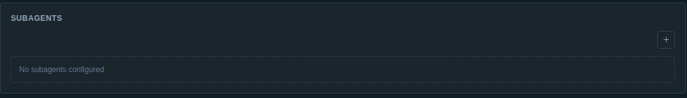

# Native Codex Pibo-Managed Subagent Validation — 2026-08-16

## Scope

This report records native Codex checkpoint 9.10 for `@pasko70/pibo@1.7.2` at implementation commit `54d0192896ec7956db58a14a829bd6189941fb08`, stacked on native-tool inspection PR #498.

The checkpoint proves that Pibo-managed subagents remain Pibo product orchestration while a native Codex parent can invoke them through the official App Server and generation-scoped MCP path. It also proves the reverse cross-runtime direction: a Pi parent can create and reuse a child Pibo Session whose frozen runtime binding is native Codex.

## Implemented contract

### Native Codex parent to Pibo child

Selected profile subagents continue to compile into portable `pibo_subagent_<name>` tools. For `codex-native`, those definitions are delivered through the same session-scoped Streamable HTTP MCP server as other selected Pibo tools. Codex owns the model loop and native code-mode invocation; Pibo's MCP credential independently restricts the call to one Pibo Session, one runtime generation, and the selected tool allowlist.

Exact Codex `0.147.0` rejects model-initiated custom MCP calls when its MCP tool approval defaults remain unapproved and no native MCP approval UI is active. The adapter therefore sets `default_tools_approval_mode = "approve"` only on the generated, explicitly selected Pibo MCP server. External MCP servers retain their configured/native approval behavior. This does not approve Codex command or file tools and does not broaden the Pibo credential's selected-tool allowlist.

### Cross-runtime child bindings

The Pibo session router remains authoritative for child creation and reuse:

- the child is a normal Pibo Session with `kind: "subagent"`, `parentId`, and `originId` linkage;
- the child profile selects and freezes its own configured runtime instance independently from the parent;
- parent and child may use different adapters in either direction;
- each child receives its own runtime generation, resources, credentials, and opaque native binding;
- a matching bounded thread key reuses the child and its native binding across parent runtime restart;
- child results return through the existing portable subagent result contract.

Thread keys are capped at 256 schema characters and 512 UTF-8 bytes before they may become persistent metadata.

### Cancellation and yielded execution

Direct subagent tools pass the MCP/tool request cancellation signal into the child turn. The router tracks active parent/child invocations and starts bounded child-abort actions when the parent turn is interrupted. Idle or previously completed children are not aborted or deleted, so their frozen binding remains reusable.

Selected Pibo subagent tools are also available through `pibo_run_start`, `pibo_run_wait`, and `pibo_run_read`. This yields Pibo-managed work only; `codex-native` still does not claim that Pibo can wrap or yield private Codex-owned tools or Codex-native collaboration agents.

### Product inspection

Agent Designer continues to expose the generic Subagents control and `pibo-run-control` package. The controls are capability-gated by portable Pibo tool delivery, not by a hard-coded runtime id. Portable Context Build reports selected subagent targets and the run-control package under the runtime's MCP tool-delivery mode.

The built-in `pibo-agent-runtime-adapter` skill now requires adapter authors to prove model-initiated MCP calls, scope any pre-approval to the selected Pibo server, preserve independent child bindings, bound thread keys, and propagate parent cancellation.

## Deterministic validation

Primary coverage:

- `test/codex-native-subagents.test.mjs` — native Codex parent, selected Pibo subagent delivery, child creation/reuse, restart continuity, yielded execution, and cancellation;
- `test/subagents.test.mjs` — portable definitions, cross-runtime target selection, thread-key bounds, and tool abort propagation;
- `test/session-reply-waiter.test.mjs` — router-level parent-abort propagation to active children without aborting idle children;
- `test/codex-native-resources.test.mjs` — scoped Pibo MCP approval mode while external MCP configuration remains unchanged;
- `test/fixtures/codex-app-server-thread-fake.mjs` — deterministic App Server-initiated MCP invocation support;
- `test/context-build-inspector.test.mjs` — selected subagent and run-control visibility through MCP delivery;
- `test/chat-ui-agent-designer-autosave.test.mjs` — capability-gated Agent Designer subagent/run-control surfaces.

Final focused checkpoint set:

- 73 tests;
- 73 passed;
- 0 failed.

Final workspace validation:

- `npm run typecheck -- --pretty false` — passed;
- `npm run build` — passed;
- canonical full suite — 1,731/1,731 passed across 12 suites;
- `git diff --check` — passed.

## Exact Codex 0.147.0 validation on Pibo2

The exact committed package was installed and activated on the dedicated Pibo2 development service.

Validated artifacts:

- implementation commit: `54d0192896ec7956db58a14a829bd6189941fb08`;
- package SHA-256: `478deb0cb49eefc4accf3e4dad6f5228cb6e8e5ca1477af080b4b639e125b4c3`;
- Codex CLI/App Server: `0.147.0`;
- Codex launcher SHA-256: `134063e133f0b4244fa3b251acf973d4fe4b4aeeacbdc135211bf480f59f1477`;
- exact native binary SHA-256: `cb0a15567e9a60a5820d54b0f6ae86d504dc3805c1eab21a47f70e3eb7b73a40`.

A deterministic loopback Responses-compatible provider drove the exact installed Codex binary through its normal model/code-mode loop. Authentication remained Pibo2-managed; no local OAuth/API credential was copied to the server, and no credential, account metadata, prompt transcript, or raw provider payload was persisted.

### Exact scenarios

1. **Codex parent to non-Codex child:** the provider selected `mcp__pibo_session_tools__pibo_subagent_helper`; Codex executed it through native `functions.exec`; Pibo created a child session bound to the configured fixture runtime; and the child result returned to the next provider request and final parent reply.
2. **Parent process restart and child reuse:** the parent runtime process was disposed and resumed on the same native Codex thread. A second model-initiated subagent call reused both the child Pibo Session and its independent native child binding.
3. **Yielded subagent:** `pibo_run_start` launched the selected subagent tool, `pibo_run_wait` reached `completed`, and `pibo_run_read` returned the child result.
4. **Cancellation:** an active child was held open, the parent received a generic abort action, the parent turn rejected, and the child runtime observed abort and stopped streaming.
5. **Pi parent to native Codex child:** a Pi-bound parent selected a target profile using `codex-native`; two calls with the same thread key reused one child Pibo Session and the same native Codex thread.
6. **Isolation and cleanup:** the configured Codex home remained mode `0700`, generated config remained mode `0600`, global `/root/.codex` content remained unchanged, all owned Codex/MCP processes exited, and the gateway returned to zero runtime sessions and zero yielded runs.

Exact summary:

- Codex-parent model subagent: passed;
- cross-runtime restart/reuse: passed;
- yielded subagent: passed;
- cancellation: passed;
- Pi-parent/native-Codex-child: passed;
- selected subagent and run tools visible to Codex: passed;
- recorded parent-link events: 4;
- recorded child Pibo Sessions: 4.

The active service reported candidate `agent-runtime-codex-subagents` at commit `54d0192896ec7956db58a14a829bd6189941fb08`, remained healthy after validation, and had no leaked validation or App Server processes.

## Authenticated public Designer validation

After candidate activation and an uncached reload, the existing authenticated Pibo2 browser rendered the generic `SUBAGENTS` control and enabled `pibo-run-control` package without browser console warnings or errors. The browser evaluation confirmed the Add Subagent action was enabled and the run-control description explicitly limited private harness-native yielding to runtimes that advertise it.

Sanitized control evidence:

A public `codex-native` profile remains intentionally unregistered until task 9.11. Consequently, this checkpoint proves exact App Server behavior through the installed candidate and exact binary, while authenticated public native-profile/model-provider execution is reserved for the profile and integrated-flow checkpoints.

## Remaining boundary

Checkpoint 9.10 does not adopt Codex's harness-native collaboration agents as Pibo subagents. Those tools remain Codex-owned and preserved. It also does not reinterpret the existing Pi-backed `codex` profile or alias; distinct `codex-native` registration and compatibility assertions are task 9.11.

## Result

Task 9.10 is complete. Native Codex can invoke selected Pibo-managed subagents directly and through yielded-run control, Pi parents can create native Codex children, child bindings remain independently frozen and reusable across restart, active work cancels with the parent, approval scope remains limited to the generated Pibo MCP server, and exact packaged Pibo2 validation shows isolated cleanup with no global Codex mutation.
