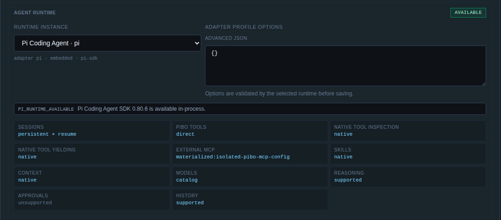

# Native Codex Tool Preservation and Inspection Validation — 2026-08-16

## Scope

This report records native Codex checkpoint 9.9 for `@pasko70/pibo@1.7.2` at implementation commit `4a53c6b0e32f2c42650b6ad99565a11e32012b3f`, stacked on resource-delivery PR #497.

The checkpoint proves that selected Pibo resources do not replace or silently redefine Codex-owned standard tools, and adds a truthful runtime-neutral inspection surface without claiming that Pibo owns or can yield those tools.

## Implemented contract

### Separate inspection and yielding capabilities

`AgentRuntimeCapabilities.tools` now distinguishes:

- `nativeToolInspection` — how accurately Pibo can report harness-owned tools;
- `nativeToolYielding` — whether Pibo may wrap a harness-owned tool through yielded-run control.

Pi advertises native inspection and native yielding because its embedded SDK exposes both. Native Codex continues to reject native-tool yielding and advertises degraded inspection mode `observed-runtime-items`.

The exact stable Codex App Server `0.147.0` v2 schema has stable MCP status and tool-call methods but no complete native `tool/list`, `tools/list`, `nativeTool/list`, or `nativeTools/list` request. Pibo therefore does not hard-code an assumed Codex catalog or use experimental Apps metadata as a substitute.

Agent Designer shows the inspection capability separately from yielding. Portable Context Build adds a `tools/native-inspection` node with the delivery mode and evidence-backed degradation reason.

### Runtime-neutral status inventory

Native Codex session status now exposes:

- selected MCP tools immediately as stable `server/tool` names;
- harness-native names after scoped stable item notifications produce normalized `tool_call` events.

The status inventory is bounded:

- at most 512 selected tool names;
- at most 256 observed tool names;
- tool names longer than 512 characters are not retained;
- selected-inventory truncation emits a safe warning.

Selected tools are reconstructed when resources are prepared again after process or gateway resume. Observed native names remain session-local because the stable protocol does not provide a complete pre-turn catalog. This is declared as degradation rather than hidden.

### Native ownership remains unchanged

The adapter does not:

- set `baseInstructions`;
- send native tool overrides in thread configuration;
- wrap Codex-owned tools as Pibo tools;
- execute a second Pibo-side copy of a Codex native tool;
- mutate global Codex configuration.

Existing stable command, file-change, MCP, and other item notifications remain the source of normalized tool lifecycle events.

## Deterministic validation

Primary coverage:

- `test/codex-native-protocol-checkpoint.test.mjs` — proves the pinned stable schema lacks a complete native-tool list method while retaining stable MCP inspection;
- `test/codex-native-resources.test.mjs` — proves selected tools are visible immediately, native prompt/tool overrides are absent, and the degraded capability is declared;
- `test/codex-native-turn.test.mjs` — proves command, file, and MCP tool names enter generic status after stable native events;
- `test/context-build-inspector.test.mjs` — proves the degraded reason appears in portable Context Build;
- `test/agent-runtime-registry.test.mjs` — proves Pi advertises exact native inspection;
- `test/fixtures/codex-app-server-thread-fake.mjs` — records only safe booleans for base-instruction and native-tool override detection.

Final focused checkpoint set:

- 133 tests;
- 133 passed;
- 0 failed.

Final workspace validation:

- `npm run typecheck -- --pretty false` — passed;
- `npm run build` — passed;
- canonical full suite — 1,723/1,723 passed across 12 suites;
- `git diff --check` — passed.

## Exact Codex 0.147.0 validation on Pibo2

The exact committed package was installed and activated on the dedicated Pibo2 development service.

Validated artifacts:

- implementation commit: `4a53c6b0e32f2c42650b6ad99565a11e32012b3f`;
- package SHA-256: `bd876419fefaf00b7d45d01f70937ac07a834ac68d14afa90489f2170be5e23c`;
- Codex CLI/App Server: `0.147.0`;
- Codex launcher SHA-256: `134063e133f0b4244fa3b251acf973d4fe4b4aeeacbdc135211bf480f59f1477`;
- exact native binary SHA-256: `cb0a15567e9a60a5820d54b0f6ae86d504dc3805c1eab21a47f70e3eb7b73a40`.

An isolated loopback Responses-compatible provider captured only the exact request structures needed for comparison. Authentication remained Pibo2-managed and no credential, account metadata, prompt transcript, or raw provider payload was persisted.

### Baseline versus selected-resource comparison

Two otherwise equivalent isolated native sessions were exercised:

1. a no-resource baseline;
2. a session with one selected Pibo MCP tool, `alpha`.

The provider-visible baseline exposed two native namespaces. The normalized native inventory contained:

- `functions.exec`;
- `functions.wait`;
- `apply_patch`;
- `exec_command`;
- `view_image`;
- `write_stdin`;
- `get_goal`;
- `create_goal`;
- `update_goal`;
- `update_plan`;
- `collaboration.spawn_agent`;
- `collaboration.send_message`;
- `collaboration.followup_task`;
- `collaboration.wait_agent`;
- `collaboration.interrupt_agent`;
- `collaboration.list_agents`.

The fixed native structures and definitions were unchanged after resource selection. Their normalized digest was:

`d411d3a0029d1df238310fad109c088bcde18f4bbd120f91bde9a9067b1d0d89`

Codex legitimately expanded the dynamic `functions.exec` nested-tool description when MCP became available. Every baseline native code-mode name remained present. Codex added only the MCP-conditional native resource helpers and the selected tool name:

- `list_mcp_resource_templates`;
- `list_mcp_resources`;
- `read_mcp_resource`;
- `mcp__pibo_session_tools__alpha`.

This proves additive delivery without treating a dynamic description as a byte-stable native schema or falsely claiming that Pibo controls Codex's tool router.

### Native execution and generic inspection

The exact provider drove one native command loop in each session.

Observed generic status:

- baseline before native use: no assumed tool names;
- baseline after native command use: `codex_command`;
- resource session before native use: `pibo-session-tools/alpha`;
- resource session after native command use: `codex_command`, `pibo-session-tools/alpha`.

Both sessions completed two provider requests, all owned App Server and MCP processes exited, global Codex state remained unchanged, and the active development gateway returned to zero runtime sessions and zero yielded runs.

## Authenticated public Designer validation

After candidate activation and an uncached reload, the existing authenticated headful browser rendered the new `NATIVE TOOL INSPECTION` capability separately from `NATIVE TOOL YIELDING`. The currently registered Pi instance displayed native inspection as `native`; the page produced no browser console warnings or errors.

A public `codex-native` profile remains intentionally unregistered until task 9.11, so this checkpoint does not temporarily mutate product profile registration merely to render the Codex degraded row. Codex capability and degradation behavior are covered through the installed candidate, exact App Server validation, deterministic UI/context tests, and the runtime catalog contract.

Sanitized capability-panel evidence:

## Remaining boundary

Checkpoint 9.9 does not make Codex-owned collaboration tools into Pibo-managed subagent tools. Native Codex collaboration remains harness-owned and merely preserved in the exact baseline. Pibo-managed subagents and cross-runtime child sessions are task 9.10.

## Result

Task 9.9 is complete. Native Codex standard tools remain harness-owned and preserved, selected MCP tools are additive, runtime status exposes only proven bounded inventory, Agent Designer and Context Build distinguish inspection from yielding, and the absence of a complete stable pre-turn inventory is reported explicitly instead of being hidden or emulated.
